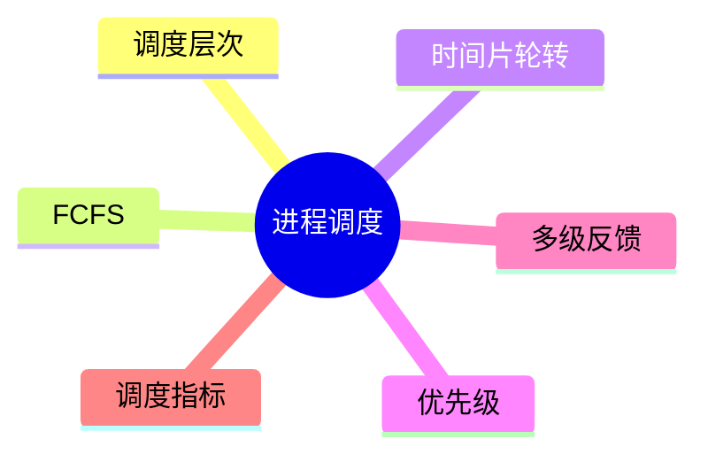
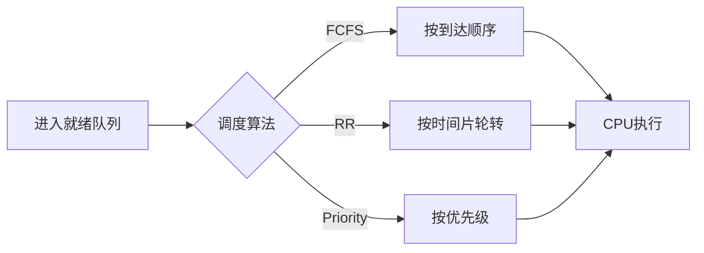

# 第五节 进程调度

> **说明**
> 本文依据《2.操作系统知识》资料整理，重点介绍处理机调度、常见调度算法及考试分析方法。

## 一句话理解

**进程调度是操作系统按照一定策略选择就绪进程占用 CPU
的过程，其目标是在公平性、响应时间和系统吞吐量之间取得平衡。**

## 学习目标

-   理解调度层次
-   掌握 FCFS、时间片轮转等算法
-   理解评价指标
-   能分析常见调度题

## 知识导图



## 1. 调度概述

处理机调度负责从就绪队列中选择一个进程运行，是操作系统核心功能之一。资料围绕
CPU 调度、高频算法及计算题进行了介绍。

## 2. 调度层次

| 类型 | 作用 |
| --- | --- |
| 高级调度 | 作业进入系统 |
| 中级调度 | 挂起与换入换出 |
| 低级调度 | CPU 调度（最常考） |

## 3. 常见调度算法

### FCFS（先来先服务）

-   按到达顺序执行
-   实现简单
-   可能导致短作业等待较长时间

### 时间片轮转（RR）

-   每个进程分配固定时间片
-   时间片用完重新进入就绪队列
-   适合分时系统

### 优先级调度

-   优先执行高优先级进程
-   需注意低优先级进程可能长期等待

### 多级反馈队列

-   综合时间片和优先级思想
-   常用于现代操作系统

## 4. 常用评价指标

-   CPU 利用率
-   吞吐量
-   周转时间
-   带权周转时间
-   响应时间

## 5. 真题分析思路

1.  按算法建立就绪队列。
2.  模拟 CPU 执行过程。
3.  绘制时间轴。
4.  计算等待时间、周转时间等指标。



## 高频考点

-   FCFS 特点
-   时间片轮转特点
-   调度指标计算
-   时间轴分析

## 易错点

> **注意：** FCFS 不一定使平均周转时间最优。

> **注意：** 时间片过大接近 FCFS；时间片过小会增加切换开销。

## AI 学习建议

```text
请生成一道 FCFS 和时间片轮转调度计算题，并给出完整求解过程。
```

## 开发者视角

Linux CFS、Windows Scheduler
等现代调度器都借鉴了经典调度算法，并结合优先级、负载均衡等策略进行优化。

## 架构师思考

在高并发系统中，合理调度
CPU、线程池和任务队列，可有效提升吞吐量和响应速度。

## 一分钟速记

```text
FCFS → 简单
RR → 公平
Priority → 高优先级优先
MLFQ → 综合优化
```

## 本节总结

掌握调度算法特点和评价指标，是分析处理机调度题目的关键，也是后续学习死锁与资源管理的重要基础。

## 下一节

➡ [继续阅读：死锁](./07-deadlock)

