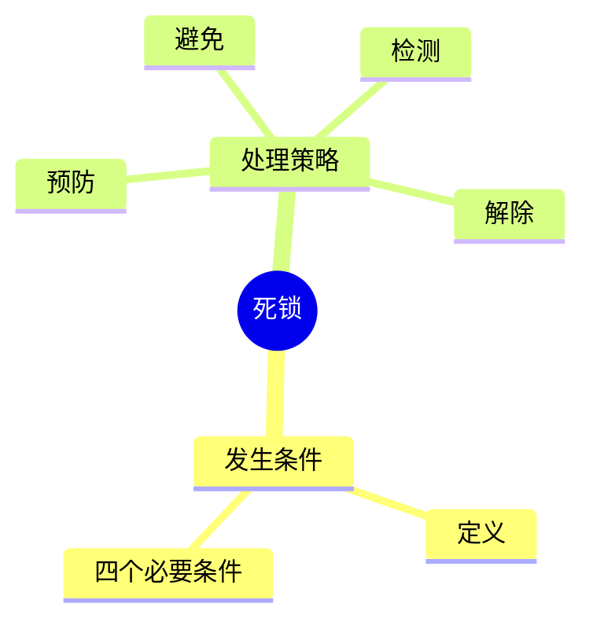
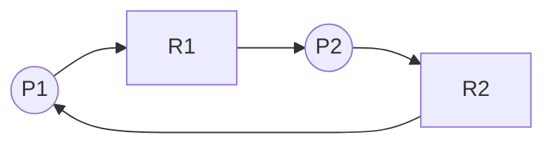

# 第六节 死锁（Deadlock）

> **说明**
> 本文依据《2.操作系统知识》资料中死锁相关知识整理，保持原资料知识框架，并补充知识图、学习建议和开发者视角。

## 一句话理解

**死锁是多个进程因竞争资源而相互等待，导致所有进程都无法继续执行的状态。**

## 学习目标

-   理解死锁概念
-   掌握死锁四个必要条件
-   掌握死锁处理策略
-   能分析资源分配图

## 知识导图



## 1. 死锁定义

多个进程在执行过程中因竞争有限资源而形成循环等待，导致所有相关进程都无法继续执行。

------------------------------------------------------------------------

## 2. 死锁产生的四个必要条件

| 条件 | 说明 |
| --- | --- |
| 互斥 | 资源一次只能被一个进程占用 |
| 请求并保持 | 已获得资源后继续申请其他资源 |
| 不可剥夺 | 已获得资源不能被强制回收 |
| 循环等待 | 多个进程形成等待环 |

> 只有四个条件同时满足，才可能发生死锁。

------------------------------------------------------------------------

## 3. 死锁处理策略

### 预防

破坏四个必要条件中的至少一个。

### 避免

动态分配资源，避免进入不安全状态。

### 检测

允许死锁发生，再通过算法检测。

### 解除

终止进程或回收资源，使系统恢复运行。

------------------------------------------------------------------------

## 4. 资源分配图



当资源分配图形成循环时，应进一步结合资源数量判断是否真正发生死锁。

------------------------------------------------------------------------

## 5. 真题分析步骤

1.  判断是否满足四个必要条件。
2.  绘制资源分配关系。
3.  判断是否存在循环等待。
4.  根据题意选择处理策略。

------------------------------------------------------------------------

## 高频考点

-   死锁四个必要条件
-   四种处理策略
-   资源分配图分析

## 易错点

> **注意：** 出现资源等待不一定就是死锁。

> **注意：** 存在环路并不一定发生死锁，还需要结合资源实例数量分析。

## AI 学习建议

```text
请设计一个包含三个进程、两个资源的资源分配图，并分析是否会发生死锁。
```

## 开发者视角

数据库事务锁、Java 多线程锁、Redis
分布式锁都可能出现死锁，需要统一加锁顺序、超时释放或死锁检测机制降低风险。

## 架构师思考

在大型分布式系统中，合理设计资源申请顺序、限制锁粒度和使用幂等机制，是避免死锁的重要手段。

## 一分钟速记

```text
四条件：
互斥
请求并保持
不可剥夺
循环等待

四策略：
预防
避免
检测
解除
```

## 本节总结

死锁是资源管理的重要内容。考试重点集中在四个必要条件、处理策略以及资源分配图分析，应结合历年真题反复练习。

## 下一节

➡ [继续阅读：存储管理](./08-memory-management)
