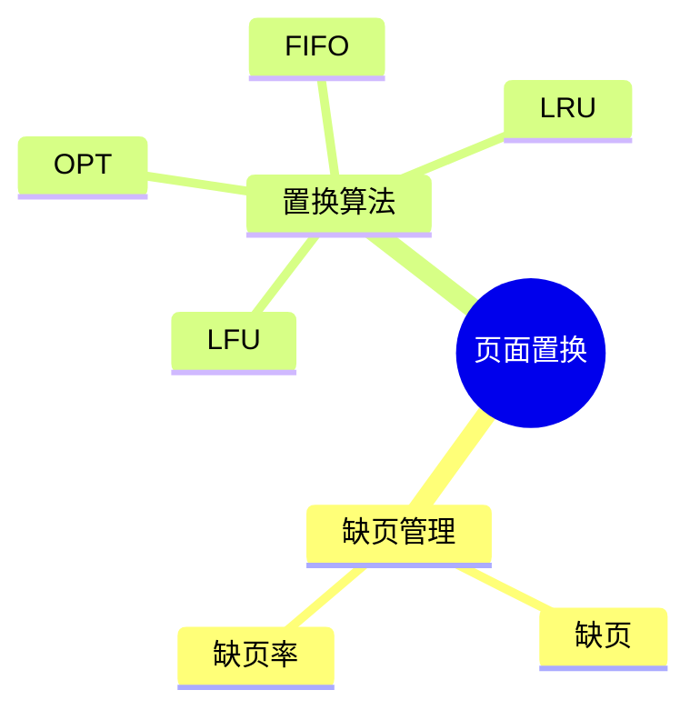
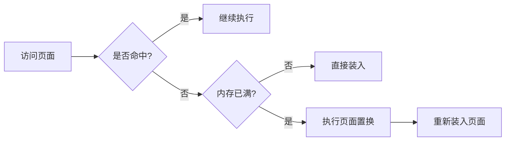

# 第八节 页面置换算法（Page Replacement）

> **说明**
> 本文依据《2.操作系统知识》资料中页面置换算法部分整理，保持原资料知识框架，并补充知识图、学习建议和工程实践视角。

## 一句话理解

**当物理内存无法容纳新的页面时，操作系统需要选择一个页面淘汰，这就是页面置换算法。**

------------------------------------------------------------------------

## 学习目标

-   理解缺页与页面置换
-   掌握 OPT、FIFO、LRU、LFU 的思想
-   理解不同算法的优缺点
-   能分析页面置换题

------------------------------------------------------------------------

## 知识导图



## 1. 页面置换概述

在分页存储系统中，当发生缺页且内存已满时，需要选择一个页面淘汰，再装入新的页面。资料将
OPT、FIFO、LRU、LFU 作为重点算法进行介绍。

## 2. OPT（最佳置换）

-   淘汰未来最长时间不会再访问的页面
-   理论最优
-   实际系统无法准确实现

**特点：**

-   缺页率最低
-   常作为其他算法的比较基准

## 3. FIFO（先进先出）

-   最早进入内存的页面最先淘汰
-   实现简单
-   可能出现 **Belady 异常**

## 4. LRU（最近最少使用）

-   淘汰最近最长时间未被访问的页面
-   基于局部性原理
-   实际应用广泛

## 5. LFU（最少使用）

-   淘汰访问次数最少的页面
-   需要维护访问计数
-   实现复杂度较高

------------------------------------------------------------------------

## 6. 四种算法对比

| 算法 | 核心思想 | 优点 | 缺点 |
| --- | --- | --- | --- |
| OPT | 淘汰未来最久不用页面 | 理论最优 | 无法真实实现 |
| FIFO | 先进先出 | 实现简单 | 可能出现 Belady 异常 |
| LRU | 最近最少使用 | 性能较好 | 维护成本较高 |
| LFU | 使用次数最少 | 适合稳定访问模式 | 需维护访问频率 |

------------------------------------------------------------------------

## 7. 页面置换流程



------------------------------------------------------------------------

## 真题分析思路

1.  按访问序列逐页访问。
2.  判断命中或缺页。
3.  根据算法选择淘汰页面。
4.  统计缺页次数与缺页率。

资料中包含页面置换相关计算题，应重点练习访问序列分析。

## 高频考点

-   OPT、FIFO、LRU、LFU 特点
-   页面置换过程
-   缺页次数计算
-   Belady 异常

## 易错点

> **注意：** OPT 是理论算法，不用于实际系统。

> **注意：** FIFO 并非总优于 LRU，且可能出现 Belady 异常。

## AI 学习建议

```text
请给出一个页面访问序列，分别用 OPT、FIFO、LRU、LFU 四种算法模拟页面置换，并统计缺页次数。
```

## 开发者视角

现代操作系统通常采用 LRU
的近似实现，以兼顾性能与实现成本。数据库缓冲池和缓存系统也广泛采用类似思想。

## 架构师思考

缓存命中率直接影响系统性能。理解页面置换算法，有助于分析操作系统、数据库和分布式缓存的资源管理策略。

## 一分钟速记

```text
OPT → 理论最优
FIFO → 最早进入先淘汰
LRU → 最近最少使用
LFU → 使用次数最少
```

## 本节总结

页面置换算法是分页存储管理的重要组成部分，也是系统架构设计师考试中的高频计算内容，应重点掌握四种经典算法及其特点。

## 下一节

➡ [继续阅读：设备管理](./10-device-management)
