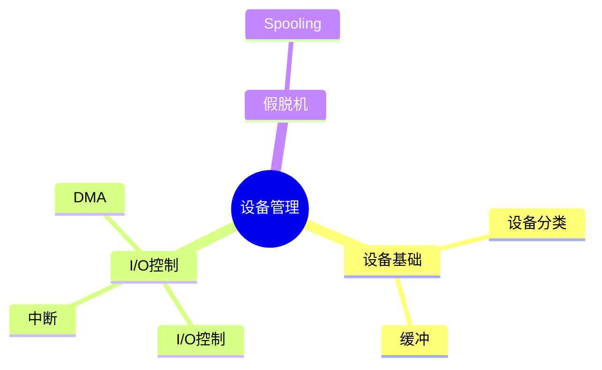
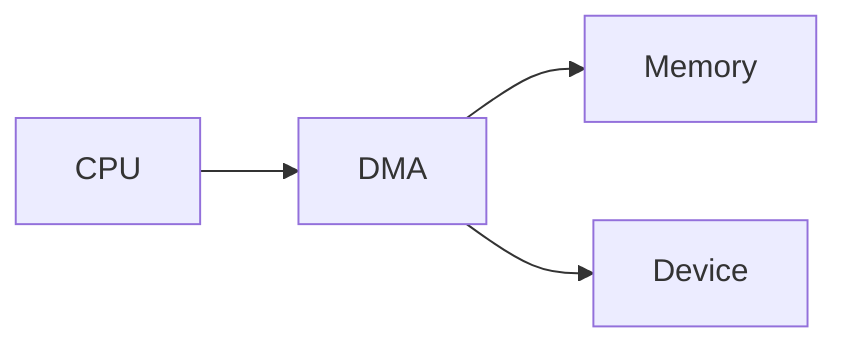

# 第九节 设备管理（Device Management）

> **说明**
> 本文依据《2.操作系统知识》资料中设备管理相关内容整理，保持原资料知识框架，并补充知识图、学习建议和工程实践视角。

## 一句话理解

**设备管理负责协调 CPU、内存与各种输入输出设备之间的数据交换，提高 I/O
效率并实现资源共享。**

## 学习目标

-   理解设备管理目标
-   掌握设备分类与控制方式
-   理解缓冲技术与 Spooling 技术
-   能分析常见设备管理题

## 知识导图



## 1. 设备管理概述

设备管理负责管理各类输入输出设备，实现设备分配、回收和数据传输，提高系统整体效率。资料重点介绍了设备控制方式、缓冲技术及
Spooling 技术。

## 2. I/O设备分类

| 分类 | 示例 |
| --- | --- |
| 输入设备 | 键盘、鼠标、扫描仪 |
| 输出设备 | 显示器、打印机 |
| 输入/输出设备 | 磁盘、网卡 |

## 3. 设备控制方式

### 程序控制方式

CPU 持续查询设备状态，实现简单但效率较低。

### 中断控制方式

设备完成操作后通过中断通知 CPU，减少等待时间。

### DMA 方式

DMA 控制器直接在设备与内存之间传输数据，降低 CPU 开销。

### 通道控制方式

利用 I/O 通道统一管理设备，适用于大型系统。



## 4. 缓冲技术

缓冲区用于协调 CPU 与外设速度差异，可减少等待、提高吞吐量。

常见形式：

-   单缓冲
-   双缓冲
-   循环缓冲

## 5. Spooling 技术

Spooling（假脱机）利用磁盘模拟共享设备，实现设备共享和脱机处理，打印系统是典型应用。

## 6. 真题分析思路

1.  判断采用的 I/O 控制方式。
2.  分析 CPU 是否参与数据传输。
3.  比较不同控制方式的效率。
4.  判断缓冲或 Spooling 的应用场景。

## 高频考点

-   中断与 DMA 区别
-   四种设备控制方式
-   Spooling 技术
-   缓冲技术作用

## 易错点

> **注意：** DMA 并非 CPU 完全不参与，只是不直接搬运数据。

> **注意：** Spooling 是利用磁盘实现共享，不是增加新的物理设备。

## AI 学习建议

```text
请比较程序控制、中断控制、DMA 和通道控制四种 I/O 控制方式，并结合实际案例说明各自适用场景。
```

## 开发者视角

现代 SSD、网卡和 GPU 普遍采用 DMA 技术，以减少 CPU
数据搬运开销，提高整体性能。

## 架构师思考

高性能系统应合理利用异步 I/O、DMA 和缓冲机制，降低阻塞，提高吞吐能力。

## 一分钟速记

```text
程序控制 → CPU轮询
中断 → 完成通知
DMA → 直接传输
通道 → 集中管理
Spooling → 假脱机
```

## 本节总结

设备管理重点考查 I/O 控制方式、DMA、缓冲和 Spooling
技术，应结合资料中的典型例题理解各种方式的适用场景。

## 下一节

➡ [继续阅读：文件管理](./11-file-management)
