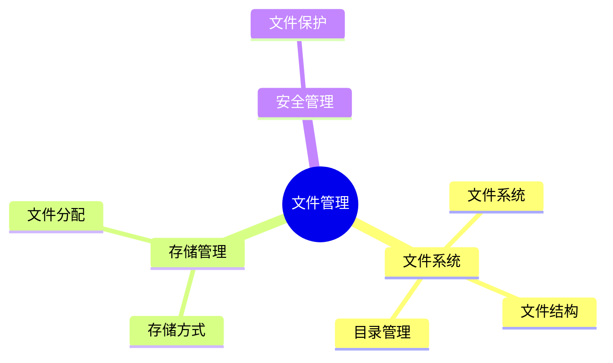
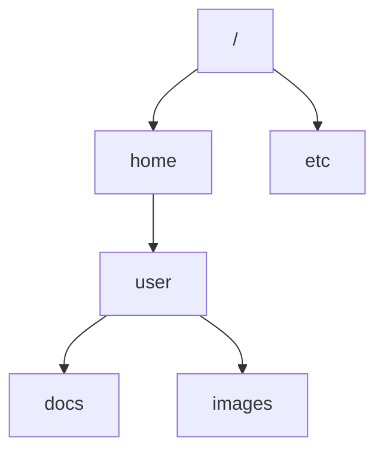

# 第十节 文件管理（File Management）

> **说明**
> 本文依据《2.操作系统知识》资料中**文件管理**相关内容整理，保持原资料知识框架，并补充知识图、学习建议和工程实践视角。

## 一句话理解

**文件管理负责对文件和目录进行组织、存储、检索与保护，为用户和应用程序提供统一的数据访问接口。**

## 学习目标

-   理解文件系统的作用
-   掌握文件的逻辑结构与物理结构
-   理解目录管理
-   掌握文件存储方式及访问方式

## 知识导图



## 1. 文件管理概述

文件管理负责文件的创建、删除、读写、共享和保护，为用户提供统一的数据组织方式，是操作系统的重要组成部分。

## 2. 文件的逻辑结构

常见逻辑结构：

-   无结构文件（流式文件）
-   有结构文件（记录式文件）

不同结构适用于不同的数据组织方式。

## 3. 目录管理

目录用于组织文件并建立文件名与存储位置之间的映射关系。

常见目录结构：

-   一级目录
-   二级目录
-   树形目录



## 4. 文件物理存储方式

| 存储方式 | 特点 |
| --- | --- |
| 连续分配 | 顺序访问快，但易产生外部碎片 |
| 链接分配 | 扩展方便，随机访问效率低 |
| 索引分配 | 随机访问效率高，实现较复杂 |

资料重点介绍了三种典型文件分配方式及其特点。

## 5. 文件访问方式

-   顺序访问
-   随机访问

不同应用场景对访问方式要求不同。

## 6. 文件保护

常见措施包括：

-   文件权限控制
-   用户身份认证
-   文件共享控制
-   数据备份与恢复

## 真题分析思路

1.  判断目录结构类型。
2.  比较三种文件分配方式。
3.  根据题意分析访问效率。
4.  判断文件保护机制。

## 高频考点

-   树形目录
-   连续、链接、索引分配
-   顺序访问与随机访问
-   文件保护

## 易错点

> **注意：** 连续分配访问效率高，但容易产生外部碎片。

> **注意：** 索引分配并非没有额外开销，需要维护索引块。

## AI 学习建议

```text
请比较连续分配、链接分配和索引分配三种文件存储方式，并结合磁盘访问场景说明各自优缺点。
```

## 开发者视角

Linux 的 ext4、Windows 的 NTFS
等现代文件系统都采用索引思想，并提供日志、权限和恢复机制，以提升可靠性。

## 架构师思考

设计分布式存储或对象存储时，同样需要考虑目录组织、元数据管理、访问效率和数据可靠性等问题。

## 一分钟速记

```text
文件系统
↓
目录管理
↓
连续分配
链接分配
索引分配
↓
权限保护
```

## 本节总结

文件管理主要考查目录结构、文件分配方式和访问方式。应重点掌握三种物理存储方式的特点及适用场景，并结合资料中的典型例题进行理解。

## 下一节

➡ [继续阅读：本章练习](./12-exercises)
