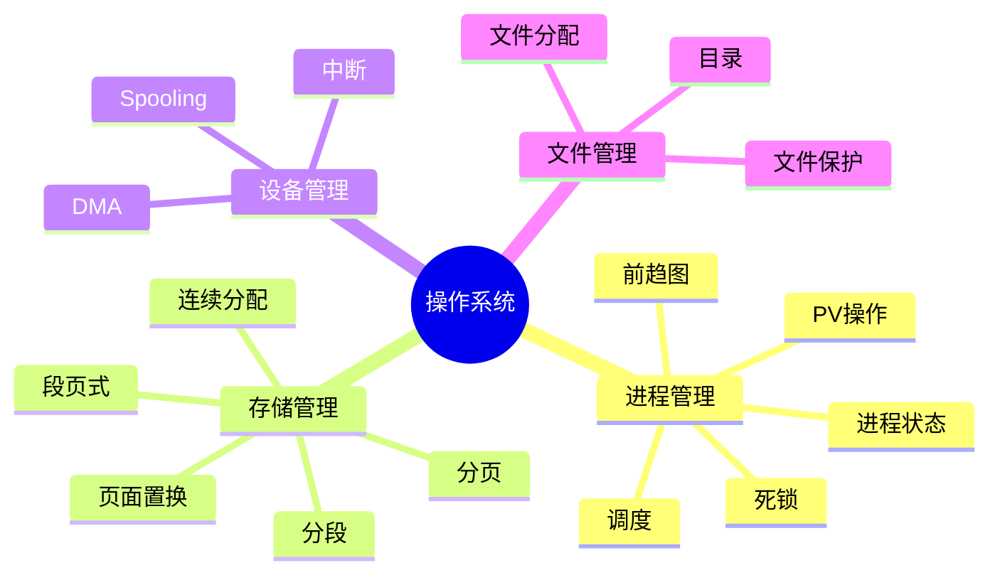

# 第二章总结（Summary）

> **说明**
> 本文依据《2.操作系统知识》资料，对本章核心知识进行归纳总结，帮助建立整体知识体系。

## 本章知识框架



## 核心知识回顾

### 1. 进程管理

-   进程状态转换
-   PCB
-   前趋图
-   PV 操作
-   调度算法
-   死锁分析

### 2. 存储管理

-   连续分配
-   分页
-   分段
-   段页式
-   页面置换算法

### 3. 设备管理

-   程序控制
-   中断控制
-   DMA
-   通道控制
-   Spooling
-   缓冲技术

### 4. 文件管理

-   文件系统
-   树形目录
-   连续、链接、索引分配
-   文件访问方式
-   文件保护

## 高频考点

| 模块 | 重点 |
| --- | --- |
| 进程 | PV、调度、死锁 |
| 存储 | 分页、分段、页面置换 |
| 设备 | DMA、Spooling |
| 文件 | 文件分配、目录结构 |

## 学习路线建议

1.  理解基本概念。
2.  掌握算法特点与适用场景。
3.  熟练完成计算题和分析题。
4.  结合历年真题查漏补缺。

## AI 学习建议

```text
请根据《操作系统》章节，为我生成一套综合复习提纲，并针对薄弱知识点设计专项练习。
```

## 开发者视角

操作系统中的调度、内存、I/O 和文件系统思想，在现代
Linux、Windows、数据库、中间件及云原生平台中均有广泛应用。

## 架构师思考

系统架构设计不仅需要掌握概念，更要理解资源管理、并发控制和性能优化背后的设计思想，并能够迁移到实际项目中。

## 一分钟速记

```text
进程 → 调度 → 死锁
存储 → 分页 → 页面置换
设备 → DMA → Spooling
文件 → 目录 → 分配
```

## 本章完成情况

-   ✅ 01 操作系统概述
-   ✅ 02 进程状态
-   ✅ 03 前趋图
-   ✅ 04 进程同步
-   ✅ 05 进程调度
-   ✅ 06 死锁
-   ✅ 07 存储管理
-   ✅ 08 页面置换
-   ✅ 09 设备管理
-   ✅ 10 文件管理
-   ✅ 11 本章练习
-   ✅ 12 本章总结

> 至此，第二章《操作系统》学习内容整理完成。建议结合本章练习复盘薄弱知识点。

---

## 下一章

➡ [继续学习：第三章 数据库系统](../chapter-03/01-database-system)
