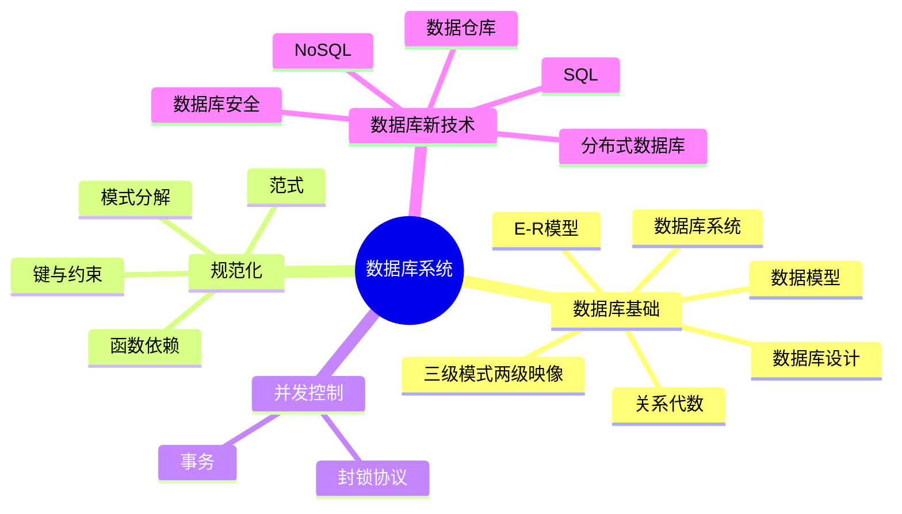

# 第三章 数据库系统

> **说明**
> 本章依据《3.数据库系统》资料整理，围绕数据库基础、规范化与并发控制、数据库新技术三大部分展开，保持原资料知识框架，并扩展为适合
> 知识库 的知识库。

## 本章学习目标

完成本章后，你将能够：

-   理解数据库系统组成及三级模式两级映像
-   掌握数据库设计流程与 E-R 模型
-   熟悉关系模型与关系代数
-   掌握函数依赖、键与范式
-   理解模式分解、事务与并发控制
-   掌握数据库安全、分布式数据库、数据仓库、NoSQL 与 SQL 基础

## 知识导图



## 文档目录

| 学习单元 | 内容 |
| --- | --- |
| [数据库系统概述](./02-database-overview) | DB、DBMS、DBS 等基础概念 |
| [三级模式两级映像](./03-three-schema) | 数据抽象层次与数据独立性 |
| [数据库设计](./04-database-design) | 六个设计阶段与 E-R 图设计 |
| [数据模型](./05-data-model) | 数据模型三要素、E-R 模型与转换 |
| [关系代数](./06-relational-algebra) | 集合运算、投影、选择与自然连接 |
| [函数依赖](./07-functional-dependency) | 部分依赖、传递依赖与 Armstrong 公理 |
| [键与约束](./08-keys-and-constraints) | 各类键与完整性约束 |
| [规范化](./09-normalization) | 1NF、2NF、3NF 与 BCNF |
| [模式分解](./10-schema-decomposition) | 无损连接与保持函数依赖 |
| [并发控制](./11-concurrency-control) | 事务、ACID 与并发问题 |
| [封锁协议](./12-lock-protocol) | 三级封锁协议及其作用 |
| [SQL](./13-sql) | DDL、DML、查询与连接 |
| [新型数据库](./14-new-database) | NoSQL 类型、特点与应用场景 |
| [章节练习](./15-exercises) | 数据库核心考点综合自测 |
| [历年真题复习](./16-past-exams) | 高频考点、题型与答题模板 |
| [第三章总结](./17-summary) | 知识体系、易错点与复习路线 |

## 学习建议

建议按照"数据库基础 → 数据库设计 → 规范化 → 并发控制 → SQL →
新技术"的顺序学习，每完成一节及时结合真题复习。

## AI 学习建议

```text
请作为系统架构设计师讲师，根据第三章数据库系统内容，为我逐节讲解知识点，并结合历年真题和开发实践进行分析。
```

## 下一节

➡ [开始学习：数据库系统概述](./02-database-overview)

