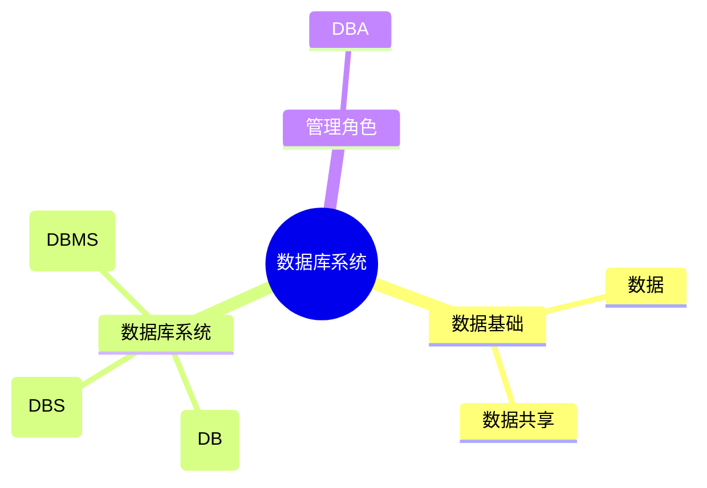
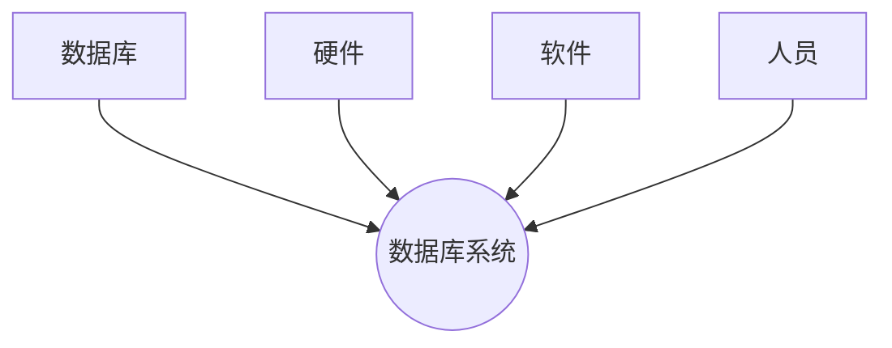

# 第一节 数据库系统概述

> **说明** 本文依据《第三章
> 数据库系统》资料中的"数据库系统"内容整理，保持原资料知识框架，并补充知识图、学习建议与工程实践视角。

## 一句话理解

**数据库系统（DBS）是利用数据库技术，对大量相关数据进行组织、存储、管理和共享的计算机系统。**

## 学习目标

-   理解数据、数据库、数据库系统、DBMS 的概念
-   掌握 DBS 的组成
-   熟悉 DBMS 的主要功能
-   理解数据库的基本特性

## 知识导图



## 1. 数据

资料指出，**数据**是数据库中存储的基本对象，是对客观事物的符号记录，可包括文本、图像、音频、视频等多种形式。

## 2. 数据库（DB）

数据库是**长期存储在计算机内、有组织、可共享的大量数据集合**。其特点包括：

-   按数据模型组织与存储
-   数据共享
-   数据冗余较小
-   数据独立性较高
-   易于扩展

## 3. 数据库系统（DBS）

数据库系统由四部分组成：

-   数据库（DB）
-   硬件
-   软件（操作系统、DBMS、应用程序）
-   人员（DBA、开发人员、最终用户等）



## 4. 数据库管理系统（DBMS）

资料中总结 DBMS 主要负责：

-   数据定义
-   数据操作
-   数据运行管理
-   数据存储管理
-   数据库建立与维护

## 高频考点

-   DB、DBMS、DBS 的区别
-   DBS 的组成
-   DBMS 的主要功能
-   数据库基本特性

## 易错点

> **注意：** DB（数据库）是数据集合；DBMS 是管理软件；DBS
> 是包含数据库、软件、硬件和人员的完整系统。

## AI 学习建议

```text
请比较 DB、DBMS、DBA 与 DBS 的区别，并结合实际项目举例说明它们之间的关系。
```

## 开发者视角

实际开发中常见的 MySQL、PostgreSQL、Oracle 都属于 **DBMS**；应用程序通过
DBMS 访问数据库，而不是直接操作底层数据文件。

## 架构师思考

设计数据库系统时，不仅要关注数据库本身，还需要综合考虑硬件、软件平台、权限管理和运维体系，才能构建稳定可靠的数据平台。

## 一分钟速记

```text
数据
 ↓
数据库(DB)
 ↓
DBMS
 ↓
DBS = DB + 硬件 + 软件 + 人员
```

## 本节总结

本节建立了数据库系统的基础概念，后续将进一步学习**三级模式两级映像**，理解数据库如何实现数据独立性。

## 下一节

➡ [继续阅读：三级模式两级映像](./03-three-schema)
