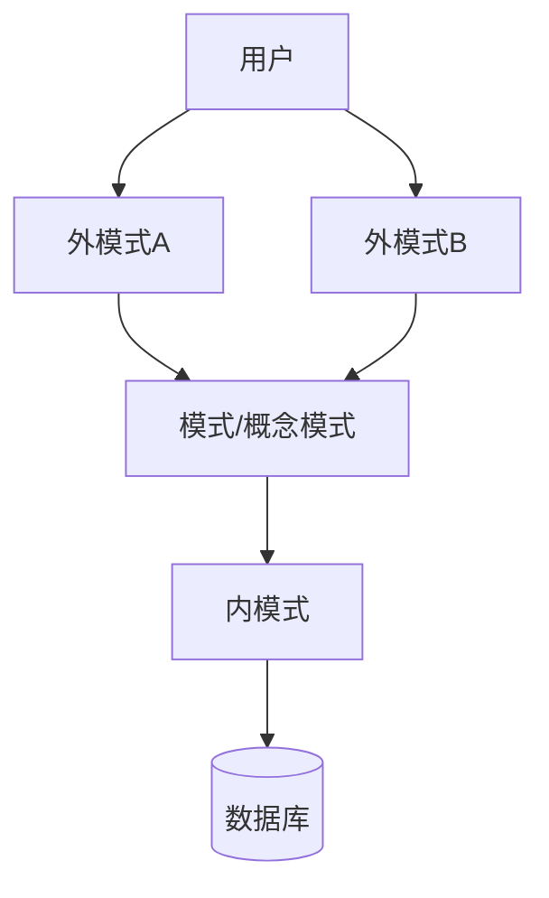

# 第二节 三级模式两级映像

> **说明** 本文依据《第三章
> 数据库系统》资料中"三级模式---两级映像"内容整理，保持原资料知识框架，并补充知识图、学习建议和工程实践视角。

## 一句话理解

**三级模式描述数据库的不同抽象层次，两级映像保证数据独立性。**

## 学习目标

-   理解内模式、模式、外模式
-   掌握两级映像
-   理解逻辑独立性与物理独立性
-   能分析相关考试题

## 知识导图



## 1. 三级模式

### 外模式

对应不同用户看到的数据视图，是数据库的**视图层**。

### 模式（概念模式）

数据库的全局逻辑结构，是用户通常接触的数据模型。

### 内模式

描述数据的物理存储方式，如文件组织、索引等。

## 2. 两级映像

#### 外模式—模式映像

维护视图与概念模式之间的对应关系。

修改概念模式时，只需调整映像即可，应用程序通常无需修改，从而保证**逻辑独立性**。

### 模式—内模式映像

维护概念模式与物理存储之间的映射关系。

改变存储结构时，只需修改映像即可，保证**物理独立性**。


## 3. 数据独立性

| 类型 | 依赖映像 | 含义 |
| --- | --- | --- |
| 逻辑独立性 | 外模式---模式映像 | 概念结构变化尽量不影响应用 |
| 物理独立性 | 模式---内模式映像 | 存储方式变化尽量不影响应用 |

## 真题分析

考试通常考查：

1.  三个模式的职责。
2.  两级映像分别保证什么独立性。
3.  DB、DBMS、DBS 与三级模式综合理解。

## 高频考点

-   外模式
-   模式
-   内模式
-   两级映像
-   逻辑独立性
-   物理独立性

## 易错点

> **注意：**
> 外模式---模式映像保证逻辑独立性；模式---内模式映像保证物理独立性，两者不要混淆。

## AI 学习建议

```text
请结合三级模式两级映像，解释数据库为什么能够实现逻辑独立性和物理独立性，并结合真实项目举例。
```

## 开发者视角

ORM（如
Prisma、Hibernate）实际上屏蔽了大量底层存储细节，开发者更多接触的是概念模式和外部视图，而数据库索引、页结构等属于内模式范畴。

## 架构师思考

大型系统升级数据库存储结构时，应尽量通过映射层完成兼容，避免影响上层业务，这正体现了数据库独立性的设计思想。

## 一分钟速记

```text
外模式 → 用户视图
模式 → 全局逻辑
内模式 → 物理存储

外-模映像 → 逻辑独立
模-内映像 → 物理独立
```

## 本节总结

三级模式与两级映像是数据库体系结构的核心，也是软考数据库部分最常见的基础考点，应重点掌握三个模式的职责及两类数据独立性的对应关系。

## 下一节

➡ [继续阅读：数据库设计](./04-database-design)

