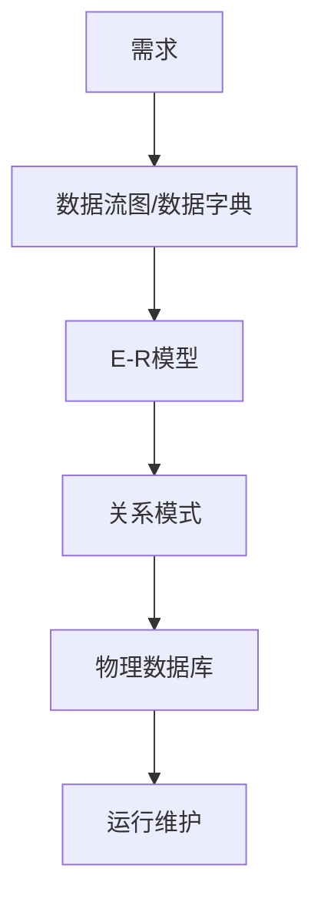

# 第三节 数据库设计

> 本文依据《第三章
> 数据库系统》中"数据库设计"部分整理。资料将数据库设计划分为六个阶段，并重点介绍概念结构设计及
> E-R 图设计。

## 一句话理解

数据库设计就是**从业务需求逐步设计出最终数据库结构**的过程。

## 学习目标

-   理解数据库设计六个阶段
-   掌握每个阶段的主要任务
-   理解 E-R 图在设计中的位置
-   能完成数据库设计相关真题

## 总体流程


## 六个阶段

### 1. 需求分析

资料指出，本阶段需要分析数据存储需求，形成：

-   数据流图
-   数据字典
-   需求说明书

并明确：

-   信息要求
-   处理要求
-   系统要求

------------------------------------------------------------------------

### 2. 概念结构设计

核心工作是设计 **E-R 图（实体---联系图）**。

主要步骤：

-   设计局部 E-R 图
-   合并局部 E-R 图
-   得到全局 E-R 图

资料指出，E-R 图合并时主要存在三类冲突：

-   属性冲突
-   命名冲突
-   结构冲突

------------------------------------------------------------------------

### 3. 逻辑结构设计

将 E-R 模型转换为指定的数据模型。

主要工作：

-   转换关系模式
-   确定完整性约束
-   确定用户视图

------------------------------------------------------------------------

### 4. 物理设计

主要确定：

-   数据分布
-   存储结构
-   访问方式

------------------------------------------------------------------------

### 5. 数据库实施

根据逻辑设计和物理设计结果：

-   建立数据库
-   编写应用程序
-   数据装载
-   调试运行

------------------------------------------------------------------------

### 6. 数据库运行与维护

系统投入运行后，需要持续：

-   评价
-   调整
-   修改

## 数据库设计流程图



## 真题分析

常见考法：

-   数据库设计阶段排序
-   哪个阶段设计 E-R 图
-   哪个阶段建立数据库
-   哪个阶段形成数据字典

## 高频考点

-   六个阶段顺序
-   概念结构设计
-   E-R 图
-   三类冲突
-   数据流图、数据字典

## 易错点

> 概念结构设计负责 E-R 图；逻辑结构设计负责关系模式；物理设计负责存储。

## AI 学习建议

```text
请结合一个图书管理系统，按照数据库设计六个阶段完成数据库设计全过程。
```

## 开发者视角

真实项目中通常会先完成产品需求、ER 建模，再生成 MySQL/PostgreSQL
表结构，最后交由 ORM（Prisma、TypeORM 等）管理。

## 架构师思考

优秀的数据库设计应尽量在需求分析阶段发现问题，而不是等到编码后再修改数据模型。

## 一分钟速记

```text
需求分析
↓
概念设计(E-R)
↓
逻辑设计
↓
物理设计
↓
实施
↓
运行维护
```

## 下一节

➡ [继续阅读：数据模型](./05-data-model)

