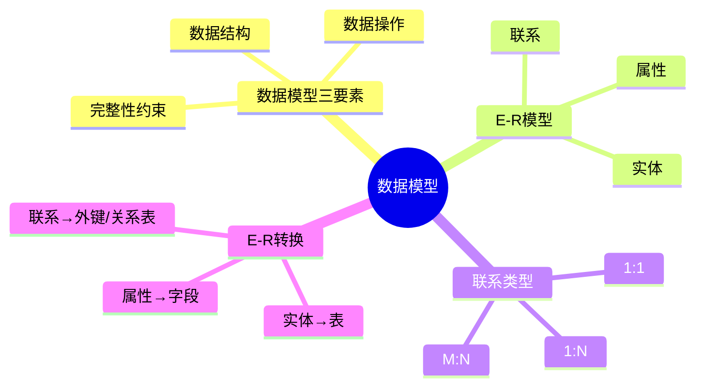
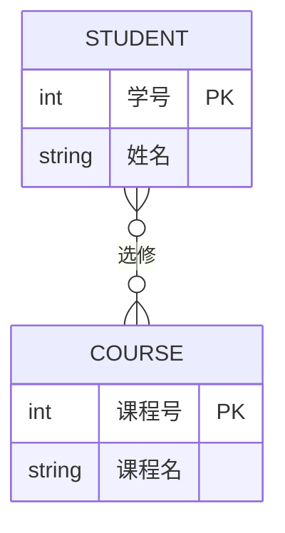

# 第四节 数据模型

> **说明** 本文依据《第三章
> 数据库系统》中"数据模型"相关内容整理，包含数据模型基础、E-R
> 模型、实体、属性、联系、联系类型以及 E-R
> 图转换为关系模型等内容。

## 一句话理解

**数据模型是描述现实世界数据、数据之间联系以及数据处理方式的抽象模型，是数据库设计的核心基础。**

## 学习目标

-   理解数据模型的作用
-   掌握数据模型三要素
-   理解 E-R 模型及组成
-   掌握 1:1、1:N、M:N 联系
-   掌握 E-R 图转换为关系模型

## 知识导图



## 1. 数据模型概述

数据模型用于描述数据库中数据的组织方式、数据之间的联系以及允许执行的操作，是数据库设计的重要工具。教材围绕概念模型及
E-R 模型展开介绍。

### 数据模型三要素

| 要素 | 说明 |
| --- | --- |
| 数据结构 | 数据及其相互关系 |
| 数据操作 | 对数据进行查询、更新等操作 |
| 完整性约束 | 保证数据正确性、一致性 |

## 2. E-R 模型

E-R（Entity-Relationship）模型用于概念结构设计。

### 实体（Entity）

现实世界中能够独立存在的对象，如学生、教师、课程。

### 属性（Attribute）

描述实体特征的数据项，如姓名、学号、课程名等，可包含主键（Key）及可为空（NULL）等属性。

### 联系（Relationship）

描述实体之间的关联，例如学生选课、教师授课。



## 3. 联系类型

| 类型 | 特点 | 转换规则 |
| --- | --- | --- |
| 1:1 | 双方最多对应一个对象 | 任一方增加外键 |
| 1:N | 一方对应多个对象 | N 端增加外键 |
| M:N | 双方均可对应多个对象 | 建立独立关系表 |

这是考试中的重点内容。

## 4. E-R 图转换为关系模型

转换原则：

-   一个实体转换为一张关系表；
-   属性转换为字段；
-   主键保留为主键；
-   1:N 联系在 N 端增加外键；
-   M:N 联系建立新的关系表。


## 真题分析

常见题型：

1.  判断实体、属性、联系；
2.  判断 1:1、1:N、M:N；
3.  根据 E-R 图推导关系表；
4.  E-R 图与关系模型相互转换。

## 高频考点

-   数据模型三要素
-   实体、属性、联系
-   联系类型
-   E-R 图
-   E-R 转关系模型

## 易错点

> **注意：** M:N 联系必须建立独立关系表；1:N 联系应在 N
> 端保存外键，不要混淆。

## AI 学习建议

```text
请以学生选课系统为例，从需求分析开始绘制 E-R 图，并转换为关系模型，解释每一步设计原因。
```

## 开发者视角

实际项目通常先完成 E-R 建模，再生成 MySQL、PostgreSQL 等数据库表，并通过
ORM（Prisma、TypeORM、Hibernate 等）映射为程序中的实体对象。

## 架构师思考

优秀的数据模型能够降低系统耦合度，提高数据库扩展性，也是后续范式设计和性能优化的重要基础。

## 一分钟速记

```text
数据模型
├── 数据结构
├── 数据操作
├── 完整性约束

实体→表
属性→字段
1:N→N端外键
M:N→关系表
```

## 本节总结

数据模型是数据库设计的基础，E-R
模型是概念设计阶段最重要的工具，应重点掌握实体、属性、联系及 E-R
图转换规则，为后续关系代数和规范化学习打下基础。

## 下一节

➡ [继续阅读：关系代数](./06-relational-algebra)

