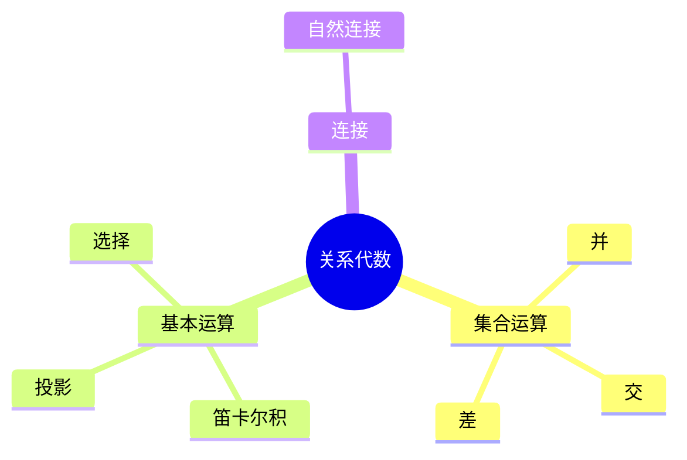
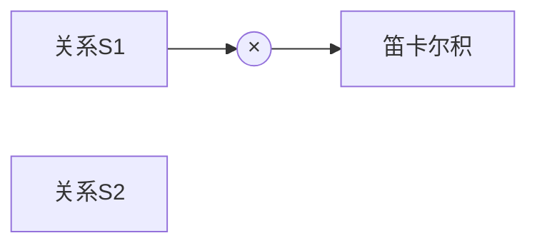
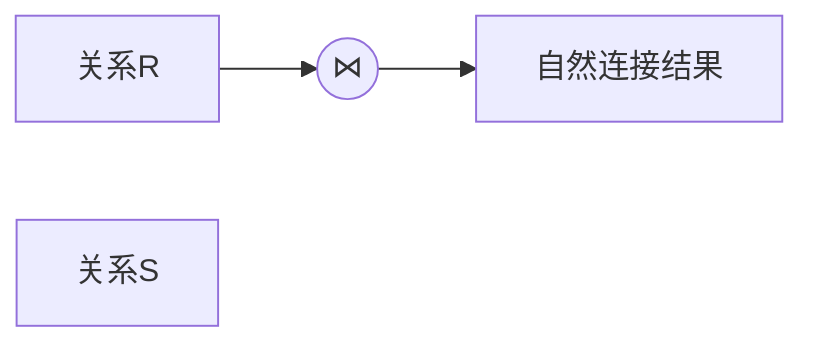

# 第五节 关系代数

> 本文依据《第三章 数据库系统》中 **关系代数**
> 一节整理，重点介绍集合运算、笛卡尔积、投影、选择及自然连接等内容。

## 一句话理解

**关系代数是一组针对关系（二维表）进行运算的操作，是 SQL
查询语言的理论基础。**

## 学习目标

-   理解关系代数基本思想
-   掌握五种基本运算
-   掌握自然连接
-   能根据关系代数推导查询结果

## 知识导图



## 1. 集合运算

教材介绍三种集合运算：

| 运算 | 含义 |
| --- | --- |
| 并（∪） | 合并两张表所有记录，相同记录只保留一次 |
| 交（∩） | 返回两张表共有记录 |
| 差（−） | 返回第一张表有、第二张表没有的记录 |

## 2. 笛卡尔积（×）

笛卡尔积将两张关系中的每条记录两两组合。

特点：

-   属性列 = 两张关系所有属性之和
-   记录数 = 两张关系记录数相乘



## 3. 投影（Projection）

投影用于**选择某些列**，教材指出可以按属性名或列号进行投影。

示例：

```text
π(Sno,Sname)(Student)
```

## 4. 选择（Selection）

选择用于**按条件筛选记录**。

示例：

```text
σ(Dept='IS')(Student)
```

## 5. 自然连接（⋈）

自然连接是在公共属性相等的条件下连接两个关系。

教材强调：

-   结果包含全部属性列；
-   相同属性列只保留一份；
-   按公共属性自动匹配。



## 真题分析

教材中的真题主要考查：

-   并、交、差结果
-   笛卡尔积记录数
-   自然连接后的属性列数量
-   将自然连接写成等价关系代数表达式。

## 高频考点

-   并、交、差
-   笛卡尔积
-   投影
-   选择
-   自然连接

## 易错点

> **注意：**
> 投影操作针对**列**；选择操作针对**行**。自然连接会自动去除重复的公共属性列。

## AI 学习建议

```text
请使用 Student、Course、Score 三张关系表，分别演示并、交、差、笛卡尔积、投影、选择和自然连接的执行过程。
```

## 开发者视角

SQL 中的大多数查询都可以映射为关系代数操作，例如：

-   SELECT 字段 → 投影
-   WHERE → 选择
-   JOIN → 自然连接（或其他连接）

理解关系代数有助于分析 SQL 执行逻辑。

## 架构师思考

关系代数是数据库查询优化的重要理论基础。查询优化器通常会重写关系代数表达式，以减少数据扫描和连接成本。

## 一分钟速记

```text
并：合并
交：共有
差：相减
投影：选列
选择：选行
连接：合表
```

## 本节总结

关系代数是关系数据库的核心理论基础，也是软考数据库章节的高频考点，应熟练掌握各种运算符的含义、特点及典型应用场景。

## 下一节

➡ [继续阅读：函数依赖](./07-functional-dependency)

