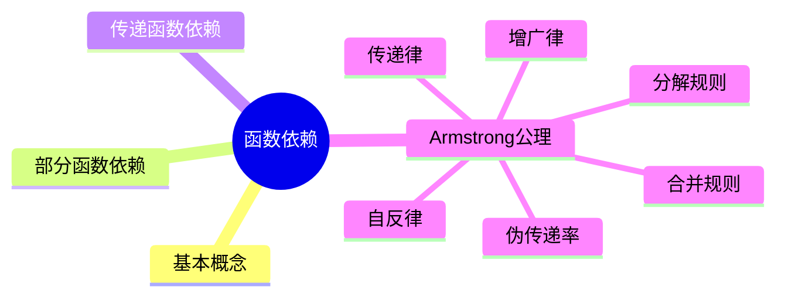
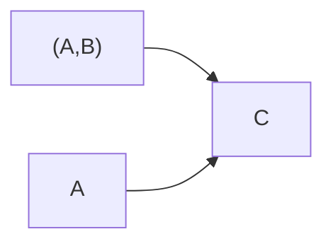

# 第六节 函数依赖

> **说明** 本文依据《第三章
> 数据库系统》中"函数依赖"章节整理，主要包括函数依赖、部分函数依赖、传递函数依赖以及
> Armstrong 公理系统等内容。

## 一句话理解

**函数依赖描述属性之间的确定关系，是数据库规范化理论的基础。**

## 学习目标

-   理解函数依赖定义
-   掌握部分函数依赖与传递函数依赖
-   掌握 Armstrong 公理
-   能分析函数依赖相关真题

## 知识导图



## 1. 函数依赖

教材给出了函数依赖的基本定义：若属性集 **X** 能唯一确定属性集
**Y**，则称 **Y 函数依赖于 X**，记作：

```text
X → Y
```

这是数据库设计和规范化分析的基础。

## 2. 部分函数依赖

若组合键的一部分即可决定某个属性，则称为**部分函数依赖**。

示例：

```text
(A,B) → C
A → C
```

说明 C 仅依赖组合键的一部分。



## 3. 传递函数依赖

若：

```text
A → B
B → C
```

则可推出：

```text
A → C
```

这种依赖关系称为**传递函数依赖**。


## 4. Armstrong 公理系统

教材介绍了函数依赖推导的核心规则：

| 公理 | 内容 |
| --- | --- |
| 自反律 | 若 Y⊆X，则 X→Y |
| 增广律 | 若 X→Y，则 XZ→YZ |
| 传递律 | 若 X→Y 且 Y→Z，则 X→Z |
| 合并规则 | 若 X→Y 且 X→Z，则 X→YZ |
| 分解规则 | 若 X→YZ，则 X→Y、X→Z |
| 伪传递率 | 若 X→Y，WY→Z，则 WX→Z |

## 真题分析

常见考查内容：

-   判断函数依赖
-   判断部分函数依赖
-   判断传递函数依赖
-   利用 Armstrong 公理推导函数依赖。

## 高频考点

-   函数依赖
-   部分函数依赖
-   传递函数依赖
-   Armstrong 公理

## 易错点

> **注意：**
> 部分函数依赖要求决定属性来自**组合键的一部分**；传递函数依赖则是通过中间属性间接确定目标属性。

## AI 学习建议

```text
请设计多个函数依赖实例，并判断哪些属于部分函数依赖、哪些属于传递函数依赖，再利用 Armstrong 公理完成推导。
```

## 开发者视角

函数依赖是数据库规范化（2NF、3NF、BCNF）的理论基础，也是数据库表设计的重要依据。

## 架构师思考

在大型系统中，合理分析函数依赖关系能够减少数据冗余，提高一致性，并降低后续维护成本。

## 一分钟速记

```text
X→Y
↓
部分依赖
↓
传递依赖
↓
Armstrong 公理
```

## 本节总结

函数依赖是数据库理论中的核心概念，也是后续学习键、范式和模式分解的基础，应重点掌握其定义及推导规则。

## 下一节

➡ [继续阅读：键与约束](./08-keys-and-constraints)

