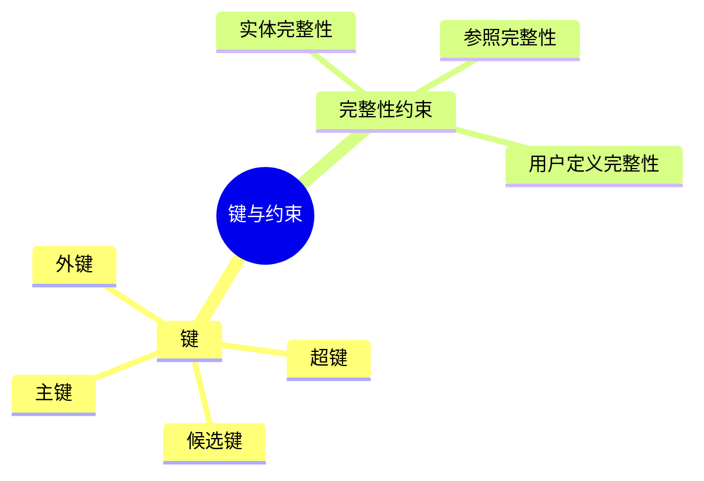
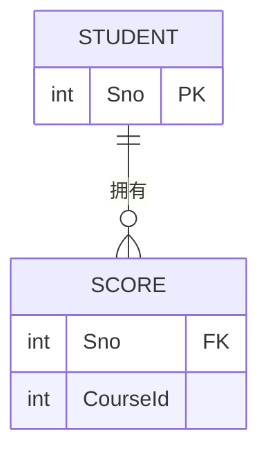

# 第七节 键与约束

> **说明** 本文依据《第三章
> 数据库系统》中与**键（Key）**相关内容整理，重点介绍超键、候选键、主键及完整性约束，并作为后续范式学习的基础。

## 一句话理解

**键用于唯一标识关系中的元组，约束用于保证数据库中数据的正确性与一致性。**

## 学习目标

-   理解超键、候选键、主键的区别
-   理解外键作用
-   掌握实体完整性、参照完整性和用户定义完整性
-   能分析键相关考试题

## 知识导图



## 1. 键（Key）

键用于唯一标识关系中的一个元组，是关系模型的重要组成部分。

### 超键（Super Key）

能够唯一标识元组的属性集，可以包含冗余属性。

### 候选键（Candidate Key）

能够唯一标识元组，且不存在多余属性，是最小超键。

### 主键（Primary Key）

从候选键中选定的一个作为主键，每张关系表通常只有一个主键。

### 外键（Foreign Key）

引用其他关系主键（或候选键）的属性，用于建立关系之间的联系。



## 2. 完整性约束

### 实体完整性

主键不能为空，也不能重复。

### 参照完整性

外键取值必须能够引用被参照关系中的有效主键（或为空，视设计而定）。

### 用户定义完整性

根据业务规则定义的数据约束，例如年龄范围、成绩区间等。

## 真题分析

常见考法：

-   判断超键、候选键、主键
-   判断外键关系
-   判断三类完整性约束
-   与函数依赖、范式综合考查。

## 高频考点

-   超键
-   候选键
-   主键
-   外键
-   实体完整性
-   参照完整性
-   用户定义完整性

## 易错点

> **注意：**
> 候选键是**最小超键**；主键是**选中的候选键**。不要把超键和候选键混为一谈。

## AI 学习建议

```text
请设计一个学生选课数据库，指出各关系中的超键、候选键、主键和外键，并说明采用了哪些完整性约束。
```

## 开发者视角

ORM 框架通常通过 `PRIMARY KEY`、`FOREIGN KEY`
等定义维护关系，业务校验则对应用户定义完整性。

## 架构师思考

合理选择主键和设计外键关系，有助于保证数据一致性，同时需要平衡约束强度与系统性能。

## 一分钟速记

```text
超键
 ↓ 最小化
候选键
 ↓ 选一个
主键

主键不能为空
外键保证关联
```

## 本节总结

键用于唯一标识数据，完整性约束用于保证数据质量。掌握各类键及三类完整性约束，是学习数据库规范化的重要前提。

## 下一节

➡ [继续阅读：规范化](./09-normalization)

