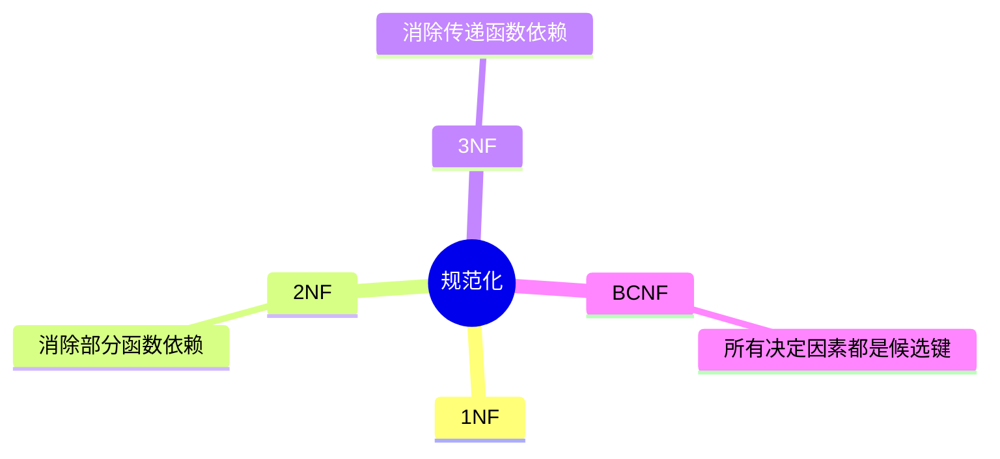
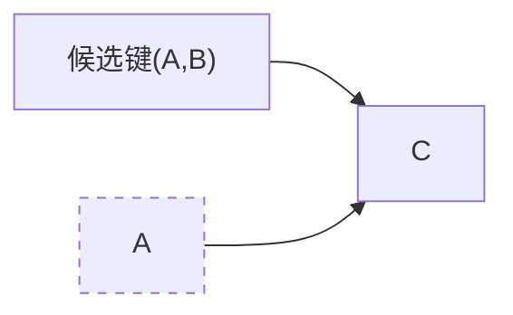
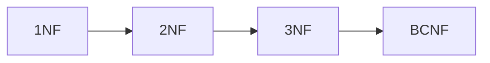

# 第八节 规范化（Normalization）

> **说明** 本文依据《第三章 数据库系统》中"规范化"章节整理，主要包括
> 1NF、2NF、3NF、BCNF
> 的概念、判定方法及其与函数依赖的关系。

## 一句话理解

**规范化的目标是在保证数据完整性的前提下，减少数据冗余，避免更新异常。**

## 学习目标

-   理解规范化目的
-   掌握 1NF、2NF、3NF、BCNF
-   理解部分函数依赖与传递函数依赖
-   能完成范式判断题

## 知识导图



## 为什么需要规范化

规范化用于解决：

-   数据冗余
-   插入异常
-   删除异常
-   更新异常

其理论基础是函数依赖。

## 1. 第一范式（1NF）

关系中的每个属性必须保持**原子性**，不能再分。

例如，一个字段中不能同时存放多个电话号码。

## 2. 第二范式（2NF）

在满足 1NF
的基础上，**消除非主属性对候选键的部分函数依赖**。



出现组合键的一部分即可决定非主属性时，不满足 2NF。

## 3. 第三范式（3NF）

在满足 2NF
的基础上，**消除非主属性对候选键的传递函数依赖**。


若 A→B、B→C，则 C 对 A 存在传递依赖。

## 4. BCNF（Boyce-Codd 范式）

BCNF 是 3NF 的进一步加强。

教材强调：**每一个决定因素都必须是候选键。**

## 范式关系



高一级范式一定满足低一级范式。

## 真题分析

教材中的典型考法：

-   判断关系属于哪一种范式；
-   根据函数依赖分析是否满足 2NF、3NF；
-   判断 BCNF 是否成立；
-   根据函数依赖进行关系分解。

## 高频考点

| 范式 | 核心要求 |
| --- | --- |
| 1NF | 属性具有原子性 |
| 2NF | 消除部分函数依赖 |
| 3NF | 消除传递函数依赖 |
| BCNF | 决定因素都是候选键 |

## 易错点

> **注意：** 2NF 关注**部分函数依赖**；3NF 关注**传递函数依赖**；BCNF
> 比 3NF 更严格，要求所有决定因素均为候选键。

## AI 学习建议

```text
请根据教材设计多个关系模式，分别判断属于 1NF、2NF、3NF 或 BCNF，并说明原因。
```

## 开发者视角

实际项目中，大部分业务数据库设计达到 **3NF**
即可；对于读多写少的系统，也可能为了性能进行适度反规范化。

## 架构师思考

规范化能够降低维护成本，但也可能增加关联查询次数。架构设计需要根据业务特点在规范化与性能之间做平衡。

## 一分钟速记

```text
1NF：原子性
2NF：去部分依赖
3NF：去传递依赖
BCNF：决定因素都是候选键
```

## 本节总结

规范化是数据库设计的重要理论基础。教材重点讲解了 1NF、2NF、3NF、BCNF
的判定方法及其与函数依赖之间的关系，是软考数据库章节的高频考点。

## 下一节

➡ [继续阅读：模式分解](./10-schema-decomposition)

