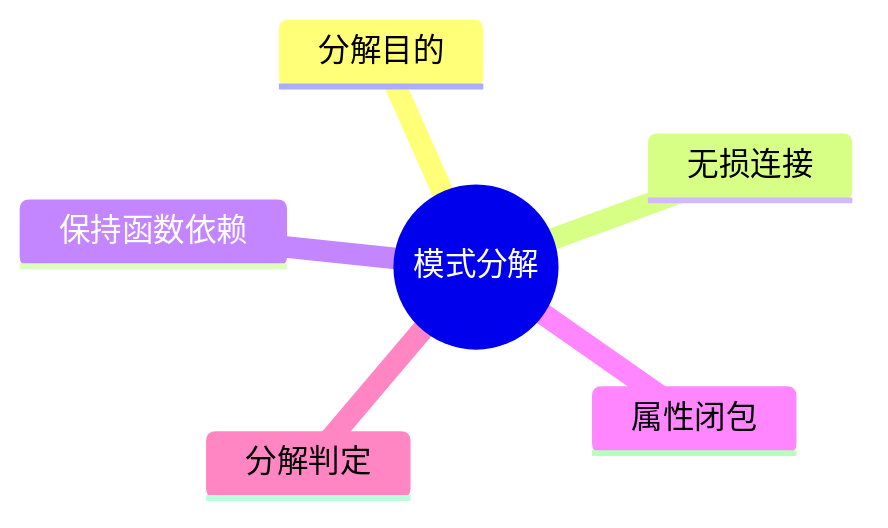
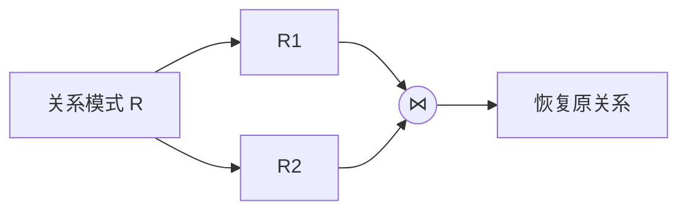

# 第九节 模式分解（Schema Decomposition）

> **说明** 本文依据《第三章
> 数据库系统》中"模式分解"相关内容整理，重点介绍模式分解、无损连接分解、保持函数依赖及相关判定方法。

## 一句话理解

**模式分解是在保持数据正确性的前提下，将一个关系模式拆分为多个关系模式，以减少冗余并提高数据库质量。**

## 学习目标

-   理解模式分解的目的
-   掌握无损连接分解
-   理解保持函数依赖
-   熟悉教材中的模式分解判定思路

## 知识导图



## 1. 为什么要进行模式分解

在完成规范化后，关系模式可能仍需要进一步拆分，以：

-   降低数据冗余
-   消除更新异常
-   提高数据一致性
-   保持良好的数据库结构

教材将模式分解作为规范化后的重要内容进行讲解。

## 2. 无损连接分解

无损连接分解（Lossless Join）要求：

> 将关系模式分解后，通过自然连接能够恢复原来的关系，不会丢失信息。



## 3. 保持函数依赖

教材指出，模式分解后应尽量保持原有函数依赖关系，即：

-   原有函数依赖能够继续成立；
-   不需要重新组合所有关系即可验证主要约束。

## 4. 属性闭包

教材在模式分解判定中使用属性闭包（Closure）思想。

属性闭包可用于：

-   判断函数依赖是否成立；
-   判断候选键；
-   判断是否保持函数依赖。


## 5. 模式分解判定

教材结合函数依赖给出了模式分解分析过程，常用于判断：

-   是否为无损连接分解；
-   是否保持函数依赖；
-   分解是否合理。

## 真题分析

常见题型：

1.  判断模式分解是否无损；
2.  判断是否保持函数依赖；
3.  利用属性闭包进行推导；
4.  综合函数依赖进行分解分析。

## 高频考点

| 知识点 | 考查重点 |
| --- | --- |
| 模式分解 | 分解目的 |
| 无损连接 | 是否可恢复原关系 |
| 保持函数依赖 | 分解后依赖是否保持 |
| 属性闭包 | 推导与判定 |

## 易错点

> **注意：**
> 无损连接与保持函数依赖并不是同一个概念。考试中常要求分别判断，两者都应重点掌握。

## AI 学习建议

```text
请根据教材给出的函数依赖关系，演示一次模式分解过程，并说明为什么属于无损连接、是否保持函数依赖。
```

## 开发者视角

实际开发中通常不会手工计算模式分解，但规范化设计、主键设计和索引规划都建立在这些理论基础之上。

## 架构师思考

数据库设计既要追求理论上的规范化，也要兼顾查询性能。在实际系统中，应在无损分解、依赖保持与业务性能之间取得平衡。

## 一分钟速记

```text
模式分解
├── 无损连接
├── 保持函数依赖
└── 属性闭包
```

## 本节总结

模式分解是规范化理论的重要延伸。教材重点围绕无损连接、保持函数依赖及属性闭包展开，这些内容也是数据库设计分析题的重要考点。

## 下一节

➡ [继续阅读：并发控制](./11-concurrency-control)

