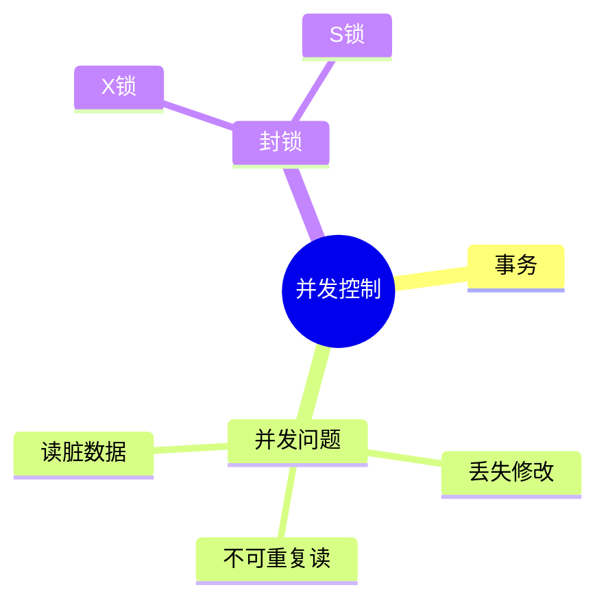
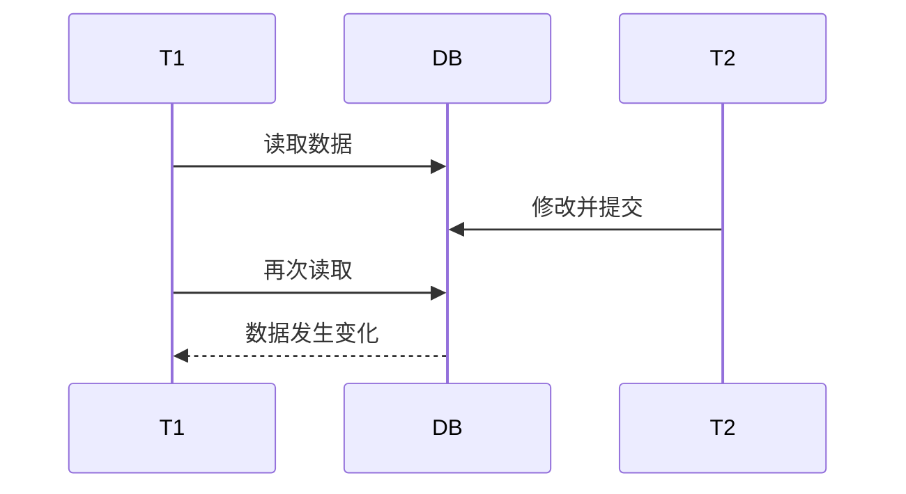
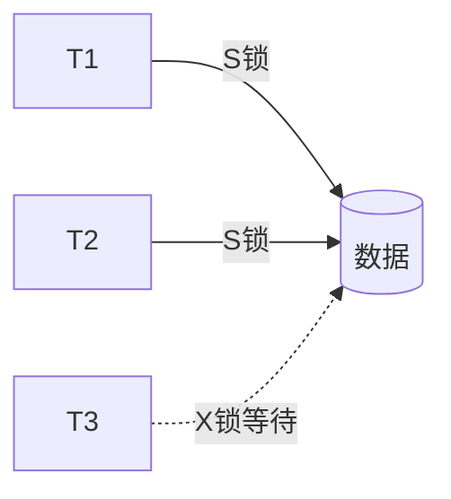

# 第十节 并发控制（Concurrency Control）

> **说明** 本文依据《第三章
> 数据库系统》中"并发控制"相关内容整理，围绕事务、并发操作带来的问题以及封锁控制等内容展开。

## 一句话理解

**并发控制用于保证多个事务同时执行时数据库仍保持一致性。**

## 学习目标

-   理解事务概念
-   理解并发操作产生的问题
-   掌握封锁控制思想
-   能分析并发控制相关真题

## 知识导图



## 1. 事务（Transaction）

事务是一组不可再分割的数据库操作单元，多个操作要么全部成功，要么全部失败。教材将事务作为并发控制的基础进行介绍。

### ACID 特性

| 特性 | 含义 |
| --- | --- |
| Atomicity | 原子性 |
| Consistency | 一致性 |
| Isolation | 隔离性 |
| Durability | 持久性 |

## 2. 并发操作带来的问题

教材重点介绍以下典型问题：

### 丢失修改（Lost Update）

两个事务同时修改同一数据，后提交的结果覆盖先提交的结果。

### 读脏数据（Dirty Read）

事务读取了另一个尚未提交事务修改的数据。

### 不可重复读（Non-repeatable Read）

同一事务两次读取同一数据，结果不同。



## 3. 封锁控制

教材介绍利用封锁机制协调事务执行。

### 排他锁（X Lock）

获得排他锁后，其它事务不能再读写该数据。

### 共享锁（S Lock）

多个事务可以同时读取，但不能修改。



## 真题分析

教材中的典型考法包括：

-   判断事务并发产生的问题；
-   判断封锁方式；
-   分析事务执行顺序；
-   综合事务与并发控制进行分析。

## 高频考点

-   事务
-   ACID
-   丢失修改
-   读脏数据
-   不可重复读
-   S锁
-   X锁

## 易错点

> **注意：**
> 不要混淆读脏数据与不可重复读：前者读取的是**未提交数据**，后者读取的是**已提交但发生变化的数据**。

## AI 学习建议

```text
请设计两个事务并发执行的案例，分别演示丢失修改、读脏数据和不可重复读，并分析如何利用封锁机制解决。
```

## 开发者视角

数据库事务广泛应用于订单、支付、库存等业务。合理使用事务和锁机制，有助于保证数据一致性。

## 架构师思考

高并发系统既要保证数据一致性，也要避免锁竞争过于严重。架构设计通常需要在一致性与性能之间进行权衡。

## 一分钟速记

```text
事务
↓
ACID
↓
并发问题
├── 丢失修改
├── 读脏数据
└── 不可重复读
↓
S锁 / X锁
```

## 本节总结

并发控制是数据库事务管理的重要组成部分。教材重点围绕事务、并发问题及封锁机制展开，是数据库设计与分析题中的重要考点。

## 下一节

➡ [继续阅读：封锁协议](./12-lock-protocol)

