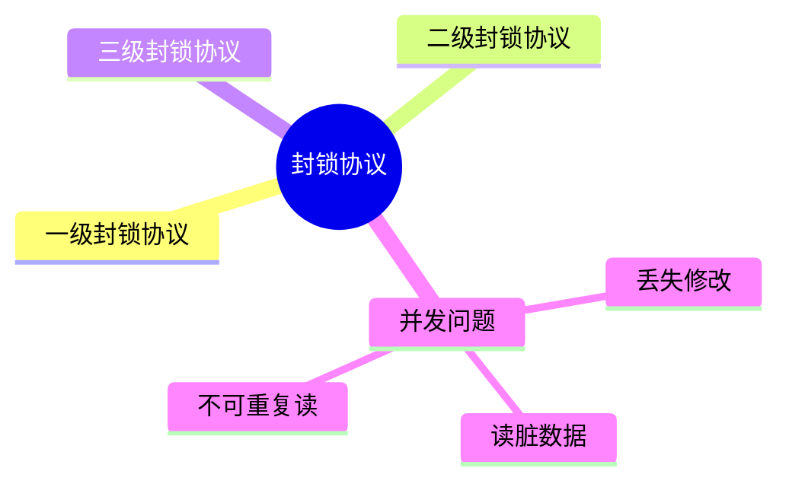
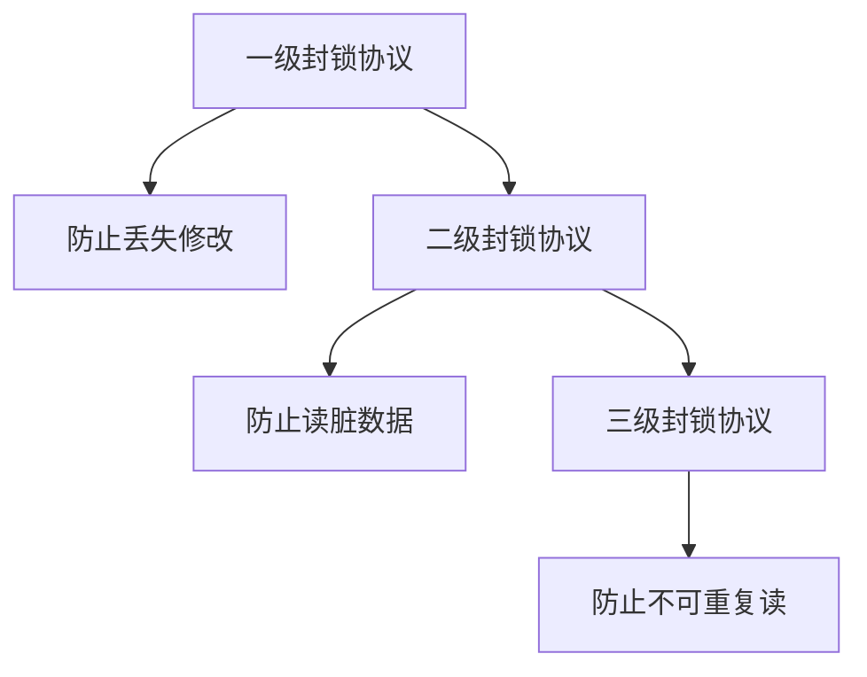

# 第十一节 封锁协议（Lock Protocol）

> **说明** 本文依据《第三章
> 数据库系统》中**封锁协议**相关内容整理，主要介绍一级封锁协议、二级封锁协议、三级封锁协议及其能够解决的并发问题。

## 一句话理解

**封锁协议通过规定事务何时加锁、何时释放锁，保证事务并发执行时的数据一致性。**

## 学习目标

-   理解封锁协议的作用
-   掌握一级、二级、三级封锁协议
-   理解不同协议解决的并发问题
-   能完成封锁协议相关真题

## 知识导图



## 1. 为什么需要封锁协议

多个事务同时访问数据库时，仅依靠加锁并不能保证一致性，还需要规定加锁和释放锁的时机，因此引入封锁协议。

## 2. 一级封锁协议

要求事务在修改数据前必须加 **X 锁（排他锁）**，并在事务结束后释放。

可防止：

-   ✅ 丢失修改（Lost Update）

不能完全避免：

-   ❌ 读脏数据
-   ❌ 不可重复读

## 3. 二级封锁协议

在一级封锁协议基础上增加：

-   读取数据前加 **S 锁（共享锁）**
-   读完即可释放共享锁

可防止：

-   ✅ 丢失修改
-   ✅ 读脏数据

仍不能完全避免：

-   ❌ 不可重复读

## 4. 三级封锁协议

在二级封锁协议基础上要求：

-   S 锁保持到事务结束后才释放。

可防止：

-   ✅ 丢失修改
-   ✅ 读脏数据
-   ✅ 不可重复读



## 协议对比

| 协议 | 丢失修改 | 读脏数据 | 不可重复读 |
| --- | --- | --- | --- |
| 一级 | ✅ | ❌ | ❌ |
| 二级 | ✅ | ✅ | ❌ |
| 三级 | ✅ | ✅ | ✅ |

## 真题分析

教材常见考查方式：

-   判断不同封锁协议可解决的问题；
-   根据事务执行过程判断采用了哪一级封锁协议；
-   与事务、锁机制结合综合分析。

## 高频考点

-   一级封锁协议
-   二级封锁协议
-   三级封锁协议
-   S 锁
-   X 锁
-   三类并发问题

## 易错点

> **注意：** 一级、二级、三级封锁协议的主要区别在于**共享锁（S
> 锁）的使用方式和释放时机**，考试中经常要求对应三种并发问题进行判断。

## AI 学习建议

```text
请分别设计三个事务执行案例，说明一级、二级、三级封锁协议能够解决哪些并发问题，并解释原因。
```

## 开发者视角

现代数据库通常已实现成熟的锁管理机制，开发者更关注事务边界和隔离级别，但理解封锁协议有助于分析死锁和并发异常。

## 架构师思考

系统设计应根据业务一致性要求选择合适的并发控制策略，在锁粒度、事务长度和系统吞吐量之间进行平衡。

## 一分钟速记

```text
一级：防丢失修改
二级：+ 防读脏数据
三级：+ 防不可重复读
```

## 本节总结

封锁协议规定了事务的加锁与解锁规则，是数据库并发控制的重要组成部分。教材重点围绕三级封锁协议及其能够解决的并发问题展开。

## 下一节

➡ [继续阅读：SQL](./13-sql)

