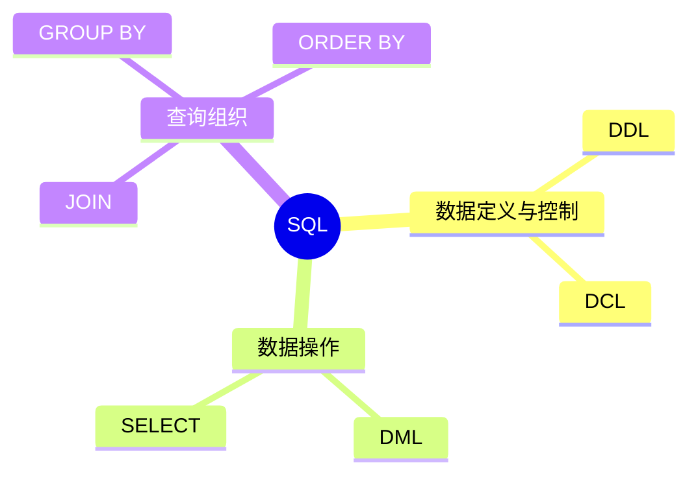
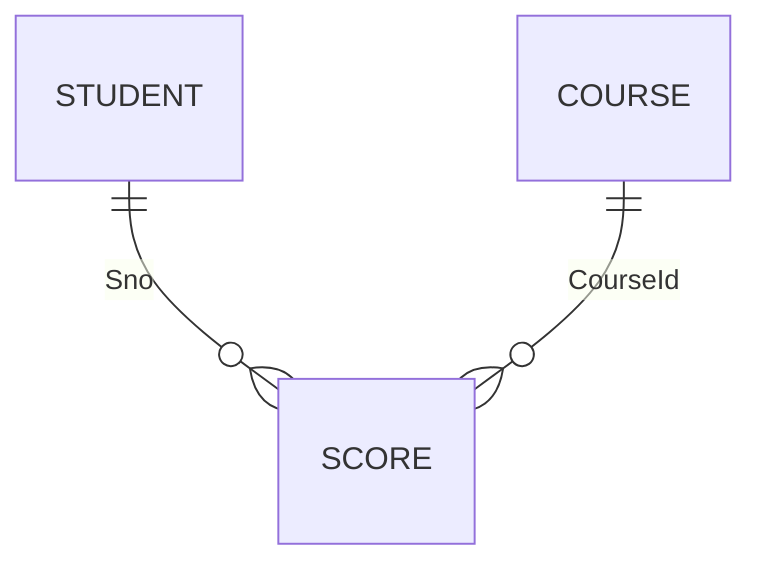

# 第十二节 SQL（Structured Query Language）

> **说明** 本文依据《第三章 数据库系统》中 **SQL** 相关内容整理，围绕
> SQL 分类、常用语句及典型考点进行归纳。

## 一句话理解

**SQL 是关系数据库的标准语言，用于定义、查询、更新和控制数据库。**

## 学习目标

-   理解 SQL 分类
-   掌握 DDL、DML、DCL
-   熟悉常用查询语句
-   能分析 SQL 相关考试题

## 知识导图



## 1. SQL 分类

教材将 SQL 按功能划分为以下几类：

| 分类 | 主要作用 | 常见语句 |
| --- | --- | --- |
| DDL | 定义数据库对象 | CREATE、ALTER、DROP |
| DML | 查询和修改数据 | SELECT、INSERT、UPDATE、DELETE |
| DCL | 控制数据库访问 | GRANT、REVOKE |

## 2. DDL（数据定义语言）

用于创建、修改和删除数据库对象。

```sql
CREATE TABLE Student(
  Sno INT PRIMARY KEY,
  Name VARCHAR(50)
);
```

## 3. DML（数据操纵语言）

用于查询和维护数据。

```sql
SELECT * FROM Student;

INSERT INTO Student VALUES (1,'Tom');

UPDATE Student
SET Name='Jerry'
WHERE Sno=1;

DELETE FROM Student
WHERE Sno=1;
```

## 4. 常用查询

### WHERE

用于指定查询条件。

```sql
SELECT * FROM Student
WHERE Score >= 60;
```

### ORDER BY

用于排序。

```sql
SELECT * FROM Student
ORDER BY Score DESC;
```

### GROUP BY 与 HAVING

用于分组统计及分组后的条件过滤。

```sql
SELECT ClassId,COUNT(*)
FROM Student
GROUP BY ClassId
HAVING COUNT(*)>30;
```

## 5. JOIN 查询

教材介绍关系之间的数据关联查询。

```sql
SELECT s.Name,c.CourseName
FROM Student s
JOIN Score sc ON s.Sno=sc.Sno
JOIN Course c ON sc.CourseId=c.CourseId;
```



## 真题分析

教材常见考查内容：

-   SQL 分类判断；
-   SELECT 查询结果分析；
-   GROUP BY 与 HAVING；
-   JOIN 查询；
-   SQL 语句补全。

## 高频考点

-   DDL、DML、DCL
-   SELECT
-   WHERE
-   GROUP BY
-   HAVING
-   ORDER BY
-   JOIN

## 易错点

> **注意：** `WHERE` 在分组前过滤数据；`HAVING` 在 `GROUP BY`
> 分组后过滤结果，两者不能混用。

## AI 学习建议

```text
请设计学生、课程、成绩三张表，并生成包含 WHERE、GROUP BY、HAVING、JOIN 的 SQL 查询练习，每题给出解析。
```

## 开发者视角

SQL
是后端开发、数据分析和运维的重要基础。熟练掌握查询语句有助于快速定位业务数据问题。

## 架构师思考

复杂系统应在正确使用 SQL
的基础上，结合索引设计、执行计划分析和事务控制提升数据库性能。

## 一分钟速记

```text
DDL：建对象
DML：查改数据
DCL：权限控制

SELECT
WHERE
GROUP BY
HAVING
ORDER BY
JOIN
```

## 本节总结

SQL 是关系数据库的标准语言，也是数据库章节的重要内容。教材重点围绕 SQL
分类及常用查询语句展开，是软考中经常出现的考点。

## 下一节

➡ [继续阅读：新型数据库](./14-new-database)
