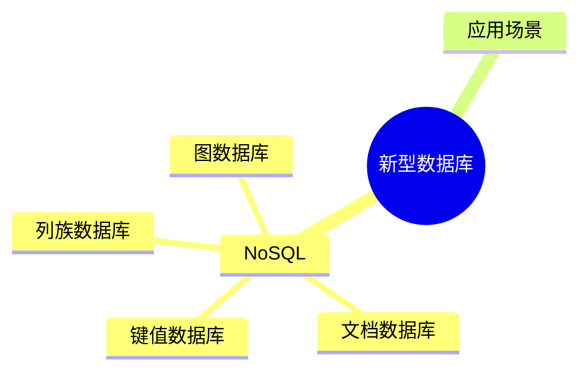
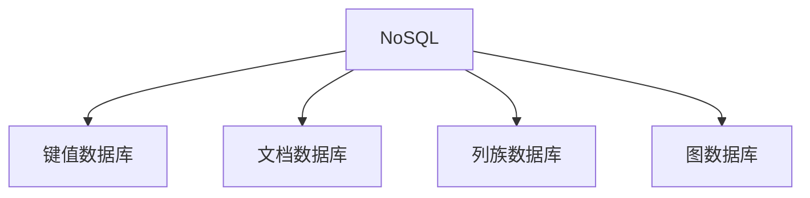

# 第十三节 新型数据库（New Database）

> **说明** 本文依据《第三章
> 数据库系统》中"新型数据库"相关内容整理，围绕 NoSQL
> 数据库及其典型类型进行归纳总结。

## 一句话理解

**新型数据库主要用于满足海量数据、高并发和分布式应用场景，与传统关系数据库形成互补。**

## 学习目标

-   理解新型数据库产生背景
-   掌握 NoSQL 的特点
-   熟悉常见 NoSQL 类型
-   理解不同数据库的适用场景

## 知识导图



## 1. 新型数据库概述

教材介绍，新型数据库主要用于解决传统关系数据库在海量数据、分布式存储和高并发访问等场景下的局限性。

## 2. NoSQL 数据库

NoSQL（Not Only SQL）并非完全不支持
SQL，而是强调根据业务特点采用更加灵活的数据模型。教材主要介绍其特点与应用场景。

主要特点：

-   易于水平扩展
-   支持分布式部署
-   适合海量数据
-   数据模型灵活

## 3. 常见 NoSQL 类型

| 类型 | 特点 | 典型应用 |
| --- | --- | --- |
| 键值数据库 | Key-Value 存储 | 缓存、会话管理 |
| 文档数据库 | 文档结构存储 | 内容管理、业务系统 |
| 列族数据库 | 面向列存储 | 大数据分析 |
| 图数据库 | 图结构存储 | 社交网络、关系分析 |



## 4. 与关系数据库对比

| 对比项 | 关系数据库 | NoSQL |
| --- | --- | --- |
| 数据模型 | 表 | 多种模型 |
| 扩展方式 | 垂直扩展 | 水平扩展 |
| 数据一致性 | 强一致性 | 根据业务选择 |
| 适用场景 | 事务型系统 | 海量数据、高并发 |

## 真题分析

教材常见考查内容：

-   NoSQL 的特点；
-   各类 NoSQL 数据库的应用场景；
-   与关系数据库的区别。

## 高频考点

-   NoSQL
-   键值数据库
-   文档数据库
-   列族数据库
-   图数据库
-   应用场景

## 易错点

> **注意：** NoSQL 表示 **Not Only SQL**，并不是"完全不用
> SQL"；考试更关注不同数据库模型的特点和适用场景。

## AI 学习建议

```text
请结合典型业务场景，为缓存系统、社交网络、电商订单和日志分析分别推荐合适的数据库类型，并说明原因。
```

## 开发者视角

现代系统通常采用关系数据库与 NoSQL
混合架构，根据业务需求选择最合适的数据存储方案。

## 架构师思考

数据库选型应综合考虑一致性、扩展性、性能、数据模型和维护成本，而不是只关注单一指标。

## 一分钟速记

```text
NoSQL
├─ 键值
├─ 文档
├─ 列族
└─ 图数据库
```

## 本节总结

新型数据库扩展了传统关系数据库的应用边界。教材重点围绕 NoSQL
的特点、分类及适用场景展开，是数据库新技术部分的重要考点。

## 下一节

➡ [继续阅读：章节练习](./15-exercises)

