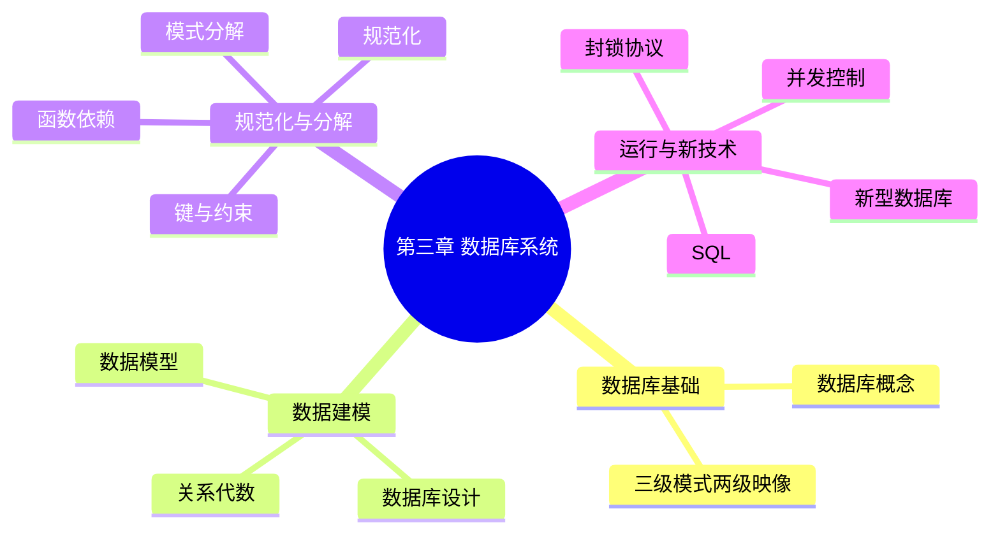

# 第十六节 第三章总结（Summary）

> **说明** 本文依据《第三章
> 数据库系统》的整体知识框架整理，用于章节复习与考前总结，不补充教材未涉及的知识点。

## 一句话总结

**数据库系统章节围绕数据库设计、关系模型、规范化、事务并发控制、SQL
与新型数据库展开，是系统架构设计师考试的重要组成部分。**

## 第三章知识体系



## 核心知识梳理

| 模块 | 核心内容 |
| --- | --- |
| 数据库基础 | DB、DBMS、DBS、三级模式、两级映像 |
| 数据库设计 | 六阶段设计流程、E-R 建模 |
| 数据模型 | 实体、属性、联系、关系模型 |
| 关系代数 | 选择、投影、连接、集合运算 |
| 函数依赖 | 函数依赖、部分依赖、传递依赖、Armstrong 公理 |
| 键与约束 | 超键、候选键、主键、外键、完整性约束 |
| 规范化 | 1NF、2NF、3NF、BCNF |
| 模式分解 | 无损连接、保持函数依赖、属性闭包 |
| 并发控制 | ACID、并发问题、事务 |
| 封锁协议 | 一级、二级、三级封锁协议 |
| SQL | DDL、DML、DCL、SELECT、JOIN |
| 新型数据库 | NoSQL、常见类型及应用场景 |

## 高频考点

-   数据库三级模式与两级映像
-   数据库设计六阶段
-   E-R 模型转换
-   关系代数运算
-   函数依赖与 Armstrong 公理
-   范式（1NF、2NF、3NF、BCNF）
-   模式分解
-   ACID 与并发问题
-   封锁协议
-   SQL 查询
-   NoSQL 分类与应用场景

## 易错点

> **注意：** - 区分三级模式与两级映像。 -
> 区分部分函数依赖与传递函数依赖。 - 区分 2NF、3NF 与 BCNF。 - 区分
> WHERE 与 HAVING。 - 区分一级、二级、三级封锁协议能够解决的问题。

## 学习路线

1.  数据库基础
2.  数据库设计与 E-R 模型
3.  关系模型与关系代数
4.  函数依赖 → 键 → 范式 → 模式分解
5.  事务、并发控制与封锁协议
6.  SQL
7.  新型数据库
8.  综合练习与真题复习

## 考前 10 分钟速记

```text
三级模式 → 数据独立性
E-R → 关系模型
关系代数 → 查询基础
函数依赖 → 范式
模式分解 → 无损连接
ACID → 并发控制
封锁协议 → 一/二/三级
SQL → DDL DML DCL
NoSQL → 键值/文档/列族/图
```

## AI 学习建议

```text
请根据第三章知识点生成一套综合模拟试卷，并针对我的错题生成专项复习计划。
```

## 开发者视角

建议将本章知识与数据库设计实践、SQL
编写和事务处理结合学习，建立理论与实践的联系。

## 架构师思考

从数据库建模到事务一致性，再到数据库选型，第三章构成了系统架构设计中数据层设计的重要基础。

## 本章总结

第三章覆盖数据库系统的核心理论与基础实践，是后续学习软件架构、系统设计和数据管理的重要支撑。建议结合练习题与真题反复复习各知识点之间的联系。

---

## 下一章

➡ [继续学习：第四章 嵌入式技术](../chapter-04/01-embedded-technology)
