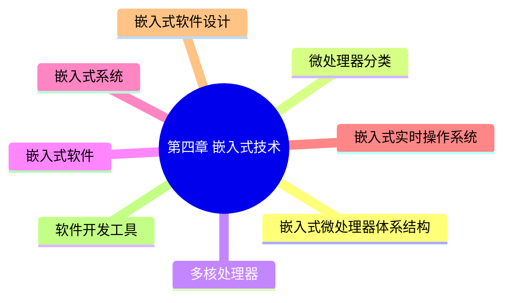

# 第四章 嵌入式技术

> **说明** 本章依据《第四章
> 嵌入式技术》教材整理，围绕嵌入式微处理器、嵌入式软件、嵌入式系统、实时操作系统、嵌入式软件设计及开发工具等内容构建知识体系。

## 一句话理解

**嵌入式技术主要研究面向专用应用场景的软硬件系统设计，是系统架构设计师考试的重要基础知识。**

## 学习目标

-   理解嵌入式系统基本组成
-   掌握微处理器体系结构与分类
-   掌握 BSP、BootLoader、驱动程序等核心概念
-   理解 RTOS 的特点及应用
-   熟悉嵌入式软件开发流程与工具

## 知识体系



## 文档目录

| 学习单元 | 内容 |
| --- | --- |
| [嵌入式微处理器体系结构](./02-microprocessor-architecture) | 冯·诺依曼结构与哈佛结构 |
| [微处理器分类](./03-microprocessor-classification) | MCU、MPU、DSP 与 SoC |
| [多核处理器](./04-multi-core-processor) | SMP、AMP 与多核任务调度 |
| [嵌入式软件](./05-embedded-software) | BSP、BootLoader 与设备驱动 |
| [嵌入式系统](./06-embedded-system) | 系统组成、特点与层次结构 |
| [嵌入式实时操作系统](./07-real-time-operating-system) | EOS、RTOS、硬实时与软实时 |
| [嵌入式软件设计](./08-embedded-software-design) | 交叉开发、编译与调试 |
| [软件开发工具](./09-development-tools) | 编辑器、GCC、GDB 与 JTAG |
| [章节练习](./10-exercises) | 第四章核心知识综合自测 |
| [历年真题复习](./11-past-exams) | 高频考点与典型题型 |
| [第四章总结](./12-summary) | 知识体系、易错点与复习路线 |

## 学习建议

建议按照以下顺序学习：

1.  微处理器体系结构
2.  微处理器分类
3.  多核处理器
4.  嵌入式软件
5.  嵌入式系统
6.  实时操作系统（RTOS）
7.  嵌入式软件设计
8.  软件开发工具
9.  章节练习
10. 历年真题
11. 章节总结

## AI 学习建议

```text
请结合教材内容，按章节讲解每个知识点，并针对软考高频考点生成练习题和思维导图。
```

## 下一节

➡ [开始学习：嵌入式微处理器体系结构](./02-microprocessor-architecture)

