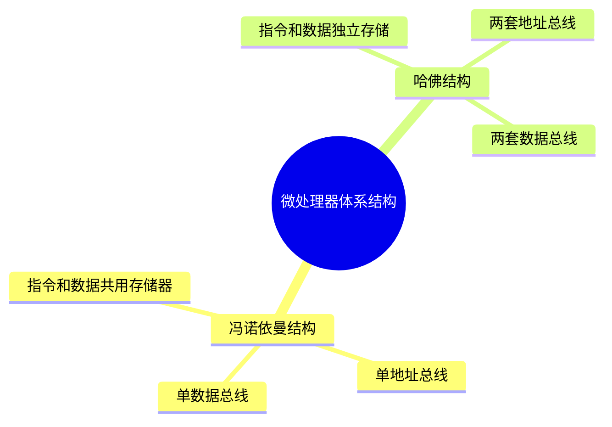
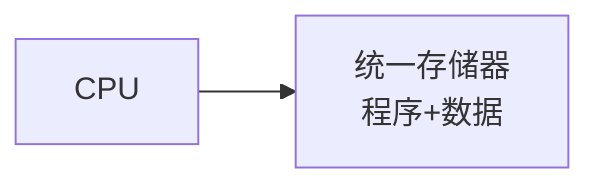
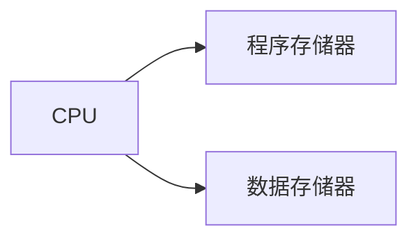

# 第一节 嵌入式微处理器体系结构

> **说明** 本文依据《第四章
> 嵌入式技术》中"嵌入式微处理器体系结构"整理，主要介绍冯·诺依曼结构与哈佛结构及其特点。

## 一句话理解

**微处理器体系结构决定了程序指令和数据的存储方式及访问方式，是嵌入式系统的重要基础。**

## 学习目标

-   理解冯·诺依曼结构
-   理解哈佛结构
-   掌握两种体系结构的区别
-   能完成相关考试题

## 知识导图



## 1. 冯·诺依曼结构（Von Neumann）

教材指出，冯·诺依曼结构（普林斯顿结构）将**程序指令存储器和数据存储器合并在一起**，程序和数据共用同一存储空间。

主要特点：

-   程序与数据共用一个存储器
-   指令地址与数据地址指向同一存储器的不同物理位置
-   采用单一地址总线和数据总线
-   执行时需先取指令再取操作数，容易产生"冯·诺依曼瓶颈"。



## 2. 哈佛结构（Harvard）

教材指出，哈佛结构采用**程序存储器和数据存储器分离**的方式，两者独立编址、独立访问。

主要特点：

-   程序与数据分别存放
-   两套独立地址总线
-   两套独立数据总线
-   可在一个机器周期内同时获取指令和操作数，提高执行效率。



## 3. 两种体系结构对比

| 对比项 | 冯·诺依曼结构 | 哈佛结构 |
| --- | --- | --- |
| 存储方式 | 程序与数据共用存储器 | 程序与数据独立存储 |
| 地址总线 | 一套 | 两套 |
| 数据总线 | 一套 | 两套 |
| 并行访问 | 不支持 | 支持 |
| 执行效率 | 较低 | 较高 |

## 真题分析

教材考查重点通常包括：

-   判断两种体系结构特点；
-   比较存储方式与总线结构；
-   分析执行效率差异。

## 高频考点

-   冯·诺依曼结构
-   哈佛结构
-   存储方式
-   地址总线
-   数据总线

## 易错点

> **注意：**
> 冯·诺依曼结构不是"两个存储器"，而是**程序和数据共用一个存储空间**；哈佛结构则是**程序和数据分别存储、独立访问**。

## AI 学习建议

```text
请绘制冯·诺依曼结构和哈佛结构示意图，并比较两者的优缺点及适用场景。
```

## 开发者视角

现代嵌入式处理器会根据应用场景采用不同的体系结构，以兼顾性能、成本和功耗。

## 架构师思考

理解处理器体系结构有助于分析系统性能瓶颈，并为嵌入式平台选型提供依据。

## 一分钟速记

```text
冯·诺依曼：
程序+数据 共用存储器

哈佛：
程序、数据 分离存储
两套总线
效率更高
```

## 本节总结

本节介绍了嵌入式微处理器两种典型体系结构——冯·诺依曼结构和哈佛结构，重点掌握两者在存储方式、总线结构和执行效率上的区别。

## 下一节

➡ [继续阅读：微处理器分类](./03-microprocessor-classification)
