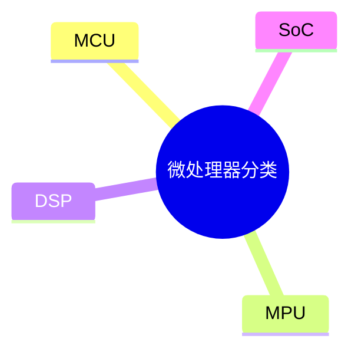
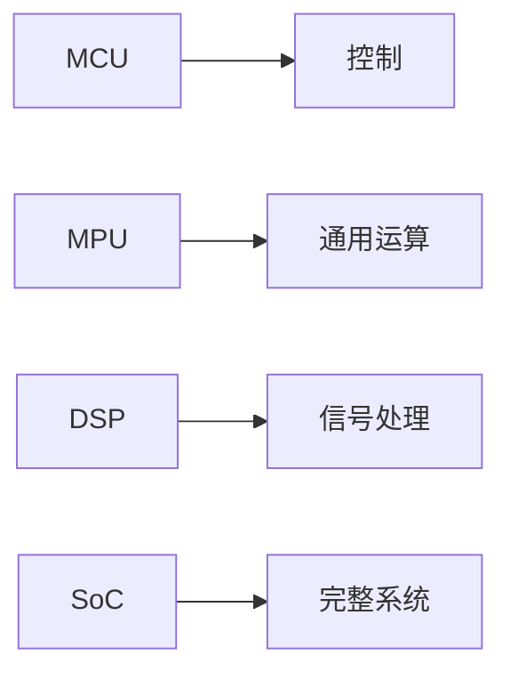

# 第二节 微处理器分类

> **说明** 本文依据《第四章
> 嵌入式技术》中"微处理器分类"整理，介绍嵌入式微控制器（MCU）、嵌入式微处理器（MPU）、数字信号处理器（DSP）及片上系统（SoC）的特点。

## 一句话理解

**不同类型的嵌入式处理器面向不同应用场景，应根据系统需求选择合适的平台。**

## 学习目标

-   理解微处理器分类方法
-   掌握 MCU、MPU、DSP、SoC 的特点
-   理解不同处理器的适用场景
-   能完成相关考试题

## 知识导图



## 分类方式

教材介绍了多种分类方法，包括按字长、系统集成度和用途分类，其中考试重点是按用途分类，即
MCU、MPU、DSP 和 SoC。

## MCU（嵌入式微控制器）

教材指出，MCU 的典型代表是单片机，通常将
CPU、ROM/Flash、RAM、I/O、A/D、D/A
等资源集成在一个芯片中，具有体积小、成本低、可靠性高、适合控制类应用等特点。

## MPU（嵌入式微处理器）

教材指出，MPU 由通用计算机 CPU 演变而来，通常具有 32
位及以上处理能力，仅保留嵌入式应用需要的核心功能，常见架构包括
ARM、MIPS、PowerPC。

## DSP（数字信号处理器）

教材指出，DSP
专门面向数字信号处理进行了优化，常采用哈佛结构，在数字滤波、FFT、语音及图像处理等方面具有较高效率。

## SoC（片上系统）

教材指出，SoC
是面向专用产品的高度集成电路，实现软硬件协同设计，将完整系统集成到单个芯片中。

## 对比总结

| 类型 | 主要特点 | 典型用途 |
| --- | --- | --- |
| MCU | 集成度高、成本低 | 控制系统 |
| MPU | 运算能力强 | 智能终端、嵌入式平台 |
| DSP | 信号处理优化 | 音视频、通信 |
| SoC | 高度集成 | 专用嵌入式产品 |



## 真题分析

教材常见考查：

-   判断四类处理器特点；
-   区分 MCU、MPU、DSP、SoC；
-   根据应用场景选择合适处理器。

## 高频考点

-   MCU
-   MPU
-   DSP
-   SoC
-   ARM
-   哈佛结构

## 易错点

> **注意：** MCU 侧重控制；MPU 强调运算能力；DSP 面向数字信号处理；SoC
> 强调系统级高度集成，考试中容易混淆四者定位。

## AI 学习建议

```text
请根据教材设计多个应用场景，判断应选择 MCU、MPU、DSP 还是 SoC，并说明理由。
```

## 开发者视角

嵌入式开发通常根据成本、性能、功耗和外设需求选择不同类型的处理器平台。

## 架构师思考

处理器选型直接影响系统性能、开发复杂度和产品成本，应结合业务需求综合评估。

## 一分钟速记

```text
MCU：控制
MPU：运算
DSP：信号处理
SoC：系统集成
```

## 本节总结

本节介绍了教材中的四类嵌入式处理器，重点掌握 MCU、MPU、DSP、SoC
的特点及应用场景，这是本章高频考点之一。

## 下一节

➡ [继续阅读：多核处理器](./04-multi-core-processor)
