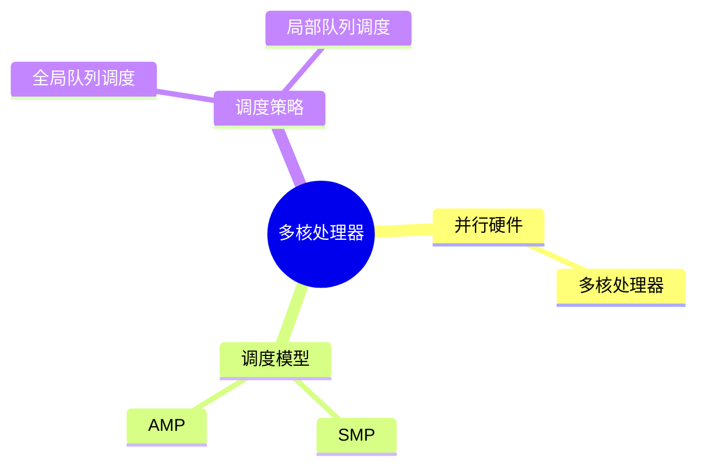
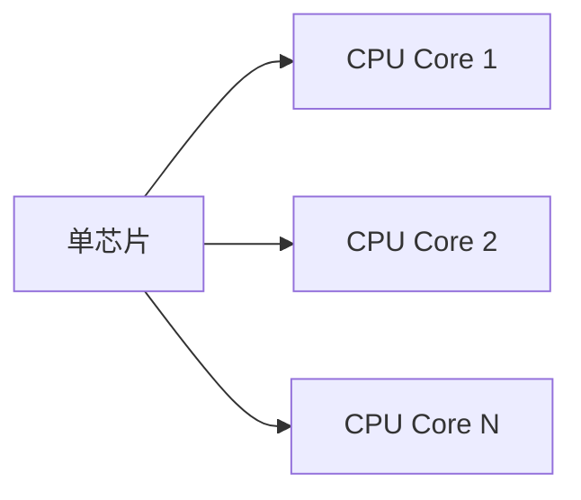
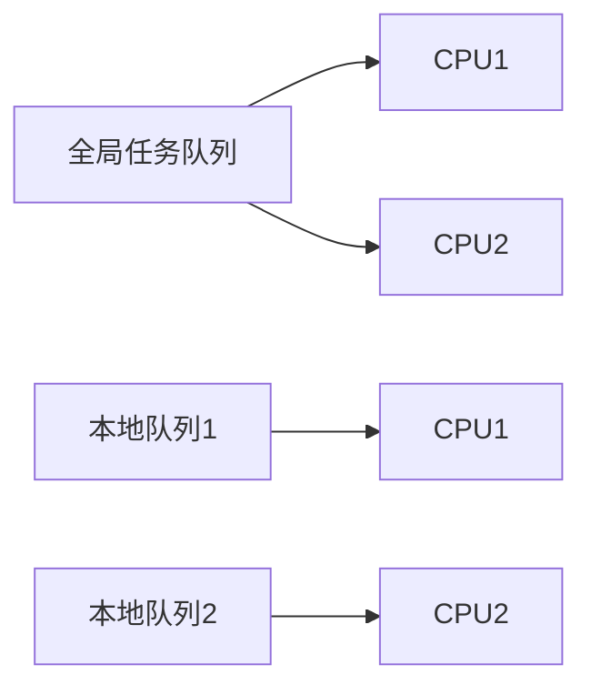

# 第三节 多核处理器（Multi-core Processor）

> **说明** 本文依据《第四章
> 嵌入式技术》中"多核处理器"内容整理，介绍多核处理器概念、SMP、AMP
> 及多核 CPU 调度方式。

## 一句话理解

**多核处理器是在一块芯片中集成多个处理器核心，通过并行执行提升系统性能并降低功耗。**

## 学习目标

-   理解多核处理器概念
-   掌握 SMP 与 AMP
-   理解全局队列调度与局部队列调度
-   能完成相关考试题

## 知识导图



## 1. 多核处理器

教材指出，多核处理器是在一个芯片中集成两个或多个微处理器内核，与多 CPU
相比，可降低系统功耗和体积，在操作系统调度下支持多进程、多线程并行执行。



## 2. SMP（对称多处理）

教材指出，SMP（Symmetric
Multi-Processing）将多个**完全相同**的处理器核心封装在同一芯片内，共同完成任务处理。

特点：

-   多个相同核心
-   共享系统资源
-   提高整体处理性能

## 3. AMP（非对称多处理）

教材指出，AMP（Asymmetric
Multi-Processing）中的处理器核心可以不同，各核心承担不同功能，在软件协调下共同完成任务。

特点：

-   核心功能不同
-   面向特定任务
-   软件协调执行


## 4. 多核 CPU 调度

教材介绍两种调度方式：

### 全局队列调度

操作系统维护**一个全局任务队列**，当某个 CPU
空闲时，从全局队列选择任务执行，可提高核心利用率。

### 局部队列调度

操作系统为**每个 CPU 维护独立任务队列**，CPU
从本地队列获取任务，减少核心之间切换。



## 真题分析

教材常见考查：

-   SMP 与 AMP 区别；
-   多核处理器特点；
-   全局队列调度与局部队列调度。

## 高频考点

-   多核处理器
-   SMP
-   AMP
-   全局队列调度
-   局部队列调度

## 易错点

> **注意：** SMP 强调**相同处理器核心**；AMP
> 强调**不同处理器核心**。全局队列由所有核心共享，局部队列则为每个核心分别维护。

## AI 学习建议

```text
请结合教材绘制 SMP 与 AMP 的结构示意图，并比较两种架构的特点、适用场景和调度方式。
```

## 开发者视角

现代嵌入式平台普遍采用多核架构，需要合理设计任务划分与调度策略，以发挥多核优势。

## 架构师思考

系统架构设计需要根据业务特点选择 SMP 或
AMP，并综合考虑实时性、资源利用率和任务隔离。

## 一分钟速记

```text
多核 = 单芯片多核心
SMP：相同核心
AMP：不同核心
调度：全局队列 / 局部队列
```

## 本节总结

本节介绍了多核处理器的基本概念，以及教材重点讲解的 SMP、AMP
和两种任务调度方式，是嵌入式处理器部分的重要考点。

## 下一节

➡ [继续阅读：嵌入式软件](./05-embedded-software)
