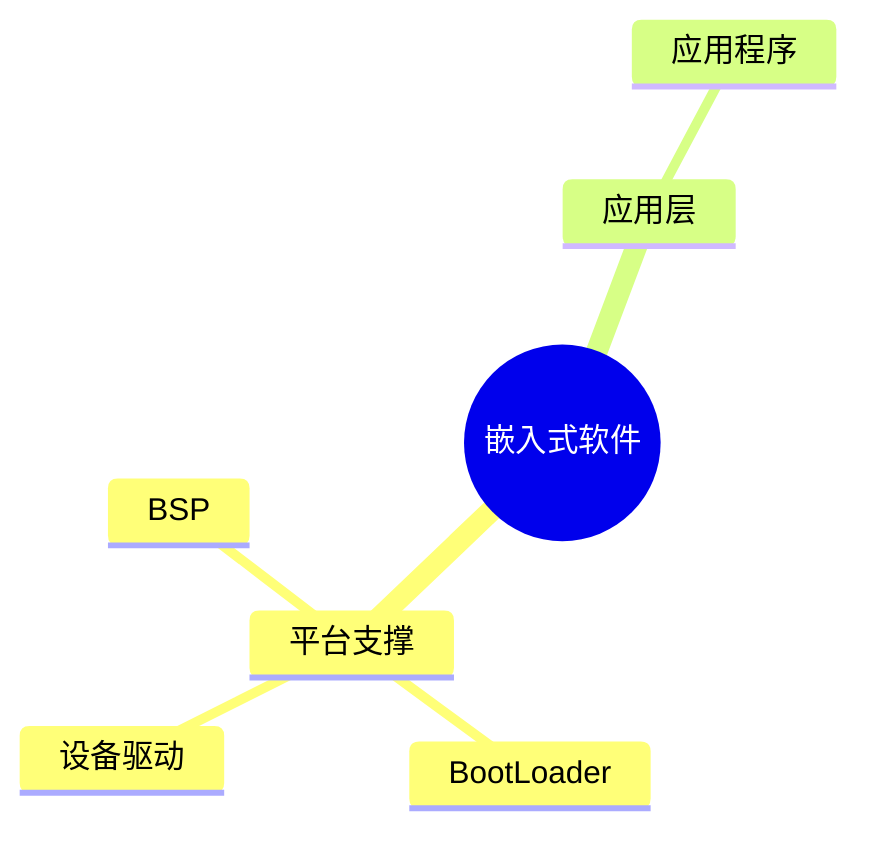

# 第四节 嵌入式软件（Embedded Software）

> **说明** 本文依据《第四章
> 嵌入式技术》中"嵌入式软件"相关内容整理，主要介绍 BSP、BootLoader
> 及驱动程序等知识。

## 一句话理解

**嵌入式软件是运行在嵌入式硬件上的软件系统，为硬件与应用程序提供连接和支撑。**

## 学习目标

-   理解嵌入式软件组成
-   掌握 BSP 的作用
-   理解 BootLoader 工作流程
-   了解设备驱动程序职责

## 知识导图



## 1. 嵌入式软件概述

教材介绍，嵌入式软件运行于嵌入式硬件平台，为操作系统和应用软件提供支持，是嵌入式系统的重要组成部分。

## 2. BSP（Board Support Package）

BSP（板级支持包）用于连接操作系统与具体硬件平台，是系统移植的重要基础。教材介绍
BSP 主要包括：

-   CPU 初始化
-   板级硬件初始化
-   中断初始化
-   启动支持等功能。


## 3. BootLoader

BootLoader（引导加载程序）是在系统上电后最先运行的软件，其主要职责包括：

-   初始化 CPU
-   初始化存储器
-   初始化必要外设
-   建立运行环境
-   加载并启动操作系统内核。


## 4. 设备驱动程序

教材介绍，设备驱动程序负责屏蔽硬件差异，为操作系统提供统一的设备访问接口，实现应用程序与硬件之间的通信。

## 真题分析

教材常见考查内容：

-   BSP 的作用；
-   BootLoader 启动流程；
-   驱动程序职责；
-   BSP 与 BootLoader 的区别。

## 高频考点

-   BSP
-   BootLoader
-   板级支持包
-   驱动程序
-   系统启动流程

## 易错点

> **注意：** BSP 并不是 BootLoader。BSP
> 负责为操作系统提供板级支持；BootLoader
> 负责系统启动与加载操作系统，两者职责不同。

## AI 学习建议

```text
请结合教材绘制嵌入式系统启动流程，并说明 BSP、BootLoader 和驱动程序分别承担哪些职责。
```

## 开发者视角

实际开发中，BSP、BootLoader
与驱动程序通常需要针对具体硬件平台进行适配，是嵌入式移植的重要工作。

## 架构师思考

系统架构设计应合理划分
BootLoader、BSP、驱动及应用层职责，提高系统可移植性与可维护性。

## 一分钟速记

```text
上电
↓
BootLoader
↓
BSP
↓
操作系统
↓
驱动
↓
应用程序
```

## 本节总结

本节介绍了嵌入式软件的组成及系统启动过程，重点掌握 BSP、BootLoader
和设备驱动程序的职责与关系，是本章的重要基础知识。

## 下一节

➡ [继续阅读：嵌入式系统](./06-embedded-system)
