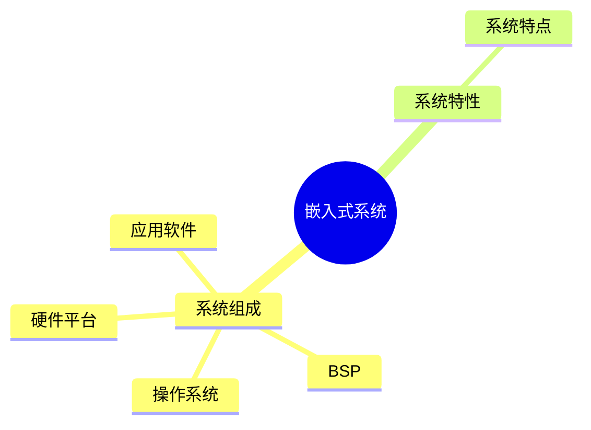
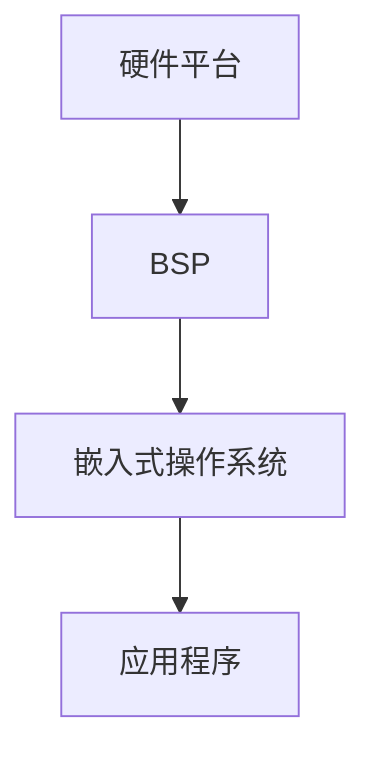
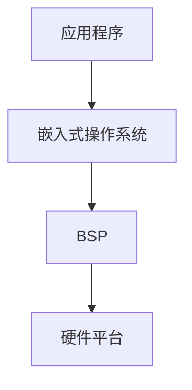

# 第五节 嵌入式系统（Embedded System）

> **说明** 本文依据《第四章
> 嵌入式技术》中"嵌入式系统"相关内容整理，介绍嵌入式系统的组成、特点及基本结构。

## 一句话理解

**嵌入式系统是以应用为中心、软硬件可裁剪、面向专用功能的计算机系统。**

## 学习目标

-   理解嵌入式系统定义
-   掌握嵌入式系统组成
-   熟悉嵌入式系统特点
-   能分析相关考试题

## 知识导图



## 1. 嵌入式系统概述

教材指出，嵌入式系统通常由硬件平台、嵌入式软件、操作系统及应用软件组成，针对特定应用进行设计，具有专用性和可裁剪性。

## 2. 系统组成

教材涉及的典型组成包括：

-   CPU（处理器）
-   ROM / Flash
-   SDRAM
-   I/O 接口
-   A/D、D/A
-   BSP（板级支持包）
-   操作系统
-   应用程序



## 3. 嵌入式系统特点

教材归纳的主要特点包括：

-   面向特定应用
-   软硬件协同设计
-   高可靠性
-   实时性要求
-   可裁剪、低功耗、小体积

## 4. 系统层次结构



该结构体现了应用、操作系统、BSP 与硬件之间的关系。

## 真题分析

教材常见考查内容：

-   嵌入式系统组成；
-   各组成部分职责；
-   系统特点及适用场景。

## 高频考点

-   系统组成
-   BSP
-   硬件平台
-   操作系统
-   应用程序
-   系统特点

## 易错点

> **注意：** BSP
> 属于硬件平台与操作系统之间的支撑层，不属于应用程序；考试中容易与
> BootLoader 混淆。

## AI 学习建议

```text
请根据教材绘制嵌入式系统组成结构图，并说明各层职责及数据流向。
```

## 开发者视角

实际开发中需要根据硬件平台完成
BSP、驱动和应用软件的协同开发，并充分考虑资源受限环境。

## 架构师思考

嵌入式系统设计应兼顾实时性、可靠性、成本和功耗，合理划分硬件、系统软件和应用软件边界。

## 一分钟速记

```text
硬件平台
↓
BSP
↓
操作系统
↓
应用程序

特点：
专用、实时、可靠、可裁剪
```

## 本节总结

本节介绍了嵌入式系统的组成、层次结构和主要特点，是理解后续实时操作系统与软件设计内容的重要基础。

## 下一节

➡ [继续阅读：嵌入式实时操作系统](./07-real-time-operating-system)
