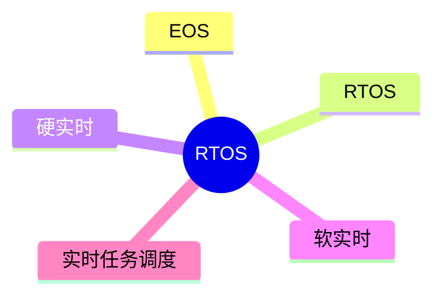

# 第六节 嵌入式实时操作系统（RTOS）

> **说明** 本文依据《第四章
> 嵌入式技术》中"嵌入式实时操作系统"相关内容整理，介绍 EOS、RTOS
> 及实时性的基本概念。

## 一句话理解

**RTOS
是面向实时任务设计的嵌入式操作系统，能够在规定时间内完成任务响应。**

## 学习目标

-   理解 EOS 与 RTOS 的概念
-   掌握 RTOS 的特点
-   理解硬实时与软实时
-   能分析 RTOS 相关考题

## 知识导图



## 1. 嵌入式操作系统（EOS）

教材介绍，EOS（Embedded Operating
System）是运行于嵌入式设备上的操作系统，为应用程序提供任务管理、存储管理、设备管理和通信等基础服务。

## 2. 实时操作系统（RTOS）

教材指出，RTOS（Real-Time Operating System）是在 EOS
基础上重点满足实时性要求的操作系统，要求系统能够在规定时间内完成响应与处理。

### RTOS 的主要特点

-   实时响应能力强
-   可预测性高
-   高可靠性
-   支持多任务并发
-   调度效率高


## 3. 实时性的分类

教材将实时系统分为两类：

### 硬实时（Hard Real-Time）

-   必须在规定时间内完成任务；
-   超时可能导致系统失效或严重后果。

### 软实时（Soft Real-Time）

-   希望在规定时间内完成任务；
-   偶尔超时通常不会导致系统失效，但会影响系统性能或用户体验。

### 对比

| 项目 | 硬实时 | 软实时 |
| --- | --- | --- |
| 时间要求 | 必须满足 | 尽量满足 |
| 超时影响 | 系统可能失效 | 性能下降 |
| 实时性 | 极高 | 较高 |

## 真题分析

教材常见考查：

-   EOS 与 RTOS 的区别；
-   RTOS 的特点；
-   硬实时与软实时的区别。

## 高频考点

-   EOS
-   RTOS
-   实时性
-   硬实时
-   软实时

## 易错点

> **注意：** RTOS
> 强调**实时响应能力**，并非单纯追求运行速度；硬实时要求严格满足时限，软实时允许有限超时。

## AI 学习建议

```text
请根据教材总结 RTOS 的主要特点，并结合实例比较硬实时与软实时系统。
```

## 开发者视角

在嵌入式开发中，RTOS
常用于工业控制、汽车电子、通信设备等需要确定性响应的场景。

## 架构师思考

系统架构设计应根据业务实时性要求选择合适的操作系统，并合理规划任务优先级和调度策略。

## 一分钟速记

```text
EOS：嵌入式操作系统
RTOS：实时操作系统

硬实时：绝不能超时
软实时：允许少量超时
```

## 本节总结

本节介绍了 EOS、RTOS、实时系统分类及 RTOS
的特点，重点掌握硬实时与软实时的区别，这是本章的重要考试内容。

## 下一节

➡ [继续阅读：嵌入式软件设计](./08-embedded-software-design)
