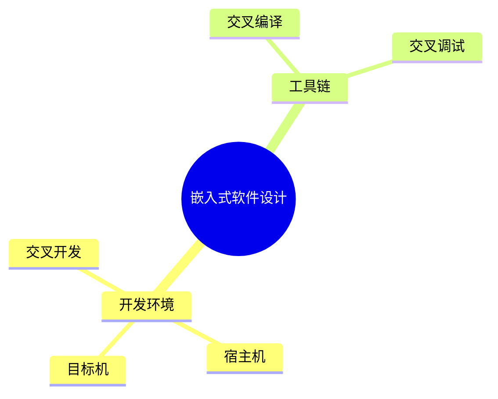
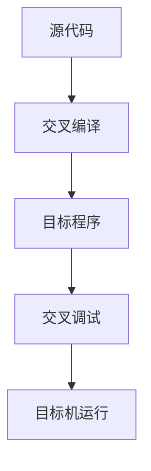

# 第七节 嵌入式软件设计（Embedded Software Design）

> **说明** 本文依据《第四章
> 嵌入式技术》中"嵌入式软件设计"相关内容整理，介绍交叉开发、交叉编译、交叉调试等知识。

## 一句话理解

**嵌入式软件通常采用交叉开发方式，在宿主机开发，在目标机运行。**

## 学习目标

-   理解交叉开发环境
-   掌握宿主机与目标机
-   理解交叉编译与交叉调试
-   熟悉嵌入式软件开发流程

## 知识导图



## 1. 交叉开发

教材指出，嵌入式软件通常采用**交叉开发（Cross
Development）**模式，即开发环境与运行环境相互分离。开发工作在宿主机完成，程序最终运行在目标机。


## 2. 宿主机（Host）

宿主机是开发人员进行程序编辑、编译、链接和管理的软件开发平台，通常拥有较高的计算能力和完整的开发工具链。

## 3. 目标机（Target）

目标机是最终运行嵌入式程序的硬件设备，通常资源受限，需要通过下载或烧录运行交叉编译后的程序。

## 4. 交叉编译

教材介绍，交叉编译是在宿主机上使用交叉编译器，将源程序编译生成能够在目标机上运行的可执行程序。

## 5. 交叉调试

教材介绍，交叉调试是在宿主机上利用调试工具，对运行在目标机上的程序进行调试、跟踪和故障分析。



## 真题分析

教材常见考查：

-   交叉开发概念；
-   宿主机与目标机区别；
-   交叉编译和交叉调试流程。

## 高频考点

-   交叉开发
-   宿主机
-   目标机
-   交叉编译
-   交叉调试

## 易错点

> **注意：**
> 宿主机负责开发，目标机负责运行；交叉编译生成的是**目标机可执行程序**，不要与本地编译混淆。

## AI 学习建议

```text
请结合教材绘制交叉开发流程图，并总结宿主机、目标机、交叉编译和交叉调试之间的关系。
```

## 开发者视角

嵌入式项目通常需要专用交叉工具链完成开发，并通过下载、烧录或网络部署到目标设备进行验证。

## 架构师思考

系统设计时应规划统一的开发环境、构建流程和调试机制，提高开发效率与软件可维护性。

## 一分钟速记

```text
宿主机：开发
目标机：运行

开发 → 交叉编译 → 下载 → 调试 → 运行
```

## 本节总结

本节介绍了嵌入式软件设计中的交叉开发模式，以及宿主机、目标机、交叉编译和交叉调试等核心概念，是嵌入式开发流程的重要基础。

## 下一节

➡ [继续阅读：软件开发工具](./09-development-tools)
