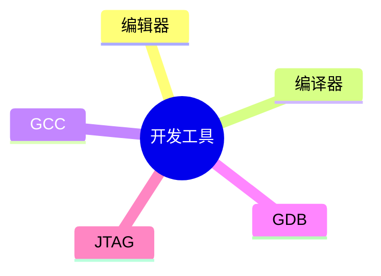

# 第八节 软件开发工具（Development Tools）

> **说明** 本文依据《第四章
> 嵌入式技术》中"软件开发工具"相关内容整理，介绍嵌入式软件开发过程中常见的开发工具及其作用。
>

## 一句话理解

**嵌入式软件开发需要借助编辑、编译、调试等工具，共同完成程序开发、构建、下载与调试。**

## 学习目标

-   理解嵌入式开发工具链
-   掌握编辑器、编译器、调试器的作用
-   熟悉 GCC、GDB、JTAG 等工具的用途
-   能完成相关考试题

## 知识导图



## 1. 开发工具链概述

教材介绍，嵌入式软件开发通常需要编辑、编译、链接、下载和调试等多个环节，不同工具共同组成完整的软件开发工具链。


## 2. 编辑器（Editor）

编辑器用于编写和修改源代码，是软件开发的基础工具，为后续编译和调试提供输入。

## 3. 编译器（Compiler）

编译器负责将源代码转换为目标代码，交叉开发环境中通常采用交叉编译器生成目标机可执行程序。

### GCC

教材提到 GCC（GNU Compiler
Collection）是常见的编译工具，可用于完成源程序编译工作。

## 4. 调试器（Debugger）

调试器用于检查程序运行状态、定位错误、分析变量和执行流程，是软件调试的重要工具。

### GDB

教材提到 GDB（GNU
Debugger）可用于程序调试，支持断点、单步执行和变量查看等调试操作。

## 5. JTAG

教材介绍，JTAG
是嵌入式开发中常用的硬件调试接口，可实现程序下载、在线调试和故障定位。


## 真题分析

教材常见考查：

-   各类开发工具的作用；
-   GCC、GDB、JTAG 的功能区别；
-   开发工具链组成。

## 高频考点

-   编辑器
-   编译器
-   GCC
-   GDB
-   JTAG
-   开发工具链

## 易错点

> **注意：** GCC 主要用于**编译程序**，GDB 主要用于**调试程序**，JTAG
> 是**硬件下载与调试接口**，三者作用不同，考试中容易混淆。
>

## AI 学习建议

```text
请根据教材整理开发工具链，并说明编辑器、GCC、GDB、JTAG 在整个嵌入式开发流程中的职责。
```

## 开发者视角

实际开发通常结合
IDE、交叉编译器、调试器和下载工具形成完整开发环境，提高开发效率和调试能力。

## 架构师思考

设计开发平台时，应统一工具链和调试方式，保证团队开发环境一致性和软件可维护性。

## 一分钟速记

```text
编辑 → 编译(GCC)
      ↓
下载(JTAG)
      ↓
调试(GDB)
```

## 本节总结

本节介绍了嵌入式软件开发中常见的开发工具及工具链，重点掌握编辑器、编译器、调试器以及
GCC、GDB、JTAG 的作用和区别。

## 下一节

➡ [继续阅读：章节练习](./10-exercises)

