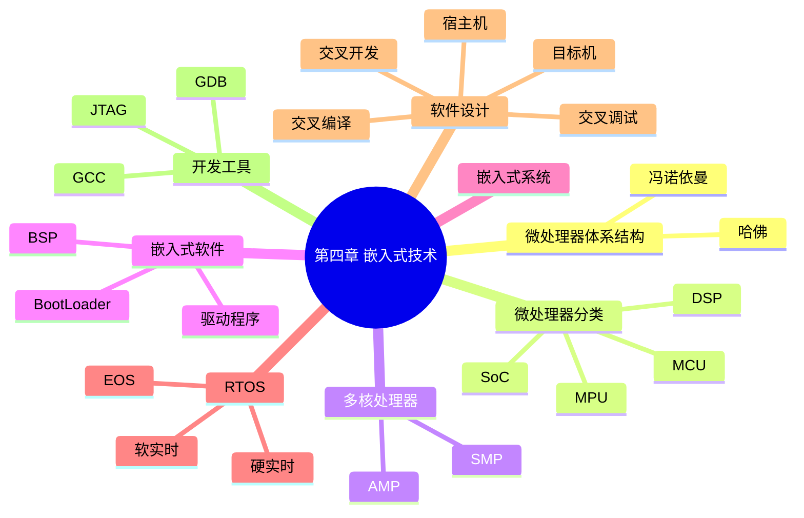

# 第四章 总结

> **说明** 本文依据《第四章
> 嵌入式技术》整理，对本章知识体系、高频考点、易错点和考前速记进行汇总，便于复习。

## 一句话总结

**第四章重点掌握嵌入式处理器、嵌入式系统、RTOS
以及嵌入式软件开发流程之间的关系。**

## 知识体系



## 高频考点

-   冯·诺依曼结构与哈佛结构
-   MCU、MPU、DSP、SoC
-   SMP 与 AMP
-   BSP、BootLoader、设备驱动
-   RTOS、硬实时、软实时
-   宿主机、目标机
-   交叉编译、交叉调试
-   GCC、GDB、JTAG

## 易错点

| 知识点 | 易错内容 |
| --- | --- |
| 冯·诺依曼 / 哈佛 | 共用存储器与分离存储器容易混淆 |
| MCU / MPU / DSP / SoC | 功能定位容易混淆 |
| SMP / AMP | 相同核心与不同核心容易混淆 |
| BSP / BootLoader | 两者职责不同 |
| 硬实时 / 软实时 | 是否允许超时容易混淆 |
| GCC / GDB / JTAG | 编译、调试、下载接口作用不同 |

## 考前一分钟速记

```text
体系结构：
冯·诺依曼（共用存储）
哈佛（分离存储）

处理器：
MCU 控制
MPU 运算
DSP 信号处理
SoC 高度集成

多核：
SMP 相同核心
AMP 不同核心

启动：
BootLoader → BSP → OS → APP

实时：
RTOS
硬实时：不能超时
软实时：允许少量超时

开发：
宿主机 → 交叉编译 → 目标机

工具：
GCC 编译
GDB 调试
JTAG 下载/硬件调试
```

## 学习建议

建议按以下顺序复习：

1.  微处理器体系结构
2.  微处理器分类
3.  多核处理器
4.  嵌入式软件
5.  嵌入式系统
6.  RTOS
7.  软件设计
8.  开发工具
9.  完成章节练习
10. 回顾典型考点

## AI 学习建议

```text
请以第四章教材为基础，为我生成系统架构设计师考试风格的综合模拟题，并逐题讲解涉及的知识点、易错点和解题思路。
```

## 本章总结

第四章围绕嵌入式技术展开，介绍了嵌入式处理器、嵌入式系统、实时操作系统、软件设计及开发工具等内容。复习时应重点关注各组成部分的职责及相互关系，并结合章节练习进行巩固。

## 下一章

[下一章：计算机网络](../chapter-05/01-computer-network)
