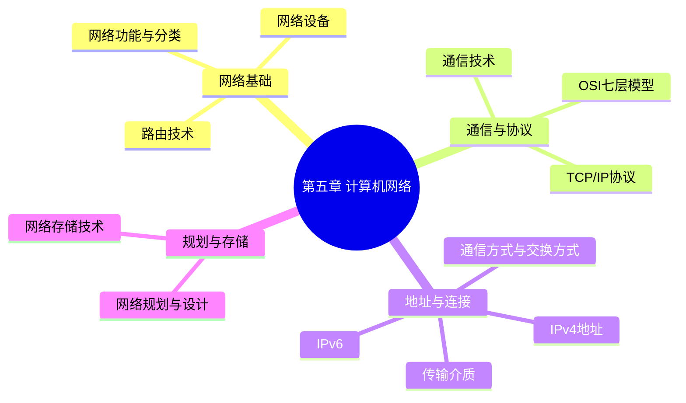

# 第五章 计算机网络

> **说明：** 本章依据《第五章
> 计算机网络》教材整理，重点介绍网络功能与分类、OSI 七层模型、TCP/IP
> 协议、IP 地址、IPv6、网络规划、网络存储等内容。

## 本章概述

计算机网络是系统架构设计师考试的重要章节，通常每年占 **3～5
分**。本章围绕网络体系结构、协议、通信方式、IP
地址与网络规划等内容展开，是考试中的高频章节。

## 学习目标

完成本章后，应能够：

-   理解计算机网络的基本功能与分类
-   掌握 OSI 七层模型与 TCP/IP 协议体系
-   熟悉常见网络协议及应用场景
-   掌握 IPv4 地址、子网划分与 IPv6
-   理解网络规划、网络存储及相关考点

## 知识导图



## 章节目录

| 单元 | 内容 |
| --- | --- |
| 01 | [网络功能与分类](./02-network-overview) |
| 02 | [通信技术](./03-communication-technology) |
| 03 | [OSI 七层模型](./04-osi-model) |
| 04 | [TCP/IP 协议族](./05-tcp-ip) |
| 05 | [网络设备](./06-network-devices) |
| 06 | [路由技术](./07-routing) |
| 07 | [传输介质](./08-transmission-media) |
| 08 | [通信方式与交换方式](./09-communication-switching) |
| 09 | [IP 地址](./10-ip-address) |
| 10 | [IPv6](./11-ipv6) |
| 11 | [网络规划与设计](./12-network-planning) |
| 12 | [网络存储](./13-network-storage) |
| 13 | [章节练习](./14-exercises) |
| 14 | [历年真题复习](./15-past-exams) |
| 15 | [第五章总结](./16-summary) |

## 高频考点

-   OSI 七层模型
-   TCP/IP 协议族
-   IPv4 地址与子网划分
-   路由与交换
-   双绞线、光纤
-   IPv6
-   网络规划与设计

## AI 学习建议

```text
请结合第五章教材，逐节讲解知识点，并为每节生成系统架构设计师考试风格的练习题和总结。
```

## 学习路线


## 下一节

[下一节：网络功能与分类](./02-network-overview)
