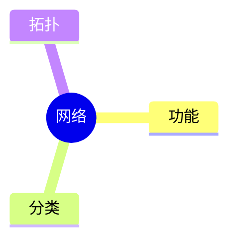
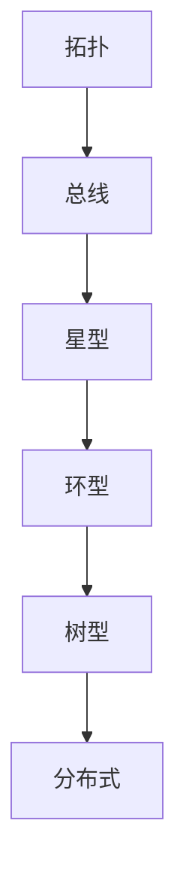

# 第一节 网络功能与分类

> 本文依据《第五章
> 计算机网络》教材中"网络功能和分类"整理。

## 一句话理解

**计算机网络通过通信技术实现数据通信、资源共享和分布式处理，并可按覆盖范围、拓扑结构等方式分类。**

## 学习目标

-   理解网络定义
-   掌握网络功能
-   掌握性能指标
-   掌握 LAN、MAN、WAN
-   理解网络拓扑

## 知识导图



## 网络功能

教材列出的主要功能：

-   数据通信
-   资源共享
-   管理集中化
-   分布式处理
-   负载均衡

## 网络性能指标

性能指标包括速率、带宽、吞吐量、时延、往返时间和利用率；非性能指标包括费用、可靠性、可扩展性、可维护性等。

## 网络分类

| 类型 | 缩写 | 范围 |
| --- | --- | --- |
| 局域网 | LAN | 房间、楼宇、校园 |
| 城域网 | MAN | 城市 |
| 广域网 | WAN | 国家或全球 |

教材还给出了各类网络典型覆盖距离与传输速率。

## 网络拓扑

-   总线型
-   星型
-   环型
-   树型
-   分布式



## 高频考点

-   网络功能
-   性能指标
-   LAN/MAN/WAN
-   网络拓扑

## 易错点

网络分类与网络拓扑属于不同维度，考试中容易混淆。

## 开发者视角

企业局域网通常采用星型拓扑，便于集中管理。

## 架构师思考

设计网络时需综合考虑覆盖范围、可靠性和扩展性。

## AI 学习建议

```text
整理网络功能、网络分类及拓扑结构，并制作记忆表。
```

## 一分钟速记

```text
功能：通信、共享、集中、分布、负载
分类：LAN MAN WAN
拓扑：总 星 环 树 分
```

## 本节总结

本节介绍了网络功能、分类、性能指标及拓扑结构，是后续学习 OSI 和 TCP/IP
的基础。

## 下一节

[下一节：通信技术](./03-communication-technology)

