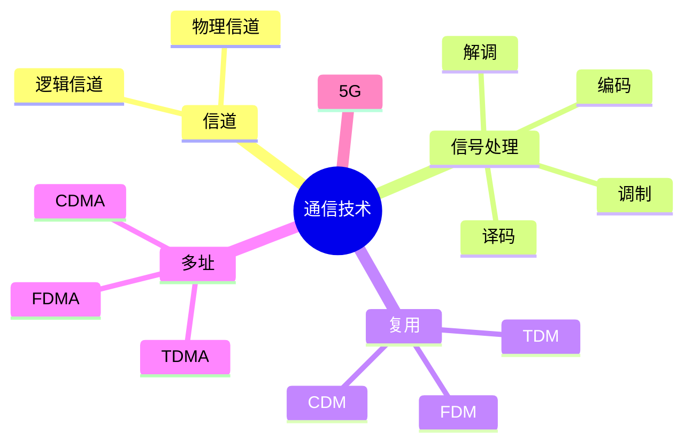

# 第二节 通信技术（Communication Technology）

> **说明：** 本文依据《第五章
> 计算机网络》中"通信技术"部分整理，包括通信模型、信道、信号处理、复用技术、多址技术及
> 5G 网络特点。

## 一句话理解

**通信技术是计算机网络的基础，负责在不同节点之间可靠地传输数据，并通过复用、多址等技术提高信道利用率。**

## 学习目标

-   理解通信技术基本概念
-   掌握物理信道与逻辑信道
-   理解发送端与接收端信号处理流程
-   掌握复用技术与多址技术
-   熟悉教材中的 5G 特点

## 知识导图



## 1. 通信技术概述

教材指出，计算机网络利用通信技术将数据从一个节点传送到另一个节点，是网络实现数据交换的基础。

## 2. 信道

通信信道包括：

-   物理信道
-   逻辑信道

逻辑信道建立在物理信道之上，可为连接方式或无连接方式。


## 3. 信号处理

发送端主要包括：

-   信源编码
-   信道编码
-   交织
-   脉冲成形
-   调制

接收端主要包括：

-   解调
-   去交织
-   信道译码
-   信源译码

## 4. 复用技术

教材介绍了三种主要复用技术：

| 技术 | 英文 |
| --- | --- |
| 时分复用 | TDM |
| 频分复用 | FDM |
| 码分复用 | CDM |

复用技术用于在一条信道上同时传输多路数据。

## 5. 多址技术

教材介绍了对应的多址方式：

| 技术 | 英文 |
| --- | --- |
| 时分多址 | TDMA |
| 频分多址 | FDMA |
| 码分多址 | CDMA |

多址技术用于多个用户共享同一通信系统。

## 6. 5G 网络特点

教材列出了 5G 的主要特点，包括：

-   基于 OFDM 优化波形和多址接入
-   可扩展 OFDM 参数配置
-   提高多路传输效率
-   灵活框架设计
-   大规模 MIMO（最多 256 根天线）
-   毫米波（24GHz 以上）
-   频谱共享
-   先进信道编码
-   服务化架构
-   网络切片

## 高频考点

-   物理信道 / 逻辑信道
-   TDM、FDM、CDM
-   TDMA、FDMA、CDMA
-   5G 特点

## 易错点

> **注意：**
> **复用（Multiplexing）**强调"一条信道传输多路数据"；**多址（Multiple
> Access）**强调"多个用户共享通信系统"，考试中容易混淆。

## 开发者视角

现代移动通信系统广泛采用 OFDM、MIMO 等技术提升频谱利用率和传输效率。

## 架构师思考

网络架构设计需要综合考虑信道利用率、用户容量和通信效率，合理选择复用与多址技术。

## AI 学习建议

```text
请根据教材整理通信技术知识点，并制作复用技术、多址技术和 5G 特点对比表。
```

## 一分钟速记

```text
信道：物理、逻辑
复用：TDM FDM CDM
多址：TDMA FDMA CDMA
5G：OFDM MIMO 毫米波 网络切片
```

## 本节总结

本节介绍了通信技术基础、信道、信号处理、复用、多址以及教材列出的 5G
网络特点，是理解网络通信原理的重要基础。

## 下一节

[下一节：OSI 七层模型](./04-osi-model)

