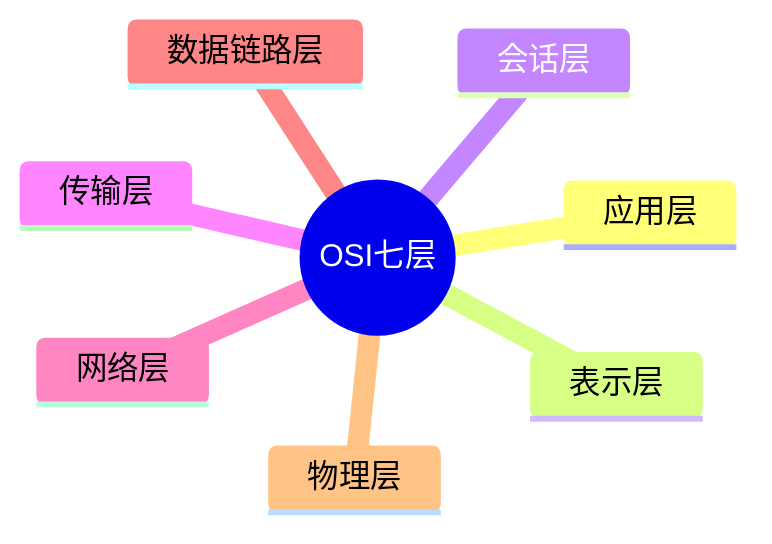
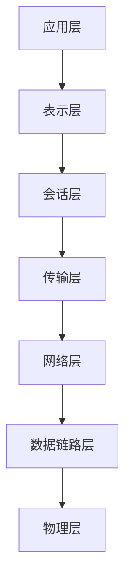

# 第三节 OSI 七层模型（OSI Model）

> **说明：** 本文依据《第五章 计算机网络》中"OSI
> 七层模型"部分整理，包括各层功能、协议、典型设备及 IEEE 802
> 局域网相关内容。

## 一句话理解

**OSI
七层模型将网络通信划分为七个层次，每层承担不同职责，并通过标准协议实现互联互通。**

## 学习目标

-   理解 OSI 七层结构
-   掌握各层功能
-   熟悉各层典型协议
-   掌握各层典型设备
-   理解 IEEE 802 相关知识

## 知识导图



## 1. OSI 七层结构



教材将网络划分为七层，每层具有独立职责，并定义了对应协议和典型设备。

## 2. 各层功能

| 层 | 主要功能 | 典型协议 | 典型设备 |
| --- | --- | --- | --- |
| 应用层 | 为用户提供网络服务 | HTTP、FTP、SMTP、POP3、DNS、DHCP | 网关 |
| 表示层 | 数据格式转换、加密、压缩 | JPEG、ASCII、GIF、MPEG、DES | 网关 |
| 会话层 | 建立、管理、释放会话 | RPC、SQL、NFS | 网关 |
| 传输层 | 端到端可靠传输 | TCP、UDP | 网关 |
| 网络层 | 路由选择、拥塞控制 | IP、ICMP、IGMP、ARP、RARP | 路由器 |
| 数据链路层 | 成帧、差错控制 | HDLC、PPP、LAPB、IEEE802、ATM | 交换机、网桥 |
| 物理层 | 比特传输 | RS-232、RJ45、FDDI 等 | 中继器、集线器 |
以上内容依据教材整理。

## 3. IEEE 802 与局域网

教材介绍：

-   IEEE 802.3：标准以太网（10Mbps）
-   IEEE 802.3u：快速以太网（100Mbps）
-   IEEE 802.3z：千兆以太网（1000Mbps）
-   IEEE 802.3ae：万兆以太网（10Gbps）
-   IEEE 802.11：无线局域网（WLAN）

## 4. 以太网帧

教材展示了以太网帧主要字段：

-   DMAC
-   SMAC
-   Length/Type
-   DATA/PAD
-   FCS

最小帧长为 **64 字节**。

## 高频考点

-   七层模型
-   各层协议
-   各层设备
-   IEEE 802
-   以太网帧

## 易错点

> **注意：** 考试中容易混淆协议所在层次，例如 TCP/UDP 属于传输层，IP
> 属于网络层，HTTP/FTP
> 属于应用层；路由器工作在网络层，交换机主要工作在数据链路层。上述对应关系均以教材内容为准。

## 开发者视角

理解 OSI 分层有助于快速定位网络故障，例如根据协议所在层分析问题范围。

## 架构师思考

网络架构设计通常遵循分层思想，使不同协议和设备能够协同工作并便于扩展。

## AI 学习建议

```text
请根据教材整理 OSI 七层模型各层功能、协议和设备，并制作记忆表。
```

## 一分钟速记

```text
应用→表示→会话→传输→网络→数据链路→物理
TCP/UDP：传输层
IP：网络层
交换机：数据链路层
路由器：网络层
```

## 本节总结

本节介绍了 OSI 七层模型、各层职责、协议、设备以及 IEEE 802
与以太网基础知识，是第五章最重要的考试内容之一。

## 下一节

[下一节：TCP/IP 协议族](./05-tcp-ip)
