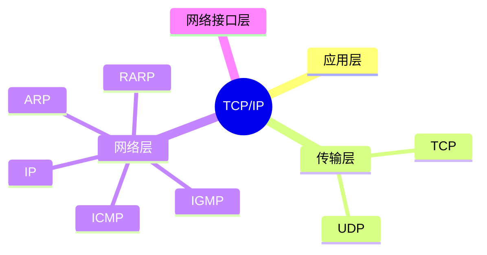
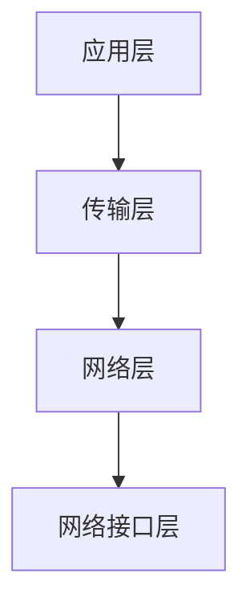

# 第四节 TCP/IP 协议族（TCP/IP）

> **说明：** 本文依据《第五章 计算机网络》教材中 TCP/IP
> 协议族相关内容整理，包括 TCP/IP
> 四层模型、IP、ARP、RARP、ICMP、IGMP、TCP、UDP
> 以及常见应用层协议。

## 一句话理解

**TCP/IP
是互联网事实标准协议体系，通过分层设计实现网络互联与数据传输。**

## 学习目标

-   理解 TCP/IP 四层模型
-   掌握 IP、ARP、RARP、ICMP、IGMP
-   理解 TCP 与 UDP 的区别
-   熟悉教材涉及的常见应用层协议

## 知识导图



## 1. TCP/IP 四层模型



教材介绍 TCP/IP
协议体系采用四层结构，各层承担不同职责。

## 2. 网络层协议

| 协议 | 作用 |
| --- | --- |
| IP | 网络层核心协议 |
| ICMP | 差错控制与诊断 |
| IGMP | Internet 组管理 |
| ARP | IP 地址解析为 MAC 地址 |
| RARP | MAC 地址解析为 IP 地址 |

以上协议均为教材列举内容。

## 3. 传输层协议

| 协议 | 特点 |
| --- | --- |
| TCP | 面向连接、可靠传输 |
| UDP | 无连接、传输开销小 |

教材重点比较 TCP 与 UDP 的特点。

## 4. 应用层协议

教材列举了常见应用层协议：

-   FTP
-   HTTP / HTTPS
-   SMTP
-   POP3
-   DNS
-   DHCP
-   Telnet
-   TFTP
-   SNMP

其中 DHCP 基于 UDP，DNS 用于域名解析，HTTP 用于 WWW 服务，FTP
用于文件传输。

## 高频考点

-   TCP/IP 四层模型
-   IP、ARP、RARP、ICMP、IGMP
-   TCP 与 UDP
-   HTTP、FTP、SMTP、POP3、DNS、DHCP

## 易错点

> **注意：** ARP 用于 **IP→MAC**，RARP 用于 **MAC→IP**；TCP
> 提供可靠传输，UDP 为无连接传输，考试中容易混淆。

## 开发者视角

开发中常通过 TCP 实现可靠业务通信，通过 UDP 支撑实时性要求较高的场景。

## 架构师思考

协议选择应综合考虑可靠性、实时性及网络开销，合理设计网络通信方案。

## AI 学习建议

```text
请根据教材整理 TCP/IP 协议族，并制作网络层、传输层、应用层协议对照表。
```

## 一分钟速记

```text
四层：应用→传输→网络→网络接口
网络：IP ICMP IGMP ARP RARP
传输：TCP UDP
应用：HTTP FTP SMTP POP3 DNS DHCP
```

## 本节总结

本节介绍了 TCP/IP
四层模型及教材涉及的主要协议，是第五章考试中的核心内容之一。

## 下一节

[下一节：网络设备](./06-network-devices)

