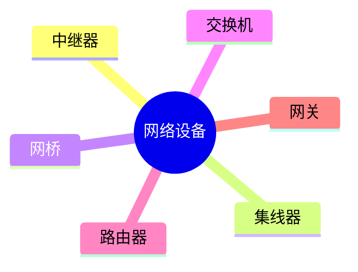
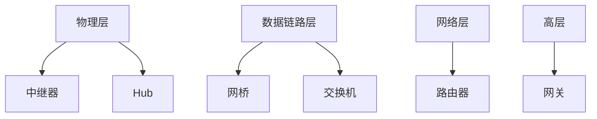

# 第五节 网络设备（Network Devices）

> **说明：** 本文依据《第五章
> 计算机网络》教材中网络设备相关内容整理，介绍集线器、网桥、交换机、路由器等典型网络设备及其工作层次。

## 一句话理解

**网络设备负责实现数据转发、网络互联与通信管理，不同设备工作在不同网络层次。**

## 学习目标

-   理解常见网络设备
-   掌握各设备工作层次
-   理解设备功能区别
-   能完成相关考试题

## 知识导图



## 1. 网络设备概述

教材介绍了网络中常见的互联设备，包括中继器、集线器（Hub）、网桥、交换机、路由器和网关等，它们承担不同层次的数据转发与互联功能。

## 2. 各设备特点

| 设备 | 工作层 | 主要作用 |
| --- | --- | --- |
| 中继器 | 物理层 | 放大、再生信号 |
| 集线器（Hub） | 物理层 | 广播转发信号 |
| 网桥 | 数据链路层 | 连接局域网、过滤帧 |
| 交换机 | 数据链路层 | 基于 MAC 地址交换数据 |
| 路由器 | 网络层 | 基于 IP 地址进行路由 |
| 网关 | 高层协议 | 不同协议之间转换 |

以上内容依据教材整理。



## 3. MAC 地址与交换

教材指出，交换机依据 **MAC 地址表**完成数据帧转发，并能够学习 MAC
地址，提高网络通信效率。

## 4. 路由

教材介绍，路由器依据 **IP
地址**进行路径选择，实现不同网络之间的互联。

## 高频考点

-   Hub
-   网桥
-   交换机
-   路由器
-   网关
-   MAC 地址

## 易错点

> **注意：** Hub
> 工作在物理层；交换机主要工作在数据链路层；路由器工作在网络层。交换机依据
> **MAC 地址**转发，路由器依据 **IP 地址**转发。

## 开发者视角

现代企业网络通常采用交换机组成局域网，再通过路由器连接不同网络，实现高效通信。

## 架构师思考

网络设计时应根据广播域、冲突域、性能及扩展需求合理选择网络设备。

## AI 学习建议

```text
请根据教材整理各种网络设备的工作层次、主要作用及区别，并制作对照表。
```

## 一分钟速记

```text
物理层：中继器、Hub
数据链路层：网桥、交换机
网络层：路由器
协议转换：网关
```

## 本节总结

本节介绍了教材中的典型网络设备及其功能、工作层次和转发依据，是网络基础的重要组成部分。

## 下一节

[下一节：路由技术](./07-routing)

