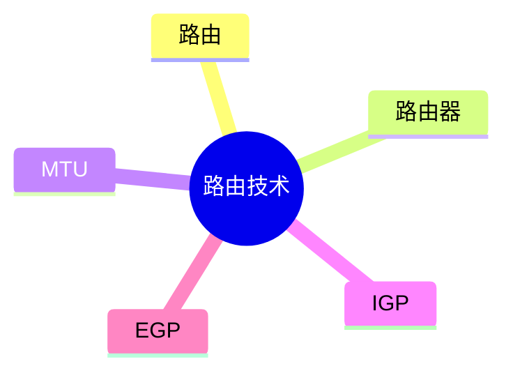

# 第六节 路由技术（Routing）

> **说明：** 本文依据《第五章
> 计算机网络》中"路由技术"相关内容整理，主要包括路由基本概念、MTU、IGP、EGP
> 等知识点。

## 一句话理解

**路由技术用于选择数据包从源主机到目标主机的最佳传输路径，是网络互联的核心技术之一。**

## 学习目标

-   理解路由基本概念
-   理解路由器的数据转发过程
-   掌握 MTU 概念
-   掌握 IGP 与 EGP 的区别
-   能完成相关考试题

## 知识导图



## 1. 路由概述

教材指出，**路由（Routing）**是网络层的重要功能，其主要任务是根据目标 IP
地址选择合适的传输路径，实现不同网络之间的数据通信。


## 2. 路由器

路由器工作在 **OSI 网络层（第三层）**。

主要职责：

-   根据 IP 地址转发数据包
-   连接不同网络
-   维护路由表
-   选择最佳路径

教材强调：**路由器依据 IP 地址进行数据转发。**

## 3. MTU

**MTU（Maximum Transmission Unit）**
表示一次能够传输的**最大数据帧长度**。

当 IP 数据报超过 MTU
时，需要进行**分片（Fragment）**后再传输。

## 4. 路由协议

## IGP（Interior Gateway Protocol）

用于**同一个自治系统（AS）内部**。

## EGP（Exterior Gateway Protocol）

用于**不同自治系统（AS）之间**。

| 项目 | IGP | EGP |
| --- | --- | --- |
| 使用范围 | 同一 AS 内 | 不同 AS 间 |
| 主要用途 | 内部路由 | 外部路由 |

## 高频考点

-   路由器
-   MTU
-   IGP
-   EGP
-   网络层

## 易错点

> **注意：** 路由器依据 **IP 地址**进行转发；交换机依据 **MAC
> 地址**进行转发，两者容易混淆。

## 开发者视角

现代企业网络通常通过路由器连接多个子网，并依据路由表完成路径选择。

## 架构师思考

网络架构设计应合理规划网络边界和路由策略，兼顾扩展性与可靠性。

## AI 学习建议

```text
请根据教材整理 MTU、IGP、EGP 等知识点，并结合网络拓扑说明数据包如何完成路由转发。
```

## 一分钟速记

```text
路由器：IP 转发（网络层）
MTU：最大传输单元
IGP：AS 内
EGP：AS 间
```

## 本节总结

本节介绍了路由技术的基本概念、路由器、MTU 以及教材涉及的
IGP、EGP，是理解网络层数据转发的重要基础。

## 下一节

[下一节：传输介质](./08-transmission-media)

