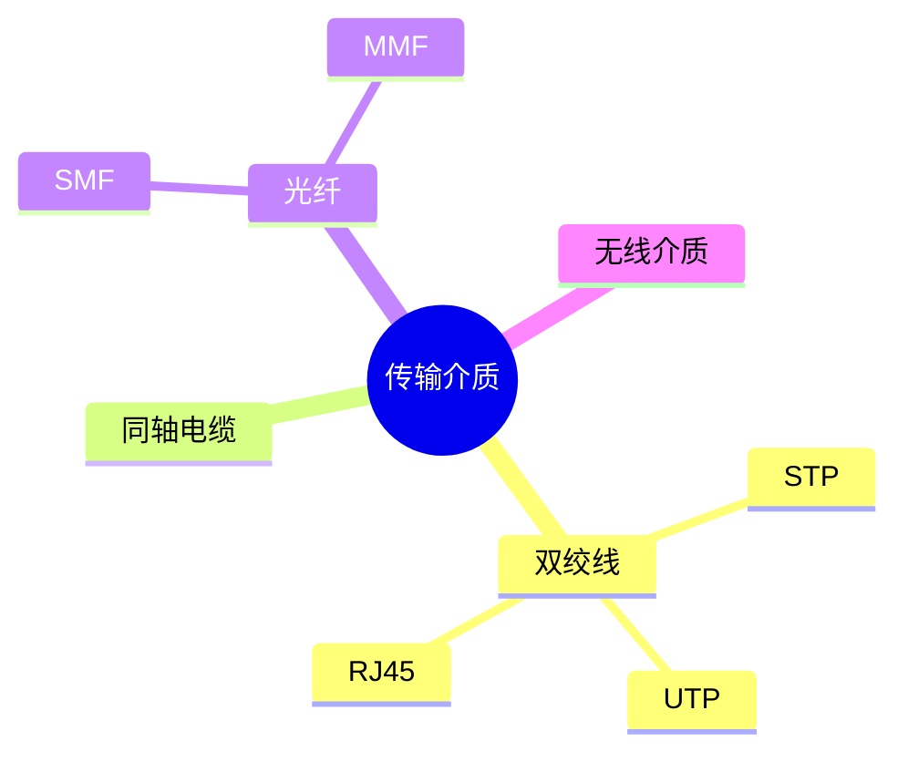
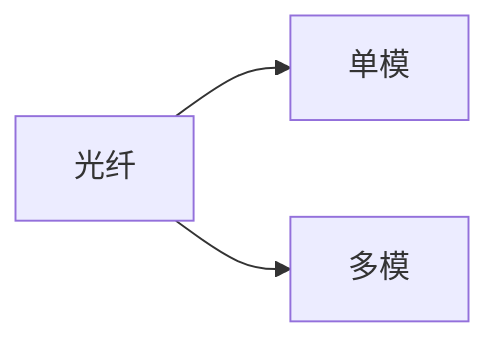

# 第七节 传输介质（Transmission Media）

> **说明：** 本文依据《第五章
> 计算机网络》中"传输介质"相关内容整理，介绍双绞线、同轴电缆、光纤及无线传输介质等知识点。

## 一句话理解

**传输介质是网络中传输数据的物理载体，不同介质在传输距离、带宽、抗干扰能力和成本方面具有不同特点。**

## 学习目标

-   理解有线与无线传输介质
-   掌握双绞线分类
-   掌握光纤分类
-   熟悉 RJ-45、T568A/B
-   理解各类介质特点

## 知识导图



## 1. 传输介质分类

教材将传输介质分为：

-   有线传输介质
-   无线传输介质

## 2. 双绞线

常见类型：

-   UTP（非屏蔽双绞线）
-   STP（屏蔽双绞线）

接口：

-   RJ-45

教材同时介绍了两种线序标准：

| 标准 | 名称 |
| --- | --- |
| T568A | A线序 |
| T568B | B线序 |

双绞线具有成本低、布线方便、应用广泛等特点。

## 3. 同轴电缆

教材指出，同轴电缆抗干扰能力较强，曾广泛应用于早期局域网，目前应用相对减少。

## 4. 光纤

主要特点：

-   带宽高
-   传输距离远
-   抗电磁干扰
-   安全性高

分类：

| 类型 | 缩写 |
| --- | --- |
| 单模光纤 | SMF |
| 多模光纤 | MMF |



## 5. 无线传输介质

教材介绍包括：

-   无线电波
-   微波
-   红外线
-   卫星通信

## 高频考点

-   UTP / STP
-   RJ-45
-   T568A / T568B
-   SMF / MMF

## 易错点

> **注意：** UTP 为非屏蔽双绞线，STP 为屏蔽双绞线；SMF 与 MMF
> 的名称及缩写容易混淆。

## 开发者视角

企业局域网通常采用双绞线接入，骨干网络多采用光纤。

## 架构师思考

网络设计时需综合考虑带宽、距离、成本和可靠性选择合适的传输介质。

## AI 学习建议

```text
请根据教材整理各种传输介质的特点，并制作双绞线、光纤和无线介质对比表。
```

## 一分钟速记

```text
UTP：非屏蔽
STP：屏蔽
RJ45：双绞线接口
SMF：单模
MMF：多模
无线：无线电、微波、红外、卫星
```

## 本节总结

本节介绍了教材中的双绞线、同轴电缆、光纤和无线传输介质，重点掌握
UTP、STP、RJ-45、T568A/B、SMF、MMF
等考试高频知识点。

## 下一节

[下一节：通信方式与交换方式](./09-communication-switching)

