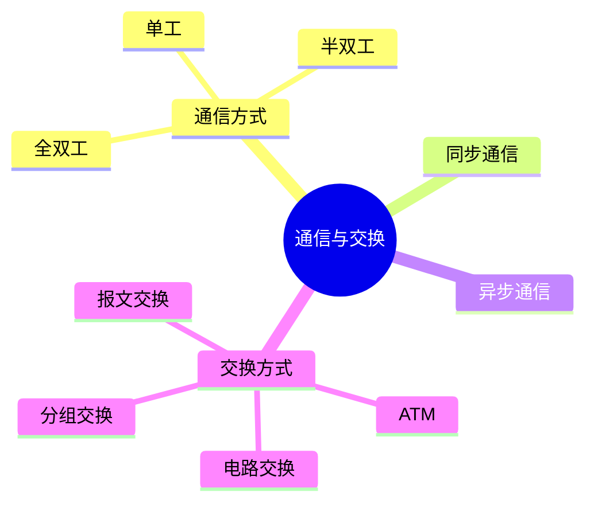
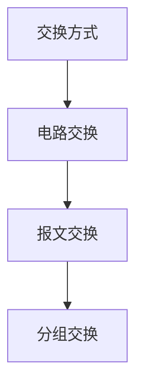

# 第八节 通信方式与交换方式（Communication Switching）

> **说明：** 本文依据《第五章
> 计算机网络》中"通信方式与交换方式"相关内容整理，包括单工、半双工、全双工，以及电路交换、报文交换、分组交换等知识点。

## 一句话理解

**通信方式决定数据如何双向传输，交换方式决定数据在网络中的转发方式。**

## 学习目标

-   理解单工、半双工、全双工
-   理解同步与异步通信
-   掌握电路交换、报文交换、分组交换
-   熟悉 ATM 基本概念

## 知识导图



## 1. 通信方式

| 类型 | 特点 |
| --- | --- |
| 单工 | 数据只能单向传输 |
| 半双工 | 双方均可发送，但不能同时发送 |
| 全双工 | 双方可同时发送与接收 |

教材将三种通信方式作为基础概念进行介绍。


## 2. 同步通信与异步通信

教材介绍：

-   同步通信：通信双方保持统一时钟。
-   异步通信：字符独立发送，通过起始位、停止位进行同步。

## 3. 交换方式

教材介绍三种典型交换方式：

| 类型 | 特点 |
| --- | --- |
| 电路交换 | 通信前建立专用连接 |
| 报文交换 | 按完整报文存储转发 |
| 分组交换 | 将数据划分为分组进行传输 |



## 4. ATM

教材介绍 ATM（Asynchronous Transfer
Mode，异步传输模式）采用固定长度信元进行交换，提高交换效率。

## 高频考点

-   单工、半双工、全双工
-   同步通信、异步通信
-   电路交换
-   报文交换
-   分组交换
-   ATM

## 易错点

> **注意：**
> 半双工允许双向通信但不能同时进行；全双工允许双方同时收发。电路交换需先建立连接，而分组交换无需建立专用电路。

## 开发者视角

现代数据网络主要采用分组交换方式，兼顾资源利用率与传输效率。

## 架构师思考

网络设计需根据业务特点选择合适的通信和交换方式，平衡实时性、带宽利用率与成本。

## AI 学习建议

```text
请根据教材整理各种通信方式和交换方式，并制作优缺点对比表。
```

## 一分钟速记

```text
通信：
单工→半双工→全双工

交换：
电路→报文→分组
ATM：固定长度信元
```

## 本节总结

本节介绍了教材中的通信方式、同步与异步通信以及交换方式，重点掌握各种通信和交换方式的特点及区别。

## 下一节

[下一节：IP 地址](./10-ip-address)

