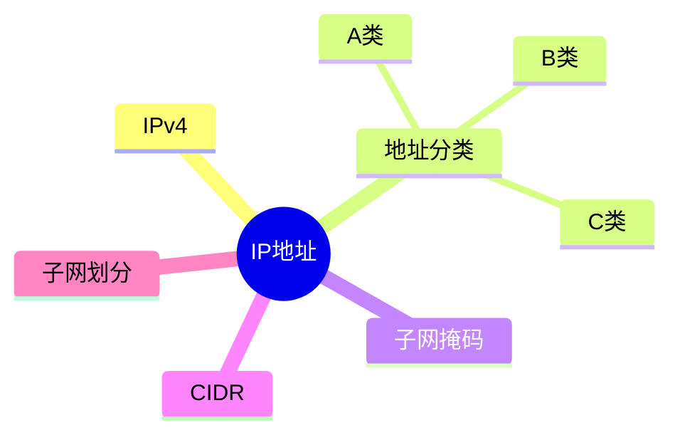

# 第九节 IP 地址（IP Address）

> **说明：** 本文依据《第五章 计算机网络》中"IP 地址"相关内容整理，包括
> IPv4 地址、地址分类、子网掩码、CIDR
> 与子网划分等内容。

## 一句话理解

**IP 地址用于唯一标识网络中的主机，结合子网掩码可完成网络划分与路由。**

## 学习目标

-   理解 IPv4 地址结构
-   掌握 A/B/C 类地址
-   理解子网掩码
-   掌握 CIDR
-   熟悉子网划分基础

## 知识导图



## 1. IPv4 地址

教材介绍，IPv4 地址长度为 **32
位**，通常采用点分十进制表示，由**网络号**和**主机号**组成。


## 2. 地址分类

| 类别 | 首字节范围 | 默认掩码 |
| --- | --- | --- |
| A 类 | 1～126 | 255.0.0.0 |
| B 类 | 128～191 | 255.255.0.0 |
| C 类 | 192～223 | 255.255.255.0 |

教材同时介绍了 D 类（组播）和 E 类（保留）地址。

## 3. 子网掩码

子网掩码用于区分网络号与主机号，并辅助网络划分。

## 4. CIDR

CIDR（无类别域间路由）采用"IP/前缀长度"的表示方式，例如：

```text
192.168.1.0/24
```

教材重点要求理解前缀长度含义及地址聚合思想。

## 5. 子网划分

教材介绍了利用子网掩码进行子网划分的基本方法，并要求能够进行基础地址计算。

## 高频考点

-   IPv4 地址结构
-   A/B/C 类地址
-   子网掩码
-   CIDR
-   子网划分

## 易错点

> **注意：** 不要混淆 IP 地址与子网掩码；CIDR
> 前缀长度表示网络位数，而不是主机数量。

## 开发者视角

开发和运维工作中，经常需要根据 IP
地址和子网掩码判断主机是否属于同一网段。

## 架构师思考

网络规划时应合理设计地址空间，提高地址利用率，并兼顾后续扩展需求。

## AI 学习建议

```text
请根据教材整理 IPv4 地址分类、子网掩码、CIDR 和子网划分知识，并生成典型计算练习。
```

## 一分钟速记

```text
IPv4：32位
A：1-126
B：128-191
C：192-223
CIDR：IP/前缀
```

## 本节总结

本节介绍了 IPv4 地址结构、地址分类、子网掩码、CIDR
和子网划分，是第五章考试中的重点内容。

## 下一节

[下一节：IPv6](./11-ipv6)

