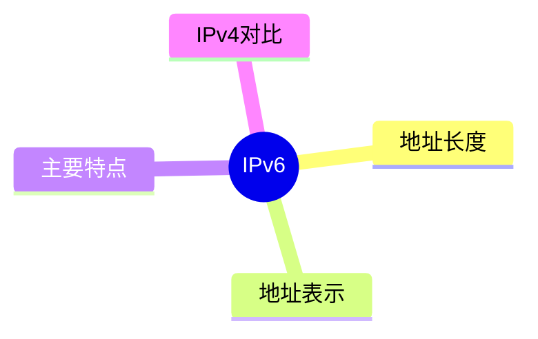
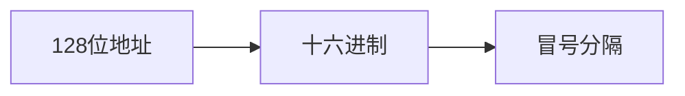

# 第十节 IPv6

> **说明：** 本文依据《第五章 计算机网络》中"IPv6"相关内容整理，介绍 IPv6
> 地址、特点及与 IPv4 的比较。

## 一句话理解

**IPv6
是新一代互联网协议，通过更大的地址空间和改进的协议设计满足互联网持续发展的需求。**

## 学习目标

-   理解 IPv6 的产生背景
-   掌握 IPv6 地址结构
-   熟悉 IPv6 主要特点
-   理解 IPv4 与 IPv6 的区别

## 知识导图



## 1. IPv6 概述

教材介绍，IPv6 是 IPv4 的下一代互联网协议，主要用于解决 IPv4
地址资源不足等问题。

## 2. IPv6 地址

-   地址长度：128 位
-   采用十六进制表示
-   使用冒号（:）分隔各字段
-   支持地址压缩表示法



## 3. IPv6 主要特点

教材介绍的主要特点包括：

-   更大的地址空间
-   更高的路由效率
-   更好的安全性支持
-   支持自动配置
-   支持服务质量（QoS）
-   简化报文首部格式

## 4. IPv4 与 IPv6 对比

| 项目 | IPv4 | IPv6 |
| --- | --- | --- |
| 地址长度 | 32 位 | 128 位 |
| 地址表示 | 点分十进制 | 十六进制冒号表示 |
| 地址空间 | 较小 | 极大 |
| 自动配置 | 有限 | 支持 |
| 首部 | 相对复杂 | 更简化 |

以上内容依据教材整理。

## 高频考点

-   IPv6 地址长度
-   IPv6 地址表示
-   IPv6 主要特点
-   IPv4 与 IPv6 对比

## 易错点

> **注意：** IPv6 地址长度为 **128 位**，采用十六进制表示，不再使用
> IPv4 的点分十进制表示法。

## 开发者视角

实际网络通常采用 IPv4/IPv6 双栈部署，以兼顾现有业务和未来演进。

## 架构师思考

网络规划应预留 IPv6 地址空间，逐步完成 IPv6 迁移和兼容设计。

## AI 学习建议

```text
请根据教材整理 IPv6 的主要特点，并与 IPv4 制作对比表，帮助记忆考试重点。
```

## 一分钟速记

```text
IPv6：
128 位
十六进制
冒号表示
地址空间更大
支持自动配置
```

## 本节总结

本节介绍了 IPv6 的基本概念、地址表示方式、主要特点及与 IPv4
的区别，是第五章网络协议部分的重要知识点。

## 下一节

[下一节：网络规划与设计](./12-network-planning)

