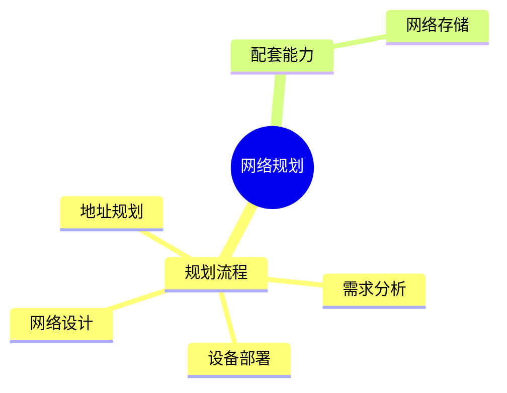

# 第十一节 网络规划与设计（Network Planning）

> **说明：** 本文依据《第五章
> 计算机网络》中"网络规划与设计、网络存储"等相关内容整理，概括网络规划原则、设计流程及网络存储基础。

## 一句话理解

**网络规划是在满足业务需求的基础上，对网络结构、地址、设备及资源进行整体设计与部署。**

## 学习目标

-   理解网络规划目标
-   掌握网络设计基本流程
-   理解网络规划主要内容
-   了解教材中的网络存储基础

## 知识导图



## 1. 网络规划概述

教材指出，网络规划应结合业务需求，对网络结构、设备配置、地址分配和性能要求进行统一设计。

## 2. 网络设计流程


教材重点强调规划与设计过程。

## 3. 网络规划内容

主要包括：

-   网络拓扑设计
-   IP 地址规划
-   网络设备选型
-   网络安全
-   性能与可靠性规划

## 4. 网络存储

教材介绍了网络存储相关内容，用于满足集中存储、共享和管理需求。

常见形式：

-   NAS（网络附加存储）
-   SAN（存储区域网络）

> 教材以概念性介绍为主。

## 高频考点

-   网络规划流程
-   IP 地址规划
-   网络设备部署
-   NAS
-   SAN

## 易错点

> **注意：**
> 网络规划强调整体设计；网络存储主要解决数据集中存储与共享，两者关注点不同。

## 开发者视角

实际项目中通常先完成需求分析，再进行地址规划、设备部署和网络测试。

## 架构师思考

网络架构设计应兼顾性能、可靠性、可扩展性和后续运维成本。

## AI 学习建议

```text
请根据教材整理网络规划流程，并总结 NAS 与 SAN 的特点及适用场景。
```

## 一分钟速记

```text
规划：
需求→设计→部署→测试

重点：
拓扑
地址
设备
安全
NAS
SAN
```

## 本节总结

本节概括了教材中的网络规划、设计流程和网络存储基础，是第五章综合设计部分的重要内容。

## 下一节

[下一节：网络存储](./13-network-storage)
