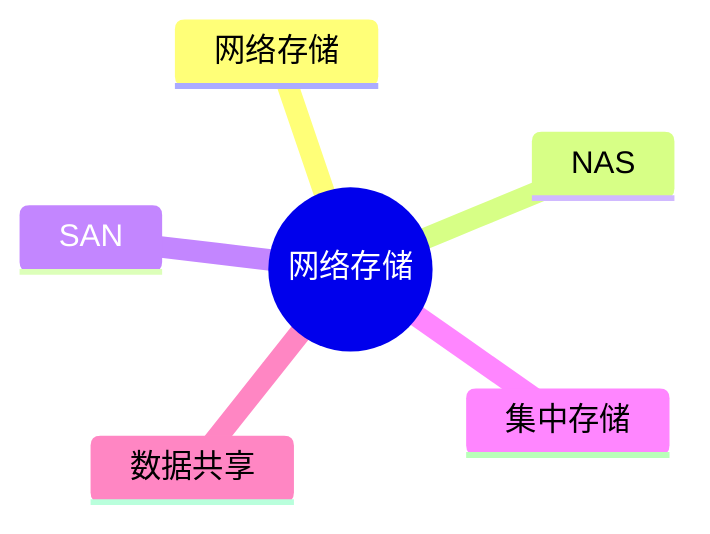
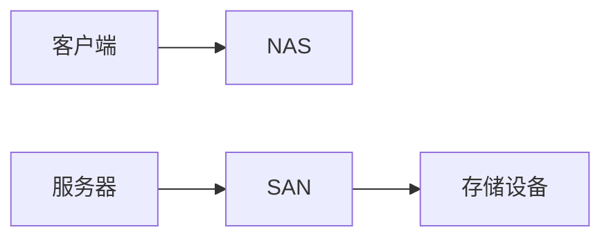

# 第十二节 网络存储（Network Storage）

> **说明：** 本文依据《第五章
> 计算机网络》中"网络存储"相关内容整理，主要介绍网络存储的基本概念及
> NAS、SAN 等内容。

## 一句话理解

**网络存储通过网络实现数据的集中存储、共享和统一管理，是网络规划的重要组成部分。**

## 学习目标

-   理解网络存储概念
-   掌握 NAS 与 SAN 的基本特点
-   了解网络存储应用场景
-   掌握教材涉及的相关考点

## 知识导图



## 1. 网络存储概述

教材介绍，网络存储通过网络实现数据集中保存、共享与管理，提高数据利用效率和管理能力。

## 2. NAS（Network Attached Storage）

NAS（网络附加存储）通过网络直接向用户提供文件共享服务，部署简单，适合文件级共享应用。

## 3. SAN（Storage Area Network）

SAN（存储区域网络）构建专用存储网络，实现服务器与存储设备之间的高速连接，适用于对性能要求较高的场景。

## NAS 与 SAN 对比

| 项目 | NAS | SAN |
| --- | --- | --- |
| 访问方式 | 文件级 | 存储级 |
| 网络形式 | 通用网络 | 专用存储网络 |
| 特点 | 部署简单 | 性能较高 |

> 对比内容依据教材整理，教材以概念介绍为主。



## 高频考点

-   网络存储
-   NAS
-   SAN
-   集中存储
-   数据共享

## 易错点

> **注意：** NAS 与 SAN
> 都属于网络存储，但侧重点不同；教材主要要求掌握两者概念及基本区别。

## 开发者视角

企业环境通常根据业务需求选择 NAS 或 SAN，实现数据共享和集中管理。

## 架构师思考

设计网络存储时应综合考虑容量、性能、可靠性及后续扩展需求。

## AI 学习建议

```text
请根据教材整理 NAS 与 SAN 的特点，并制作网络存储知识总结表。
```

## 一分钟速记

```text
网络存储：
集中管理
数据共享

NAS：文件共享
SAN：专用存储网络
```

## 本节总结

本节介绍了教材中的网络存储基础，重点掌握网络存储概念以及 NAS、SAN
的基本特点和区别。

## 下一节

[下一节：章节练习](./14-exercises)

