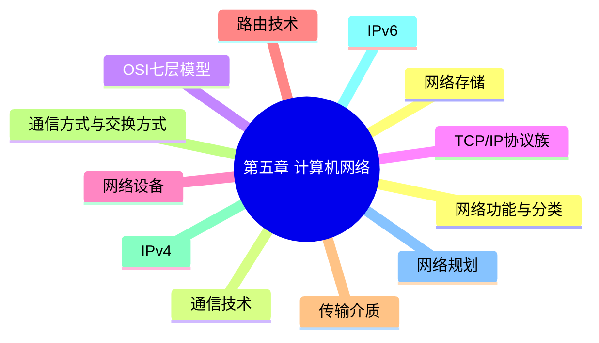

# 第五章 总结

> **说明：** 本文依据《第五章
> 计算机网络》教材整理，对本章知识体系、高频考点、易错点及考前速记进行汇总，便于整体复习。

## 一句话总结

**第五章围绕计算机网络体系结构、通信协议、网络设备、IP
地址及网络规划展开，是系统架构设计师考试的重要章节。**

## 知识体系



## 高频考点

-   网络功能与分类
-   OSI 七层模型
-   TCP/IP 协议族
-   网络设备（Hub、交换机、路由器、网关）
-   IPv4 地址、子网掩码、CIDR、子网划分
-   IPv6
-   路由技术（MTU、IGP、EGP）
-   网络规划与网络存储（NAS、SAN）

## 易错点

| 知识点 | 易错内容 |
| --- | --- |
| OSI 七层 | 协议、设备对应层次混淆 |
| TCP / UDP | 是否面向连接、是否可靠 |
| ARP / RARP | 地址解析方向容易混淆 |
| Hub / Switch / Router | 工作层次与转发依据混淆 |
| IPv4 / IPv6 | 地址长度与表示方式混淆 |
| NAS / SAN | 文件级与存储网络概念混淆 |

## 考前一分钟速记

```text
OSI：七层、协议、设备
TCP/IP：TCP UDP IP ARP DNS
设备：Hub 交换机 路由器 网关
IPv4：32位 A/B/C CIDR
IPv6：128位 十六进制
路由：MTU IGP EGP
存储：NAS SAN
```

## 学习建议

建议按以下顺序复习：

1.  网络基础
2.  OSI 七层模型
3.  TCP/IP 协议族
4.  网络设备
5.  IP 地址与 IPv6
6.  路由技术
7.  网络规划与网络存储
8.  完成章节练习
9.  回顾高频考点

## AI 学习建议

```text
请以第五章教材为基础，生成系统架构设计师考试风格的综合模拟题，并逐题讲解涉及的知识点、易错点和解题思路。
```

## 本章总结

第五章系统介绍了计算机网络的基础理论、网络体系结构、通信协议、网络设备、IP
地址、网络规划和网络存储等内容。复习时应重点掌握各知识点之间的联系，并结合练习进行巩固。

