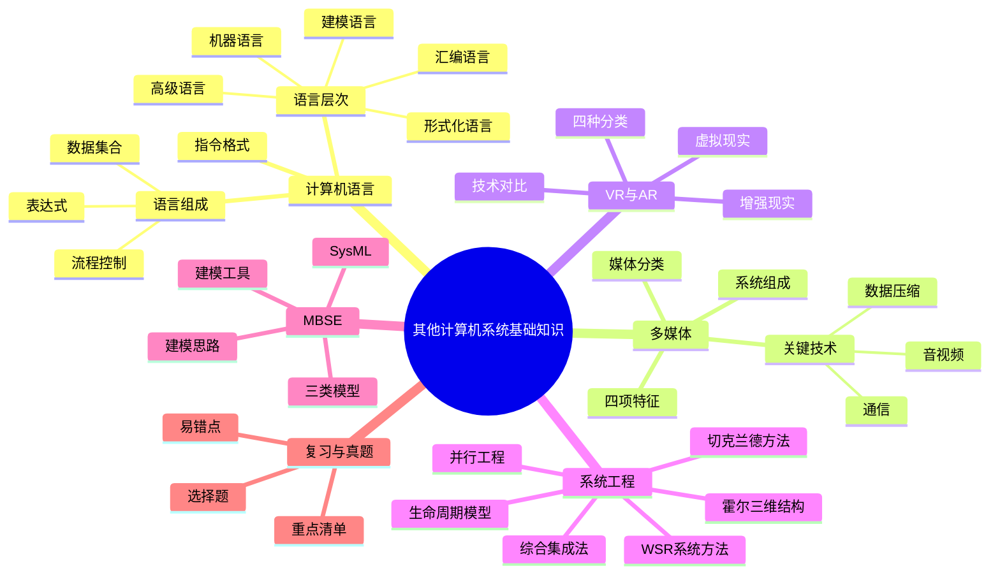

# 第六章 其他计算机系统基础知识

本章覆盖计算机语言、多媒体、虚拟现实与增强现实、系统工程和基于模型的系统工程（MBSE）。从课件考情看，本章整体题量不大，但系统工程的概念、霍尔三维结构、生命周期方法和 MBSE 很适合用结构化方式记忆。

## 学习地图

## 章节目录

| 单元 | 内容 | 学习目标 |
| --- | --- | --- |
| 01 | [计算机语言](./02-computer-language) | 认识五类语言、语言组成和指令地址码 |
| 02 | [多媒体](./03-multimedia) | 掌握媒体分类、系统组成、四项特征和压缩 |
| 03 | [VR 与 AR](./04-vr-ar) | 能够区分 VR、AR 及四种 VR 分类 |
| 04 | [系统工程](./05-system-engineering) | 掌握霍尔三维结构和五类系统工程方法 |
| 05 | [MBSE](./06-mbse) | 理解 SysML、建模工具、建模思路和模型分类 |
| 06 | [章节练习](./07-exercises) | 通过填空、选择和简答检验掌握程度 |
| 07 | [历年真题复习](./08-past-exams) | 结合课件真题回顾霍尔三维结构 |
| 08 | [第六章总结](./09-summary) | 考前压缩记忆，形成一页知识框架 |

## 推荐学习顺序

1. 先看计算机语言和多媒体，建立概念边界。
2. 再看 VR/AR，重点记分类和技术特征。
3. 用系统工程一节掌握本章核心：三维结构、生命周期和方法比较。
4. 最后学习 MBSE，把传统系统工程的流程映射到模型和 SysML。
5. 用练习与真题验证，而不是只背总结清单。

## 高频辨析

| 容易混淆 | 区分方式 |
| --- | --- |
| 表示媒体与显示媒体 | 表示媒体规定信息的编码形式；显示媒体是呈现信息的物理设备 |
| VR 与 AR | VR 构造并沉浸于虚拟世界；AR 保留现实世界并叠加虚拟信息 |
| 时间维与逻辑维 | 时间维回答“先后阶段”；逻辑维回答“每个阶段做什么” |
| 计划驱动与敏捷 | 前者强调流程和文档稳定；后者欢迎变化并持续交付 |
| MBSE 与普通画图 | MBSE 是贯穿需求、分析、设计、验证的工程方法，不是孤立画图 |

[上一章：计算机网络](../chapter-05/16-summary)

## 下一节

[下一节：计算机语言](./02-computer-language)
