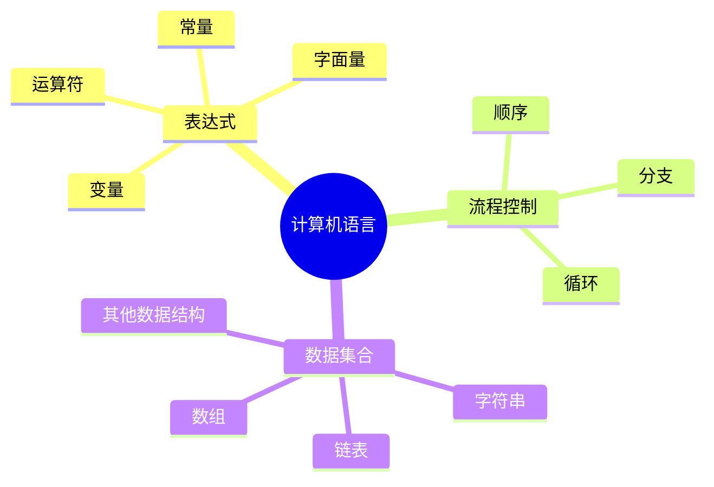
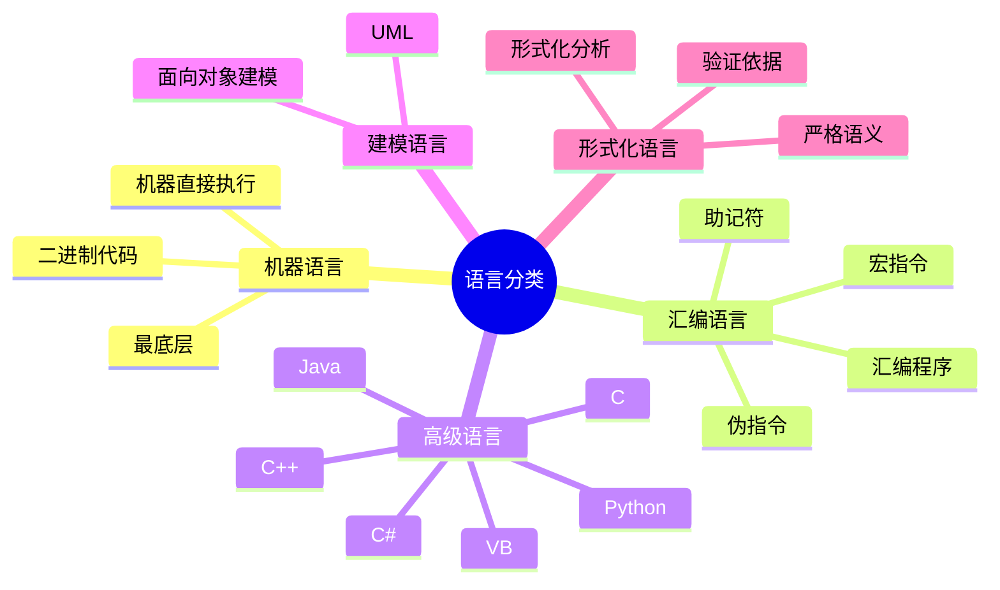

# 第一节 计算机语言

计算机语言是人与计算机之间交换信息的媒介。它不只是“写程序的符号”，还要表达数据、控制执行流程，并组织程序使用的数据集合。

## 1. 计算机语言的组成



| 组成部分 | 作用 | 典型内容 |
| --- | --- | --- |
| 表达式 | 描述数据和计算 | 变量、常量、字面量、运算符 |
| 流程控制 | 描述执行顺序 | 顺序、选择、循环 |
| 数据集合 | 组织多项数据 | 字符串、数组、链表 |

## 2. 五类计算机语言



### 2.1 机器语言

机器语言是第一代计算机语言，以二进制代码表示指令，机器可以直接执行。它最贴近硬件，但可读性、可移植性和编写效率都较差。

一条机器指令通常需要表达：

- 操作码：说明执行什么操作。
- 操作数地址：说明参与操作的数据在哪里。
- 结果存储地址：说明结果写回哪里。
- 下一条指令地址：说明执行完后到哪里取指。

### 指令地址码格式

| 格式 | 地址码含义 | 常见理解 |
| --- | --- | --- |
| 三地址指令 | 两个操作数地址 + 一个结果地址 | `A = B + C`，地址最完整 |
| 二地址指令 | 一个操作数地址 + 一个操作数/结果地址 | 一个操作数位置被结果复用 |
| 一地址指令 | 一个操作数地址 + 固定寄存器 | 常与累加器配合 |
| 零地址指令 | 不显式写地址 | 操作数和结果位于栈顶 |
| 可变地址数指令 | 地址数随指令变化 | 根据指令功能使用 0～6 个地址 |

地址数越多，指令表达能力通常越直接，但指令长度和硬件实现复杂度也会增加。考试题常通过“操作数、结果地址、累加器、栈”判断指令格式。

### 2.2 汇编语言

汇编语言使用助记符和符号名代替二进制指令，仍然面向具体机器。汇编程序负责把汇编源程序翻译成机器代码。

| 汇编要素 | 含义 |
| --- | --- |
| 指令 | 翻译后会产生机器代码并执行 |
| 伪指令 | 给汇编程序的控制信息，本身通常不产生机器指令 |
| 宏指令 | 把一段常用指令序列封装成可重复调用的名字 |
| 指令语句格式 | 名字（标号）、操作码、操作数、注释 |

### 2.3 高级语言

高级语言更接近人类表达方式，通常需要编译器或解释器执行。常见语言包括 C、C++、Java、VB、C# 和 Python。高级语言的重点不在于记忆语言名称，而在于理解其相对于机器语言的抽象层次更高、可移植性更好。

### 2.4 建模语言

建模语言用图形或符号描述系统结构与行为，面向对象建模中最常见的是 UML。它强调“描述系统”，不直接等同于某种可执行编程语言。

### 2.5 形式化语言

形式化语言把概念、判断和推理转换成具有精确定义的符号系统，用于描述程序功能和验证程序正确性。典型开发过程可以记为：

```text
可行性分析 → 需求分析 → 体系结构设计 → 详细设计 → 编码 → 测试 → 发布
```

## 3. 考试辨析

| 题干关键词 | 优先判断 |
| --- | --- |
| 二进制代码、机器直接执行 | 机器语言 |
| 助记符、汇编程序、标号 | 汇编语言 |
| C、Java、Python | 高级语言 |
| UML、系统结构图、对象建模 | 建模语言 |
| 精确语义、推理、正确性验证 | 形式化语言 |

## 小结

本节要形成两条主线：一是语言抽象层次从机器语言逐步走向高级语言、建模语言和形式化语言；二是机器指令地址码从三地址到零地址逐步减少显式地址，背后对应不同的硬件组织方式。

## 下一节

[下一节：多媒体](./03-multimedia)
