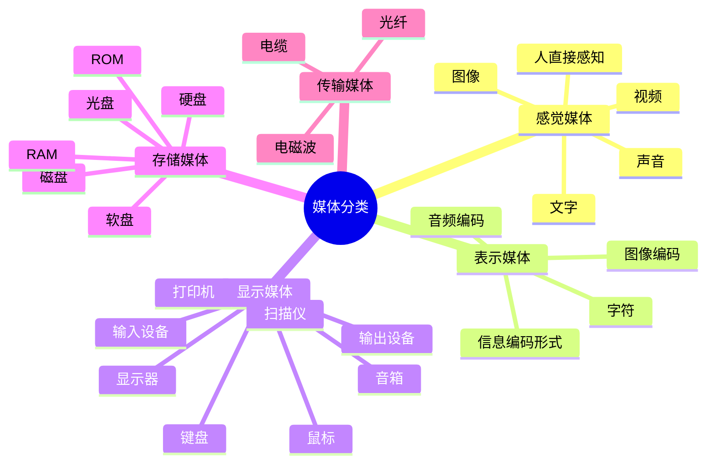

# 第二节 多媒体

多媒体是承载信息的综合载体。它把文字、声音、图像、动画和视频等信息形式组织起来，并通过计算机完成采集、存储、处理、传输和交互。

## 1. 媒体的五种分类

| 类型 | 核心问题 | 例子 |
| --- | --- | --- |
| 感觉媒体 | 人直接感受到什么 | 文字、声音、图像、视频 |
| 表示媒体 | 信息用什么形式编码 | 字符、图像码、音频码 |
| 显示媒体 | 信息通过什么设备输入或输出 | 键盘、扫描仪、显示器、打印机 |
| 存储媒体 | 信息保存在哪种物理介质 | 硬盘、光盘、ROM、RAM |
| 传输媒体 | 信息通过什么介质传送 | 电缆、光纤、电磁波 |

注意：显示媒体也称表现媒体，强调信息的输入和输出设备；表示媒体强调编码形式，二者不要混淆。

## 2. 多媒体的四项特征

| 特征 | 含义 | 记忆关键词 |
| --- | --- | --- |
| 多维化 | 综合多种信息形式，扩大信息空间 | 多样化 |
| 集成性 | 集成多种媒体设备和信息内容 | 设备与信息一体化 |
| 交互性 | 用户主动获取、处理和反馈信息 | 主动参与 |
| 实时性 | 音频、视频等信息具有时间特性 | 随时间变化 |

## 3. 多媒体系统组成

### 硬件层

- 多媒体计算机（MPC）、图形工作站等主机。
- 多媒体板卡，如显示卡、声卡、视频卡。
- 外部设备，如触摸屏、扫描仪、摄像头、话筒、显示器和音箱。

### 软件层

- 驱动程序和多媒体操作系统。
- 支持软件，包括多媒体素材制作工具、著作工具和多媒体编程语言。
- 面向用户的多媒体应用软件。

## 4. 关键技术与数据压缩

多媒体系统的关键技术主要包括音频与视频技术、通信技术和数据压缩技术。

| 分类方式 | 类型 | 适用场景 |
| --- | --- | --- |
| 是否实时 | 实时压缩、非实时压缩 | 实时通信强调低延迟；离线制作强调压缩效率 |
| 数据对象 | 数据压缩、文件压缩 | 处理采集数据或保存文件 |
| 是否允许丢失信息 | 无损压缩、有损压缩 | 无损保证可恢复；有损换取更高压缩比 |

### 编码格式

| 格式 | 主要对象 | 典型特点 |
| --- | --- | --- |
| JPEG | 静态图像 | 联合图像专家组标准，常见有损图像压缩 |
| MPEG | 动态图像/视频 | 动态图像专家组标准，适合视频编码 |
| H.26L | 视频编解码 | 视频编码器标准系列中的高压缩方案 |

## 高频判断

1. “人直接感知的信息形式”对应感觉媒体。
2. “硬盘、光盘、RAM”属于存储媒体，不属于显示媒体。
3. 有损压缩不是“错误压缩”，而是利用人类视觉、听觉不敏感特征换取压缩比。
4. 视频和音频的时间变化决定了多媒体系统的实时性要求。

## 下一节

[下一节：VR 与 AR](./04-vr-ar)
