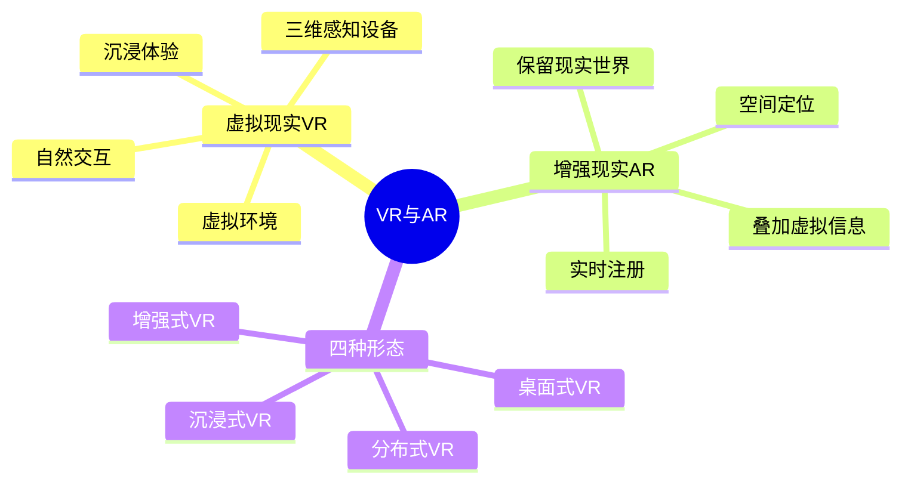

# 第三节 VR 与 AR

## 1. 虚拟现实 VR

VR（Virtual Reality）利用计算机生成一个逼真的视觉、听觉、触觉甚至味觉环境，使用户沉浸其中并与虚拟实体交互。

VR 的三层含义：

1. 虚拟实体：由计算机生成的逼真对象或环境。
2. 自然交互：用户通过头部转动、眼动、手势等自然技能与环境交互。
3. 感知设备：借助立体显示器、数据手套、数据服、三维鼠标等设备完成感知和操作。

## 2. 增强现实 AR

AR（Augmented Reality）不是完全替换现实，而是在真实世界的时间和空间范围内叠加虚拟信息。系统需要识别现实场景，并把虚拟图像准确注册到现实位置。

常见技术包括：

- 计算机图形图像技术：生成或叠加虚拟对象。
- 空间定位技术：确定用户、设备和现实目标的位置关系。
- 人文智能：结合传感器、可穿戴计算等手段理解人的行为和环境。

## 3. VR/AR 分类

| 类型 | 定义 | 特点与代价 |
| --- | --- | --- |
| 桌面式 VR | 利用计算机形成三维交互场景 | 易实现、成本低，但沉浸感有限，容易受环境干扰 |
| 分布式 VR | 将 VR 与网络结合，在同一虚拟环境中协作 | 共享度高，可扩展，但网络延迟和同步要求高 |
| 沉浸式 VR | 借助多种输入输出设备使用户完全沉浸 | 实时交互和体验感好，但设备配置与开发成本高 |
| 增强式 VR/AR | 将虚拟现实模拟信息加入现实世界 | 感知更贴近现实，但注册、混合技术要求高 |

## 4. VR 与 AR 对比

| 对比项 | VR | AR |
| --- | --- | --- |
| 世界基础 | 计算机生成的虚拟世界 | 真实世界 |
| 信息关系 | 用户进入虚拟环境 | 虚拟信息叠加到现实环境 |
| 关键能力 | 沉浸、交互、逼真感 | 注册、定位、实时叠加 |
| 典型设备 | 头戴显示器、数据手套、动作捕捉 | 摄像头、透明显示器、空间定位传感器 |

## 易错点

- “完全沉浸在虚拟环境”优先选 VR；“在现实视野上叠加数字信息”优先选 AR。
- AR 不是简单的图像叠加，虚拟信息必须和现实空间位置相匹配。
- 分布式 VR 的关键不是“多人登录”，而是网络环境下共享同一虚拟空间。

## 下一节

[下一节：系统工程](./05-system-engineering)
