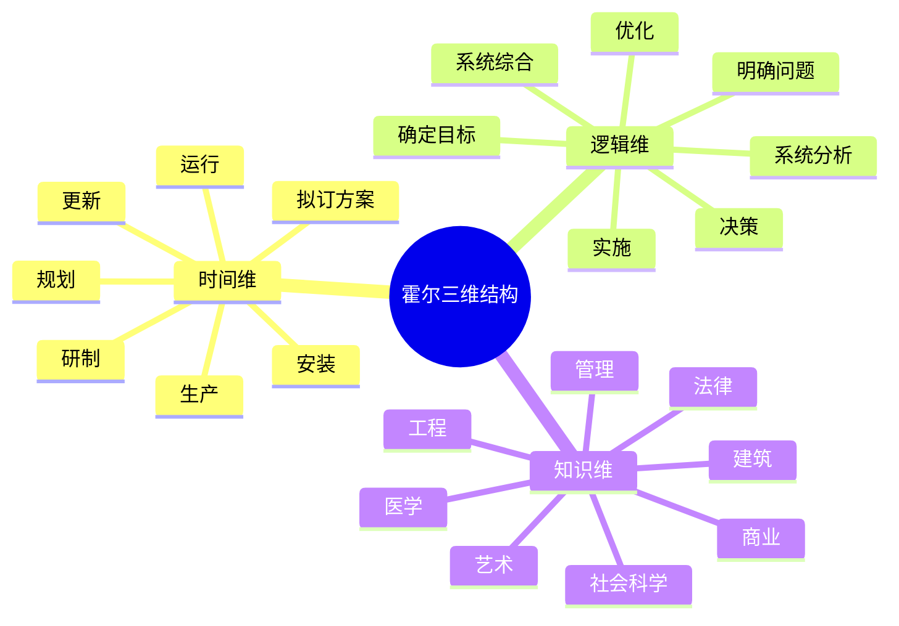
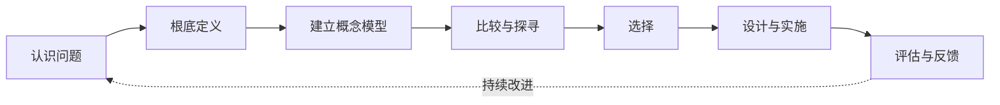

# 第四节 系统工程

系统工程是利用计算机等工具，对系统的结构、元素、信息和反馈进行分析，以实现系统整体最优规划、最优设计、最优管理和最优控制的方法。它关注系统之间的关系和整体目标，而不是孤立优化某个部件。

## 1. 霍尔三维结构

霍尔三维结构把系统工程活动组织成三个相互关联的维度：

### 三个维度的含义

| 维度 | 回答的问题 | 关键内容 |
| --- | --- | --- |
| 时间维 | 系统工程活动按什么先后推进 | 规划、拟订方案、研制、生产、安装、运行、更新 |
| 逻辑维 | 每个阶段应该完成哪些思维步骤 | 明确问题、确定目标、系统综合、系统分析、优化、决策、实施 |
| 知识维 | 完成任务需要哪些专业知识 | 工程、医学、建筑、法律、管理、社会科学、艺术等 |

考试中最常见的填空是：时间维、逻辑维、知识维；时间维有 7 个阶段，逻辑维有 7 个步骤。

## 2. 切克兰德方法

切克兰德方法适合处理社会经济系统等难以精确定义的问题。它的核心不是直接寻找唯一“最优解”，而是通过现实问题与概念模型的比较，探索可行的改善路径。

| 步骤 | 作用 |
| --- | --- |
| 认识问题 | 收集信息，描述问题现状及相关主体 |
| 根底定义 | 澄清关键因素、相互关系和系统边界 |
| 建立概念模型 | 用结构模型或语言模型描述理想系统 |
| 比较与探寻 | 将现实问题与概念模型对比，寻找可行途径 |
| 选择 | 结合人员态度、社会和行为因素选择方案 |
| 设计与实施 | 形成详细方案并获得相关人员支持 |
| 评估与反馈 | 根据实施结果修正问题描述、定义和模型 |

## 3. 并行工程

并行工程对产品及其相关过程进行并行、集成化处理，从产品设计开发开始就考虑整个生命周期，目标是提高质量、降低成本、缩短开发周期和上市时间。

并行工程强调三点：

1. 在产品设计开发期，把概念设计、结构设计、工艺设计和最终需求结合起来。
2. 由与项目相关的各个项目小组协同完成，信息及时反馈。
3. 利用信息系统、反馈和协调机制推动项目并行进行。

## 4. 综合集成法

综合集成法由钱学森等提出，面向开放的复杂巨系统，强调从定性认识走向定性与定量相结合，再从整体上综合解决问题。

开放的复杂巨系统通常具有：开放性、复杂性、演化与涌现性、层次性和巨量性。综合集成法的关键特征包括：

- 定性研究和定量研究相结合，贯穿全过程。
- 科学理论与经验知识相结合。
- 用系统思想把多种学科结合起来。
- 通过宏观研究与微观研究共同分析复杂系统。
- 需要计算机系统支持管理信息、决策支持和综合集成功能。

## 5. WSR 系统方法

WSR 表示物理（物理事）、事理（事理）和人理（人理），强调把客观规律、做事规律和人的因素结合起来。

| 维度 | 关注点 |
| --- | --- |
| 物理 | 系统客观存在的结构、资源和约束 |
| 事理 | 问题的过程、因果和解决方法 |
| 人理 | 相关人员的认知、利益、协作与接受程度 |

WSR 方法的 7 个步骤：理解意图、制定目标、调查分析、构造策略、选择方案、协调关系、实现构想。它提醒架构师：方案可行不仅取决于技术，也取决于流程和人的协作。

## 6. 生命周期模型

| 模型 | 核心特征 | 适用情境 |
| --- | --- | --- |
| 计划驱动 | 遵守既定流程，重视文档完整、需求可追溯和验证 | 需求稳定、合规要求高 |
| 渐进迭代式开发 | 先交付初始能力，再持续交付和快速响应 | 需求不完全清晰、系统规模较小 |
| 精益开发 | 以客户价值为中心，减少浪费 | 需要持续优化价值流 |
| 敏捷开发 | 欢迎变化，短周期交付，持续反馈和改进 | 需求变化快、风险需要尽早暴露 |

### 敏捷宣言常考表述

- 尽早、持续交付有价值的软件，使客户满意。
- 欢迎需求变化，即使项目后期也应利用变化创造竞争优势。
- 经常交付可用软件，周期从几周到几个月，并偏向更短周期。
- 业务人员和开发人员在项目期间每天协作。
- 面对面沟通是团队内外最有效的信息传递方式。
- 可工作的软件是衡量进展的主要指标。
- 持续关注技术卓越和良好设计，以增强敏捷性。
- 简单性是精益的艺术，强调最大化不必要工作的减少。
- 最好的架构、需求和设计来自自组织团队。
- 团队定期反思并调整行为，以持续提高效率。

## 方法选择提示

| 题目描述 | 对应方法 |
| --- | --- |
| 过程分为时间、逻辑、知识三个维度 | 霍尔三维结构 |
| 现实问题与概念模型比较、持续反馈 | 切克兰德方法 |
| 产品全生命周期、设计制造同时考虑 | 并行工程 |
| 开放复杂巨系统、定性定量综合 | 综合集成法 |
| 物理、事理、人理 | WSR |

## 下一节

[下一节：MBSE](./06-mbse)
